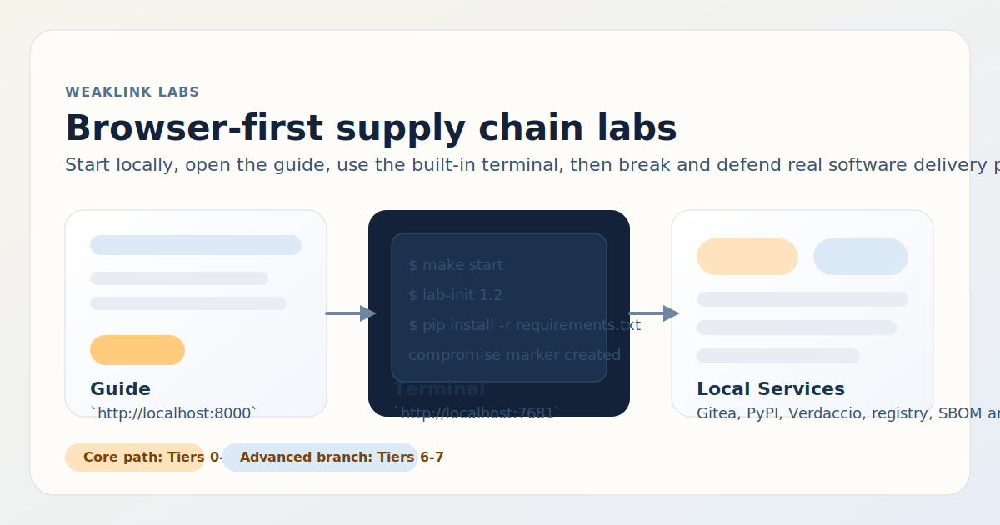

# WeakLink Labs

**Learn supply chain security by breaking and fixing real pipelines.**

[](https://codespaces.new/beyildirim/weaklink-labs?quickstart=1)
[](guide/docs/getting-started.md)
[](LICENSE)
[](https://slsa.dev)
[](https://github.com/beyildirim/weaklink-labs/releases)
[](https://github.com/beyildirim/weaklink-labs/releases)

WeakLink Labs is a browser-first training platform for software supply chain security. It brings up a local workstation plus the surrounding systems attackers actually target: Git hosting, private and public package registries, an OCI registry, CI/CD-style repos, container images, SBOMs, signatures, and attestations. Learners run real attacks in isolated infrastructure, then apply the controls that stop them.



<p align="center">
  <a href="guide/docs/getting-started.md"><strong>Getting Started</strong></a> ·
  <a href="guide/docs/index.md"><strong>Browse Labs</strong></a> ·
  <a href="guide/docs/placement-test.md"><strong>Placement Test</strong></a> ·
  <a href="SECURITY.md"><strong>Security</strong></a> ·
  <a href="CONTRIBUTING.md"><strong>Contributing</strong></a>
</p>

## In 2 Minutes

- Start the platform with `make start` or `make compose-up`.
- Open the guide at `http://localhost:8000` and the browser terminal at `http://localhost:7681`.
- Follow the mainline through Tiers `0-5`; treat Tiers `6-7` as advanced branches with more case-study and response-oriented content.

## At a Glance

- **50 hands-on labs across 8 tiers** covering packages, CI/CD, containers, artifact integrity, IaC, case studies, and response.
- **Browser-first workflow** with the guide at `http://localhost:8000` and the workstation terminal at `http://localhost:7681`.
- **Two local paths**: a full `minikube` path for the main experience and a faster Docker Compose path that pulls prebuilt images.
- **`make` is the only supported host-side interface.** Startup, teardown, logs, smoke tests, and helper actions all go through the `Makefile`.
- **Published images include supply chain metadata**: signing, SBOMs, and provenance-related attestations.

> Main path: run `make start`, open `http://localhost:8000`, and do the lab work in the browser terminal at `http://localhost:7681`.

## Safety and Scope

- **Local training stack only.** WeakLink Labs is designed for local use on your machine or in a Codespace. It is not hardened for public Internet exposure or multi-tenant hosting.
- **The labs include intentionally malicious content.** Expect trojanized packages, poisoned workflows, fake secrets, weak credentials, and vulnerable configurations used for training.
- **Do not connect real infrastructure or credentials.** Keep the environment isolated from real registries, clusters, cloud accounts, signing keys, and production secrets.
- **Some defaults are intentionally permissive.** Local services and seeded credentials trade security for repeatable lab setup. That is part of the training environment, not a deployment recommendation.
- **Report actual repo or platform security issues privately.** See [SECURITY.md](SECURITY.md) for reporting guidance and scope.

## Choose a Setup Path

| Path | Command | Requirements | Use when |
|------|---------|--------------|----------|
| **Recommended local** | `make start` | Docker, minikube, kubectl, Helm, Python 3.11+ | You want the full local platform and the main supported path |
| **Fastest local** | `make compose-up` | Docker | You want to start quickly with prebuilt GHCR images |
| **Zero install** | Codespaces badge above | GitHub account | You do not want to install local dependencies |

For full setup details and prerequisites, see [guide/docs/getting-started.md](guide/docs/getting-started.md).

## Quick Start

### Recommended Local Path

```bash
git clone https://github.com/beyildirim/weaklink-labs.git
cd weaklink-labs
make start
```

Open **http://localhost:8000** in your browser. That is the main experience.

- `make stop` tears down the platform but leaves `minikube` running.
- `make clean` tears down the platform and deletes the `minikube` cluster.

### Docker Compose Path

```bash
git clone https://github.com/beyildirim/weaklink-labs.git
cd weaklink-labs
make compose-up
```

Open **http://localhost:8000** in your browser. This path pulls published images from GHCR instead of building them locally.

To pin a published release instead of `latest`, run:

```bash
WEAKLINK_IMAGE_TAG=<release-tag> make compose-up
```

## Most Useful Commands

| Command | Purpose |
|---------|---------|
| `make start` | Start the full local platform |
| `make stop` | Tear down the platform and leave `minikube` running |
| `make clean` | Tear down the platform and delete the `minikube` cluster |
| `make status` | Show current pod status |
| `make logs` | Show recent logs from platform pods |
| `make shell` | Open a shell in the workstation |
| `make compose-up` | Start the Docker Compose path |
| `make compose-down` | Tear down the Docker Compose path |
| `make docs-check` | Run strict docs validation |
| `make test` | Run the lab smoke test against the cluster |

The host terminal is only for `make` commands. Lab work happens inside the browser terminal.

## What Opens Where

| Surface | URL | Purpose |
|---------|-----|---------|
| Guide | `http://localhost:8000` | Main learning interface |
| Workstation terminal | `http://localhost:7681` | Browser access to the lab shell |
| Gitea | `http://localhost:3000` | Git UI used in repo and CI/CD labs |

## Split of Responsibilities

| Where you are | What you do there |
|---------------|-------------------|
| **Host terminal** | Start, stop, inspect, and test the platform with `make` |
| **Browser guide** | Read the lab flow, context, and defense steps |
| **Browser terminal** | Run the actual lab commands against the isolated environment |

## What You'll Learn

| Tier | Topic | Labs |
|------|-------|:----:|
| **0** | **Foundations** — Version control, package managers, containers, CI/CD | 5 |
| **1** | **Package Security** — Dependency confusion, typosquatting, lockfile injection | 6 |
| **2** | **Build & CI/CD** — Pipeline poisoning, secret exfiltration, runner attacks | 8 |
| **3** | **Container Security** — Image tampering, registry confusion, layer attacks | 6 |
| **4** | **SBOM & Signing** — SBOMs, signing, attestations, and how to bypass them | 7 |
| **5** | **IaC Supply Chain** — Helm, Terraform, Ansible, admission controllers | 5 |
| **6** | **Advanced Domains & Case Studies** — AI/ML, firmware, multi-vector attacks, major incidents | 10 |
| **7** | **Response & Threat Modeling** — Incident triage, IR playbooks, threat modeling | 3 |

**Recommended mainline:** Tiers `0-5`. They are the clearest continuation of the hands-on core product.

**Advanced branches:** Tiers `6-7`. They are useful, but they shift into case studies and response-oriented work instead of staying on the default browser-first attack path.

## Start at the Right Depth

| You are a... | Start here | Focus on |
|--------------|-----------|----------|
| **SOC Analyst** | Tier 0 | Core path first, then optional Tier 7 |
| **Security Engineer** | [Placement test](guide/docs/placement-test.md), likely Tier 1 | Mainline through Tiers 1-5, then optional Tiers 6-7 |
| **DevSecOps** | Tier 2 | CI integration, artifact integrity, and IaC controls |
| **DevOps Engineer** | Tier 0 | Defend phases, Tiers 2-3 and 5 |
| **Team Lead / Manager** | Tier 0 | Core path through Tier 5, then Tier 7.3 and 7.5 for response planning |

## How Every Lab Works

Most hands-on labs follow a simple teaching flow:

**1. Understand** — See the system working normally. In Lab 0.2, you install a package from a private registry and inspect how dependency resolution works. In Lab 3.1, you pull apart container image layers to see what is actually inside.

**2. Break** — Exploit a real vulnerability. In Lab 1.2, you publish a malicious package to a public registry and watch the build system pull it instead of the private one. In Lab 2.4, you inject a step into a CI pipeline that exfiltrates secrets to an external endpoint.

**3. Defend** — Apply the fix, re-run the attack, watch it fail. In Lab 1.2, you configure scoped registries and pin hashes. In Lab 4.3, you sign an artifact with Cosign and set up verification that rejects unsigned images.

**4. Detect or Discuss Impact** — Some labs add detection, triage, or case study analysis when it helps learners connect the attack to real work. Not every lab requires formal detection content.

## Published Images and Security Metadata

Tagged releases publish multi-architecture images for `guide`, `workstation`, and `lab-setup`.

- Images are built in GitHub Actions and pushed to GHCR.
- Cosign keyless signing is applied during publish.
- Build provenance is enabled during image build.
- CycloneDX SBOMs are generated with Syft.
- SBOMs are uploaded as release assets and attached as attestations during publish.

This matters for the content too: Tier 4 covers SBOMs, signatures, provenance, attestation verification, and ways those controls can fail.

## Optional Helper CLI

Most learners can ignore the helper CLI after startup and work directly in the browser. If you want repo-local convenience commands, use:

```bash
make shell                         # Open a shell in the workstation
./cli/weaklink info <lab-id>      # Show lab metadata
./cli/weaklink hint <lab-id>      # Get a hint if you are stuck
```

## Contributing

See [CONTRIBUTING.md](CONTRIBUTING.md) for the lab template and guidelines.

## License

[MIT](LICENSE)
