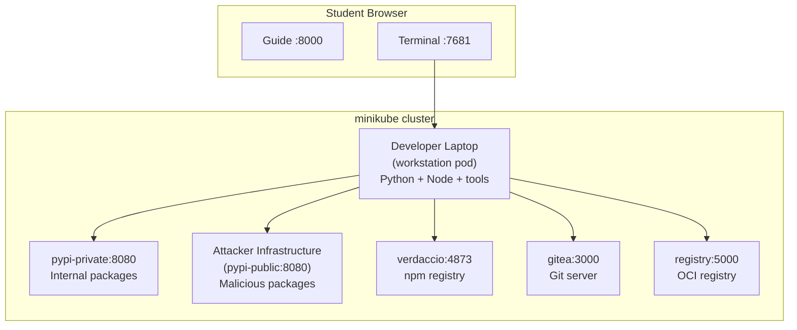

# Getting Started

## What is Software Supply Chain Security?

The software supply chain is everything between a developer writing code and that code running in production. It includes source code repositories, package registries, build systems, CI/CD pipelines, container images, and deployment configurations. Every one of these stages is a link in a chain, and every link is a potential target.

Attackers know this. Instead of attacking your application directly, they compromise one of the tools or dependencies your application relies on. A poisoned npm package, a backdoored container base image, a tampered CI pipeline. These attacks bypass traditional application security entirely because the malicious code arrives through trusted channels.

In WeakLink Labs, you will execute real supply chain attacks against isolated lab infrastructure, then build the defenses that stop them. You will work with Git repositories, package registries, container images, build pipelines, and signing systems across 50 hands-on labs organized into 8 tiers.

The main goal is to help you understand how software supply chains work, where trust breaks down, and what good decisions look like from different roles. You do not need to become a detection engineer to get value from the platform.

---

## Choose Your Setup Path

WeakLink Labs supports two local paths plus Codespaces. Use `make` as the host-side interface.

### Recommended Path

If you want the main local experience, use `make start`.

| Tool | Minimum version | Install | What it does |
|------|----------------|---------|--------------|
| [Docker](https://docs.docker.com/get-docker/) | 20.10+ | `brew install --cask docker` | Container runtime |
| [minikube](https://minikube.sigs.k8s.io/) | 1.30+ | `brew install minikube` | Runs a single-node Kubernetes cluster locally |
| [kubectl](https://kubernetes.io/docs/tasks/tools/) | 1.27+ | `brew install kubectl` | CLI for interacting with Kubernetes clusters |
| [Helm](https://helm.sh/) | 3.12+ | `brew install helm` | Deploys the lab chart |
| [Python](https://www.python.org/downloads/) | 3.11+ | `brew install python@3.11` | Runs the host-side WeakLink automation behind `make` |

```bash
make start
```

When it finishes, open [http://localhost:8000](http://localhost:8000). For most learners, that is enough.

### Docker-Only Alternative

The fastest alternative. Requires only Docker.

| Tool | Minimum version | Install |
|------|----------------|---------|
| [Docker](https://docs.docker.com/get-docker/) | 20.10+ | `brew install --cask docker` |

```bash
make compose-up
open http://localhost:8000
```

This pulls the pre-built images and starts all services. The guide is available at [http://localhost:8000](http://localhost:8000) and the workstation terminal at [http://localhost:7681](http://localhost:7681).

To pin a published release instead of `latest`, run `WEAKLINK_IMAGE_TAG=<release-tag> make compose-up`.

### Zero Install (GitHub Codespaces)

Open the repository in a GitHub Codespace. The devcontainer configuration handles all setup automatically. No local installation required.

### Host-Side Commands

Use `make` for routine host-side control:

```bash
make start
make stop
make restart
make status
make logs
make shell
make compose-up
make compose-down
make docs-check
```

`make` is the only supported host-side interface. The legacy top-level start and stop scripts are gone.

---

## Connecting to the Lab Environment

Labs run inside your Docker Compose or Kubernetes environment. The intended learner flow is simple:

1. Start the platform.
2. Open the guide in your browser.
3. Use the built-in terminal for the lab.

!!! warning "Two Terminals, Two Purposes"
    After startup, most of your work happens in the browser terminal.

    1. **The browser terminal** at [localhost:7681](http://localhost:7681) is your **lab workstation**. This is where you run lab commands (clone repos, install packages, execute attacks and defenses).
    2. **Your own Mac/Linux terminal** is only for starting or stopping the platform.

    When a lab says "run this command", it means inside the browser terminal unless it explicitly says otherwise.

!!! info "Address Rules"
    The docs use two kinds of addresses:

    1. **`localhost:*` addresses** are for your host browser. Examples: the guide at [http://localhost:8000](http://localhost:8000), the workstation terminal at [http://localhost:7681](http://localhost:7681), and Gitea at [http://localhost:3000](http://localhost:3000).
    2. **Service names** like `gitea:3000`, `pypi-private:8080`, `verdaccio:4873`, and `registry:5000` are for commands you run *inside the workstation terminal*.

    If a lab tells you to open a page in your browser, it should use a `localhost` URL. If it tells you to run `curl`, `pip`, `npm`, or `docker` commands, those usually target service names from inside the workstation.

### Workstation Terminal

The workstation terminal is available at [http://localhost:7681](http://localhost:7681). Lab pages also open it in the split terminal panel so you can work without leaving the guide.

<div class="terminal-embed">
  <iframe src="http://localhost:7681" title="WeakLink Workstation Terminal"></iframe>
</div>

## Architecture



### Available Services

From inside the workstation, these services are reachable:

| Service | Address | Purpose |
|---------|---------|---------|
| Private PyPI | `pypi-private:8080` | Corporate/private Python package registry |
| Public PyPI | `pypi-public:8080` | Simulated public PyPI (attacker-controlled packages) |
| Verdaccio | `verdaccio:4873` | Local npm registry |
| Gitea | `gitea:3000` | Git hosting (like GitHub) |
| Container Registry | `registry:5000` | Local Docker/OCI image registry |

From your host browser, the main UI surfaces are:

| Surface | URL | Purpose |
|---------|-----|---------|
| Guide | `http://localhost:8000` | Main learning interface |
| Workstation terminal | `http://localhost:7681` | Browser access to the lab shell |
| Gitea | `http://localhost:3000` | Git UI used in CI/CD and repo review labs |

### Starting Labs

Each lab initializes automatically when you open it in the guide. You do not need to manually start individual labs or jump back out to your host terminal to finish them.

---

## The Learning Flow

Most attack-focused labs use the same progression:

<div class="phase-flow" markdown>
  <span class="phase-step understand">1. Understand</span>
  <span class="arrow">&rarr;</span>
  <span class="phase-step break">2. Break</span>
  <span class="arrow">&rarr;</span>
  <span class="phase-step defend">3. Defend</span>
  <span class="arrow">&rarr;</span>
  <span class="phase-step detect">4. Detect</span>
</div>

### Phase 1: Understand

<span class="phase-badge understand">UNDERSTAND</span>

Learn how the technology works under normal conditions. Explore configuration files, run standard commands, and see how legitimate packages flow through the system.

**You can't attack what you don't understand.** This phase builds the foundation for the exploit that follows.

### Phase 2: Break

<span class="phase-badge break">BREAK</span>

Execute a real supply chain attack in the lab environment. You will compromise systems using the same techniques used in real-world incidents like SolarWinds, event-stream, and Codecov.

**This is not a simulation.** The attacks are real. They just run against local, isolated infrastructure.

### Phase 3: Defend

<span class="phase-badge defend">DEFEND</span>

Build the defenses that stop the attack you just performed. Configure branch protection, enable hash verification, pin digests, set up lockfile integrity checks.

**Every defense is directly mapped to the attack.** You know exactly what it stops because you did the attack yourself.

### Phase 4: Detect

<span class="phase-badge detect">DETECT</span>

When it fits the topic, connect the attack to detection, triage, policy, or operational impact. Some labs stay hands-on and technical. Others shift toward case-study analysis or program design.

**You do not need formal detection engineering knowledge to use the platform.** Detection is one perspective, not the only one.

---

## Recommended Path

If you are new to supply chain security, follow the tiers in order:

1. **Tier 0: Foundations.** Understand Git, package managers, and containers before attacking them
2. **Tier 1: Package Security.** The most common real-world attack surface
3. **Tier 2-5: Core path.** Build pipelines, container supply chains, artifact integrity, and infrastructure code
4. **Tier 6-7: Optional advanced branches.** Case studies, incident response, and threat modeling

If you already have experience, jump directly to the tier that matches your interest. Each lab lists its prerequisites at the top.

---

## Tips

- **Read the output.** When a command fails or produces unexpected results, that is often the point of the exercise.
- **Don't skip Phase 1.** The "Understand" phase teaches you what normal looks like, which makes the attack in Phase 2 much more impactful.
- **Take notes.** Each lab ends with a summary table. Use it as a reference when hardening your own systems.
- **Stay in the flow.** Use the guide and built-in terminal as the main experience instead of bouncing between tools.
