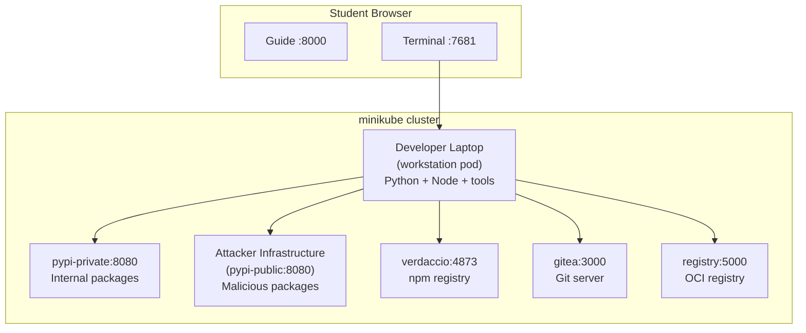

# Getting Started

## What is Software Supply Chain Security?

The software supply chain is everything between a developer writing code and that code running in production. It includes source code repositories, package registries, build systems, CI/CD pipelines, container images, and deployment configurations. Every one of these stages is a link in a chain, and every link is a potential target.

Attackers know this. Instead of attacking your application directly, they compromise one of the tools or dependencies your application relies on. A poisoned npm package, a backdoored container base image, a tampered CI pipeline. These attacks bypass traditional application security entirely because the malicious code arrives through trusted channels.

In WeakLink Labs, you will execute real supply chain attacks against isolated lab infrastructure, then build the defenses that stop them. You will work with Git repositories, package registries, container images, build pipelines, and signing systems across 62 hands-on labs organized into 10 progressive tiers.

---

## Choose Your Setup Path

WeakLink Labs supports three ways to get started. Pick the one that fits your situation.

### Quick Start (Docker Compose)

The fastest way to start. Requires only Docker.

| Tool | Minimum version | Install |
|------|----------------|---------|
| [Docker](https://docs.docker.com/get-docker/) | 20.10+ | `brew install --cask docker` |

```bash
docker compose up -d
open http://localhost:8000
```

This pulls the pre-built images and starts all services. The guide is available at [http://localhost:8000](http://localhost:8000) and the workstation terminal at [http://localhost:7681](http://localhost:7681).

### Full Experience (Kubernetes)

Runs the platform on a local Kubernetes cluster. This gives you the full infrastructure (Helm charts, services, pods) and is closer to a production setup. Recommended if you want to explore Kubernetes-based supply chain attacks in later tiers.

| Tool | Minimum version | Install | What it does |
|------|----------------|---------|--------------|
| [Docker](https://docs.docker.com/get-docker/) | 20.10+ | `brew install --cask docker` | Container runtime |
| [minikube](https://minikube.sigs.k8s.io/) | 1.30+ | `brew install minikube` | Runs a single-node Kubernetes cluster locally |
| [kubectl](https://kubernetes.io/docs/tasks/tools/) | 1.27+ | `brew install kubectl` | CLI for interacting with Kubernetes clusters |
| [Helm](https://helm.sh/) | 3.12+ | `brew install helm` | Kubernetes package manager for deploying the lab chart |

```bash
./start.sh
```

This starts minikube, builds all images, and deploys the platform via Helm. When it finishes, open [http://localhost:8000](http://localhost:8000).

### Zero Install (GitHub Codespaces)

Open the repository in a GitHub Codespace. The devcontainer configuration handles all setup automatically. No local installation required.

---

## Connecting to the Lab Environment

Labs run inside your Docker Compose or Kubernetes environment. You can connect in two ways:

1. **Browser (recommended):** Open any lab in the guide. The embedded terminal initializes the lab automatically.
2. **CLI:** Run `./cli/weaklink shell` to open a terminal, then run `lab-init <lab-id>` to set up the environment for a specific lab.

!!! warning "Two Terminals, Two Purposes"
    You have two terminals, and it matters which one you use:

    1. **The browser terminal** at [localhost:7681](http://localhost:7681) is your **lab workstation**. This is where you run lab commands (clone repos, install packages, execute attacks and defenses).
    2. **Your own Mac/Linux terminal** is where you run `weaklink verify`, `weaklink hint`, and other CLI commands that check your progress.

    When a lab says "run this command", it means inside the browser terminal unless it explicitly says otherwise.

### Workstation Terminal

The terminal below connects directly to your workstation. You can run all lab commands here without leaving the browser.

<div class="terminal-embed">
  <iframe src="http://localhost:7681" title="WeakLink Workstation Terminal"></iframe>
</div>

## Architecture



### Available Services

From inside the workstation, these services are reachable:

| Service | Address | Purpose |
|---------|---------|---------|
| Private PyPI | `pypi-private:8080` | Corporate/private Python package registry |
| Public PyPI | `pypi-public:8080` | Simulated public PyPI (attacker-controlled packages) |
| Verdaccio | `verdaccio:4873` | Local npm registry |
| Gitea | `gitea:3000` | Git hosting (like GitHub) |
| Container Registry | `registry:5000` | Local Docker/OCI image registry |

### Starting and Verifying Labs

Each lab initializes automatically when you open it in the guide. If using the CLI directly, run `lab-init <lab-id>` to set up the environment. To verify your work after completing a lab:

```bash
# Run from OUTSIDE the workstation (your host terminal)
weaklink verify <lab-id>
```

For example: `weaklink verify 1.2` to verify the Dependency Confusion lab.

---

## The Four-Phase Structure

Every lab follows the same progression:

<div class="phase-flow" markdown>
  <span class="phase-step understand">1. Understand</span>
  <span class="arrow">&rarr;</span>
  <span class="phase-step break">2. Break</span>
  <span class="arrow">&rarr;</span>
  <span class="phase-step defend">3. Defend</span>
  <span class="arrow">&rarr;</span>
  <span class="phase-step detect">4. Detect</span>
</div>

### Phase 1: Understand

<span class="phase-badge understand">UNDERSTAND</span>

Learn how the technology works under normal conditions. Explore configuration files, run standard commands, and see how legitimate packages flow through the system.

**You can't attack what you don't understand.** This phase builds the foundation for the exploit that follows.

### Phase 2: Break

<span class="phase-badge break">BREAK</span>

Execute a real supply chain attack in the lab environment. You will compromise systems using the same techniques used in real-world incidents like SolarWinds, event-stream, and Codecov.

**This is not a simulation.** The attacks are real. They just run against local, isolated infrastructure.

### Phase 3: Defend

<span class="phase-badge defend">DEFEND</span>

Build the defenses that stop the attack you just performed. Configure branch protection, enable hash verification, pin digests, set up lockfile integrity checks.

**Every defense is directly mapped to the attack.** You know exactly what it stops because you did the attack yourself.

### Phase 4: Detect

<span class="phase-badge detect">DETECT</span>

Learn what this attack looks like in logs, SIEM alerts, and CI output. Map the technique to MITRE ATT&CK and write detection rules you can use at work tomorrow.

**Detection is not a separate skill.** It is built into every lab so you learn to find attacks as you learn to execute them.

---

## Recommended Path

If you are new to supply chain security, follow the tiers in order:

1. **Tier 0: Foundations.** Understand Git, package managers, and containers before attacking them
2. **Tier 1: Package Security.** The most common real-world attack surface
3. **Tier 2+: Advanced.** Build pipelines, container supply chains, artifact integrity, and much more

If you already have experience, jump directly to the tier that matches your interest. Each lab lists its prerequisites at the top.

---

## Tips

- **Read the output.** When a command fails or produces unexpected results, that is often the point of the exercise.
- **Don't skip Phase 1.** The "Understand" phase teaches you what normal looks like, which makes the attack in Phase 2 much more impactful.
- **Take notes.** Each lab ends with a summary table. Use it as a reference when hardening your own systems.
- **Verify your work.** Run `weaklink verify <lab-id>` after each lab to confirm you completed all phases.
