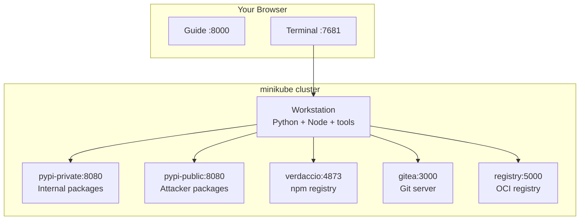

# Getting Started

## Connecting to the Lab Environment

All labs run inside a Kubernetes cluster on your machine. To start working:

```bash
# Connect to the workstation
./weaklink shell
```

You are now inside the lab workstation. All registries, Git servers, and tools are pre-configured and reachable by DNS name. You do not need to install anything else.

### Workstation Terminal

The terminal below connects directly to your workstation. You can run all lab commands here without leaving the browser.

<div class="terminal-embed">
  <iframe src="http://localhost:7681" title="WeakLink Workstation Terminal"></iframe>
</div>

## Architecture



### Available Services

From inside the workstation, these services are reachable:

| Service | Address | Purpose |
|---------|---------|---------|
| Private PyPI | `pypi-private:8080` | Corporate/private Python package registry |
| Public PyPI | `pypi-public:8080` | Simulated public PyPI (attacker-controlled packages) |
| Verdaccio | `verdaccio:4873` | Local npm registry |
| Gitea | `gitea:3000` | Git hosting (like GitHub) |
| Container Registry | `registry:5000` | Local Docker/OCI image registry |

### Starting and Verifying Labs

Each lab is started automatically when you connect. To verify your work after completing a lab:

```bash
# Run from OUTSIDE the workstation (your host terminal)
weaklink verify <lab-id>
```

For example: `weaklink verify 1.2` to verify the Dependency Confusion lab.

---

## The Three-Phase Structure

Every lab follows the same progression:

<div class="phase-flow" markdown>
  <span class="phase-step understand">1. Understand</span>
  <span class="arrow">&rarr;</span>
  <span class="phase-step break">2. Break</span>
  <span class="arrow">&rarr;</span>
  <span class="phase-step defend">3. Defend</span>
</div>

### Phase 1: Understand

<span class="phase-badge understand">UNDERSTAND</span>

Learn how the technology works under normal conditions. Explore configuration files, run standard commands, and see how legitimate packages flow through the system.

**You can't attack what you don't understand.** This phase builds the foundation for the exploit that follows.

### Phase 2: Break

<span class="phase-badge break">BREAK</span>

Execute a real supply chain attack in the lab environment. You will compromise systems using the same techniques used in real-world incidents like SolarWinds, event-stream, and Codecov.

**This is not a simulation.** The attacks are real. They just run against local, isolated infrastructure.

### Phase 3: Defend

<span class="phase-badge defend">DEFEND</span>

Build the defenses that stop the attack you just performed. Configure branch protection, enable hash verification, pin digests, set up lockfile integrity checks.

**Every defense is directly mapped to the attack.** You know exactly what it stops because you did the attack yourself.

---

## Recommended Path

If you are new to supply chain security, follow the tiers in order:

1. **Tier 0: Foundations.** Understand Git, package managers, and containers before attacking them
2. **Tier 1: Package Security.** The most common real-world attack surface
3. **Tier 2+: Advanced.** Build pipelines, container supply chains, artifact integrity, and much more

If you already have experience, jump directly to the tier that matches your interest. Each lab lists its prerequisites at the top.

---

## Tips

- **Read the output.** When a command fails or produces unexpected results, that is often the point of the exercise.
- **Don't skip Phase 1.** The "Understand" phase teaches you what normal looks like, which makes the attack in Phase 2 much more impactful.
- **Take notes.** Each lab ends with a summary table. Use it as a reference when hardening your own systems.
- **Verify your work.** Run `weaklink verify <lab-id>` after each lab to confirm you completed all phases.
