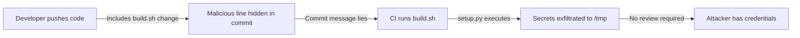

# Lab 0.1: How Version Control Works

  Understand: ~7 min | Break: ~7 min | Defend: ~6 min | Detect: ~5 min
  Beginner
  Prerequisites: None

  Overview
  ›
  <a href="understand/" class="phase-step upcoming">Understand</a>
  ›
  <a href="break/" class="phase-step upcoming">Break</a>
  ›
  <a href="defend/" class="phase-step upcoming">Defend</a>
  ›
  <a href="detect/" class="phase-step upcoming">Detect</a>

Version control (Git) is the foundation of every software supply chain. Every piece of code, configuration change, and build script lives in a Git repository. Compromise what goes into a repo and you control what gets built and deployed.

### Attack Flow

## Environment

| Service     | Address                             |
|-------------|-------------------------------------|
| Gitea UI    | `gitea:3000`                        |
| Login       | `weaklink` / `weaklink`     |
| Repository  | `weaklink/web-app`                  |
