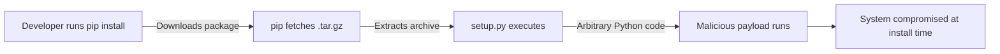

# Lab 0.2: How Package Managers Work

<div class="lab-meta">
  <span>~20 min hands-on | ~5 min reference</span>
  <span class="difficulty beginner">Beginner</span>
  <span>Prerequisites: <a href="0.1-version-control.md">Lab 0.1</a></span>
</div>

Every modern application is built from dozens or hundreds of third-party packages. When you run `pip install`, you download and execute code written by strangers. Package managers make this convenient, but convenience is the enemy of security.

### Attack Flow



---

## Environment

| Service       | Address                     |
|---------------|-----------------------------|
| Local PyPI    | `pypi-private:8080`         |
| PyPI browser  | `pypi-private:8080/simple/` |

## Connect to the Workstation

```bash
./weaklink shell
```

You are now inside the lab workstation. All commands below run here.

---

???+ info "Phase 1: UNDERSTAND. How pip install Works"

### Step 1: Browse the local package server

```bash
curl -s http://pypi-private:8080/simple/ | grep -o 'href="[^"]*"'
```

You should see links for `safe-utils` and `malicious-utils`.

### Step 2: Install a safe package

```bash
pip install --index-url http://pypi-private:8080/simple/ --trusted-host pypi-private safe-utils
```

pip downloaded `safe-utils` as a `.tar.gz`, extracted it, and ran `setup.py install`.

### Step 3: Use the package

```bash
python -c "from safe_utils import greet; print(greet('Security Analyst'))"
```

### Step 4: Download and inspect without installing

```bash
mkdir -p /workspace/inspect
pip download --index-url http://pypi-private:8080/simple/ --trusted-host pypi-private \
    --no-deps -d /workspace/inspect safe-utils
cd /workspace/inspect
tar xzf safe-utils-*.tar.gz
cat safe-utils-1.0.0/setup.py
```

This is the file pip executes when installing. For `safe-utils`, it just defines metadata. **But setup.py is a full Python script. It can do anything.**

---

???+ warning "Phase 2: BREAK. Malicious Code in setup.py"

### Step 1: First, verify /tmp/pwned does not exist

```bash
ls -la /tmp/pwned 2>&1
```

You should see "No such file or directory".

### Step 2: Look at the malicious package (before installing)

```bash
cd /workspace/inspect
pip download --index-url http://pypi-private:8080/simple/ --trusted-host pypi-private \
    --no-deps -d . malicious-utils
tar xzf malicious-utils-*.tar.gz
cat malicious-utils-1.0.0/setup.py
```

The `setup.py` contains normal package setup code plus **a malicious payload** that writes to `/tmp/pwned`. In a real attack, this could steal API keys, install backdoors, or exfiltrate source code. The malicious code runs **during installation**, before the package is even usable.

### Step 3: Install the malicious package

```bash
pip install --index-url http://pypi-private:8080/simple/ --trusted-host pypi-private malicious-utils
```

In a real attack, there would be no warning. The malicious code would run silently.

### Step 4: Check the damage

```bash
cat /tmp/pwned
```

You should see:
```
You have been compromised!
This code ran as user: root
...
```

**The package's `setup.py` ran arbitrary code the moment you ran `pip install`.** You didn't import it. You didn't run it. Just installing it was enough.

**Checkpoint:** You should now have `/tmp/pwned` containing the compromise proof, and `malicious-utils` installed in your Python environment.

### Step 5: Think about scale

On the real PyPI (pypi.org), there are over 500,000 packages. Any one of them could have a malicious `setup.py`. Typosquatting attacks ([Lab 1.3](../tier-1/1.3-typosquatting.md)) create packages with names like `reqeusts` instead of `requests`, hoping people make typos.

---

???+ success "Phase 3: DEFEND. Hash Verification with --require-hashes"

### Step 1: Clean up from the attack

```bash
pip uninstall -y malicious-utils safe-utils 2>/dev/null
rm -f /tmp/pwned
```

### Step 2: Get the hash of the safe package

```bash
SAFE_HASH=$(pip hash /workspace/inspect/safe-utils-1.0.0.tar.gz 2>/dev/null | grep sha256 | cut -d: -f2)
echo "Safe package hash: sha256:${SAFE_HASH}"
```

If the above fails (older pip):

```bash
SAFE_HASH=$(python -c "
import hashlib, glob
f = glob.glob('/workspace/inspect/safe-utils-*.tar.gz')[0]
print(hashlib.sha256(open(f,'rb').read()).hexdigest())
")
echo "Safe package hash: sha256:${SAFE_HASH}"
```

### Step 3: Create a requirements file with hashes

```bash
cat > /workspace/requirements.txt << EOF
safe-utils==1.0.0 --hash=sha256:${SAFE_HASH}
EOF

cat /workspace/requirements.txt
```

This tells pip: "Only install `safe-utils` version 1.0.0 if its hash matches exactly."

### Step 4: Install with hash verification

```bash
pip install --require-hashes \
    --index-url http://pypi-private:8080/simple/ --trusted-host pypi-private \
    -r /workspace/requirements.txt
```

### Step 5: Try to install the malicious package with wrong hash

```bash
cat > /workspace/requirements-evil.txt << EOF
malicious-utils==1.0.0 --hash=sha256:${SAFE_HASH}
EOF

pip install --require-hashes \
    --index-url http://pypi-private:8080/simple/ --trusted-host pypi-private \
    -r /workspace/requirements-evil.txt 2>&1 || true
```

pip **refuses** because the hash does not match.

### Step 6: Verify the defense worked

```bash
ls -la /tmp/pwned 2>&1
```

"No such file or directory". The malicious `setup.py` never ran.

### Step 7: Verify the lab

Run the verification from your host terminal (outside the workstation):

```bash
weaklink verify 0.2
```

---

???+ danger "Phase 4: DETECT. Spotting Malicious Package Installations"

    **MITRE ATT&CK:** T1195.002 (Compromise Software Supply Chain), T1059.006 (Python), T1204.002 (Malicious File)

What to look for:

- Packages installed that are not in `requirements.txt`
- Package names similar to popular libraries (typosquatting: `reqeusts`, `colorsama`)
- File creation in `/tmp/`, `/dev/shm/`, or home directories during `pip install`
- Outbound HTTP/DNS requests during installation (should only contact the package index)
- Child processes of `setup.py` that spawn shells or open network sockets

| Technique | ID | What to Monitor |
|-----------|----|-----------------|
| Compromise Software Supply Chain | T1195.002 | Unexpected packages, typosquatting names |
| Python Execution | T1059.006 | setup.py spawning shells, writing outside site-packages |
| Malicious File | T1204.002 | File writes to /tmp during install, cron/systemd creation |

??? tip "SOC Relevance"

    When you see **"Unexpected outbound connection during build"** or **"Process spawned by pip/setup.py writing to /tmp"**: a `pip install` ran a package with a malicious `setup.py`. The payload executed immediately during installation with the full privileges of the installing user (often root in CI containers). Correlate the timestamp with pip install logs to identify which package triggered it, then inspect that package's `setup.py`.

??? example "CI Integration"

    Add this GitHub Actions workflow to enforce hash-verified installs in CI. Save as `.github/workflows/dependency-check.yml`:

    ```yaml
    name: Dependency Hash Verification

    on:
      pull_request:
        paths:
          - 'requirements*.txt'
          - 'setup.py'
          - 'setup.cfg'
          - 'pyproject.toml'
      push:
        branches: [main]

    permissions:
      contents: read

    jobs:
      verify-hashes:
        runs-on: ubuntu-latest
        steps:
          - uses: actions/checkout@v4

          - uses: actions/setup-python@v5
            with:
              python-version: '3.11'

          - name: Verify requirements.txt has hashes
            run: |
              if [ -f requirements.txt ]; then
                if ! grep -q -- '--hash=sha256:' requirements.txt; then
                  echo "::error::requirements.txt must use --hash=sha256: for all packages."
                  echo "Generate hashes with: pip-compile --generate-hashes requirements.in"
                  exit 1
                fi
              fi

          - name: Install with --require-hashes
            run: |
              pip install --require-hashes -r requirements.txt
            env:
              PIP_NO_CACHE_DIR: "1"

          - name: Verify no unexpected packages
            run: |
              # List installed packages and compare to requirements
              pip freeze > /tmp/installed.txt
              echo "Installed packages:"
              cat /tmp/installed.txt
    ```

---

## What You Learned

- **`pip install` runs `setup.py`, which is arbitrary Python.** Installation equals code execution with the installing user's full privileges.
- **Hash checking pins exact content.** `--require-hashes` ensures you get the exact bytes you verified, not a tampered version.
- **Public registries are trusted by default but not verified.** You must explicitly verify what you install before trusting it.

## Further Reading

- [pip install --require-hashes documentation](https://pip.pypa.io/en/stable/topics/secure-installs/)
- [PyPI Malware: What You Need to Know](https://blog.phylum.io/pypi-malware/)
- [OWASP Dependency Check](https://owasp.org/www-project-dependency-check/)
