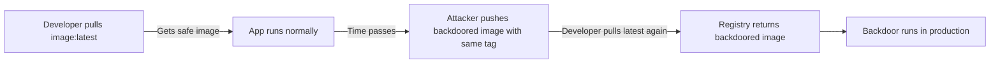

# Lab 0.3: How Containers Work

<div class="lab-meta">
  <span>~25 min hands-on | ~5 min reference</span>
  <span class="difficulty beginner">Beginner</span>
  <span>Prerequisites: <a href="../0.2-package-managers/">Lab 0.2</a></span>
</div>

Containers are how modern software is packaged and deployed. When you pull a Docker image, you trust that it contains what you expect. But container tags like `latest` are mutable. They can be changed to point to a completely different image at any time.

### Attack Flow



---

## Environment

| Service        | Address              |
|----------------|----------------------|
| Local Registry | `registry:5000`      |

## Connect to the Workstation

```bash
./weaklink shell
```

You are now inside the lab workstation. All commands below run here.

---

???+ info "Phase 1: UNDERSTAND. Building and Inspecting Container Images"

### Step 1: Look at the Dockerfile

```bash
cat /lab/src/app/Dockerfile
```

A Dockerfile is a recipe for building a container image. Each line is an instruction:

| Instruction | What It Does |
|-------------|--------------|
| `FROM python:3.11-slim` | Start from an existing image (the "base image") |
| `WORKDIR /app` | Set the working directory inside the container |
| `COPY app.py .` | Copy a file from your machine into the image |
| `EXPOSE 8000` | Document which port the app uses |
| `CMD ["python", "app.py"]` | Define what runs when the container starts |

### Step 2: Build the image

```bash
cd /lab/src/app
docker build -t my-webapp:v1 .
```

Each Dockerfile instruction creates a **layer**. Layers stack to form the final image.

### Step 3: See the layers

```bash
docker history my-webapp:v1
```

### Step 4: Run the container

```bash
docker run -d --name test-app -p 8000:8000 my-webapp:v1
curl -s http://localhost:8000/health | jq .
```

You should see `"backdoor": false`. Stop it:

```bash
docker stop test-app && docker rm test-app
```

### Step 5: Check the local registry

```bash
curl -s http://registry:5000/v2/webapp/tags/list | jq .
```

Tags `latest` and `1.0.0` both point to the same safe image.

### Step 6: Pull and note the digest

```bash
docker pull registry:5000/webapp:latest
cat /workspace/safe-digest.txt
```

**This digest matters in Phase 3.**

---

???+ warning "Phase 2: BREAK. Mutable Tags and Image Substitution"

### Step 1: Verify the current image is safe

```bash
docker run -d --name check-safe -p 8001:8000 registry:5000/webapp:latest
sleep 2
curl -s http://localhost:8001/health | jq .
docker stop check-safe && docker rm check-safe
```

The `backdoor` field should be `false`.

### Step 2: Simulate an attacker overwriting the tag

An attacker with registry or CI/CD access builds a backdoored image and pushes it with the same `latest` tag:

```bash
cd /lab/src/backdoor
docker build -t registry:5000/webapp:latest .
docker push registry:5000/webapp:latest
```

The `latest` tag now points to the **backdoored image**. The registry accepted it without complaint.

### Step 3: Pull "latest" again. you get the backdoor

```bash
docker rmi registry:5000/webapp:latest 2>/dev/null
docker pull registry:5000/webapp:latest
```

### Step 4: Run it and see the backdoor

```bash
docker run -d --name check-backdoor -p 8001:8000 registry:5000/webapp:latest
sleep 2
curl -s http://localhost:8001/health | jq .
```

The `backdoor` field is now `true`. The backdoored image also has a hidden `/debug` endpoint that leaks environment variables:

```bash
curl -s http://localhost:8001/debug | jq .
```

```bash
docker exec check-backdoor cat /tmp/backdoor-active
```

**The container looks identical from the outside** (same homepage, same version string) but runs completely different code.

**Checkpoint:** You should now have the backdoored image running with `backdoor: true` in `/health` and a `/debug` endpoint leaking environment variables. The `latest` tag in the registry points to the attacker's image.

Clean up:

```bash
docker stop check-backdoor && docker rm check-backdoor
```

### Step 5: Notice the tag `1.0.0` is still safe

```bash
docker pull registry:5000/webapp:1.0.0
docker run -d --name check-pinned -p 8001:8000 registry:5000/webapp:1.0.0
sleep 2
curl -s http://localhost:8001/health | jq .
docker stop check-pinned && docker rm check-pinned
```

The `backdoor` field is `false`. The attacker only overwrote `latest`, not `1.0.0`. But version tags are also mutable. **The only immutable reference is the digest.**

---

???+ success "Phase 3: DEFEND. Digest Pinning"

### Step 1: Get the safe image's digest

```bash
SAFE_DIGEST=$(cat /workspace/safe-digest.txt)
echo "Safe image digest: ${SAFE_DIGEST}"
```

### Step 2: Pull by digest

```bash
docker pull "registry:5000/webapp@${SAFE_DIGEST}"
```

The digest is immutable. It does not matter that `latest` now points to the backdoored image.

### Step 3: Verify it is safe

```bash
docker run -d --name check-digest -p 8001:8000 "registry:5000/webapp@${SAFE_DIGEST}"
sleep 2
curl -s http://localhost:8001/health | jq .
docker stop check-digest && docker rm check-digest
```

`backdoor: false`. Digest pinning works.

### Step 4: Create a Dockerfile with digest pinning

```bash
cat > /workspace/Dockerfile.defended << EOF
# DEFENDED: Pinned by digest, not by tag.
# This guarantees we always get the exact image we verified,
# even if someone overwrites the tag in the registry.
FROM registry:5000/webapp@${SAFE_DIGEST}

# Any additional customization goes here
LABEL security.pinned="true"
LABEL security.verified-digest="${SAFE_DIGEST}"
EOF

cat /workspace/Dockerfile.defended
```

### Step 5: Build and test the defended image

```bash
docker build -t my-defended-app:v1 -f /workspace/Dockerfile.defended /workspace
docker run -d --name check-defended -p 8001:8000 my-defended-app:v1
sleep 2
curl -s http://localhost:8001/health | jq .
docker stop check-defended && docker rm check-defended
```

`backdoor: false`. The Dockerfile is pinned to the safe digest regardless of what `latest` points to.

### Step 6: Verify the lab

Run the verification from your host terminal (outside the workstation):

```bash
weaklink verify 0.3
```

---

???+ danger "Phase 4: DETECT. Spotting Container Image Tampering"

    **MITRE ATT&CK:** T1195.002 (Compromise Software Supply Chain), T1525 (Implant Internal Image), T1610 (Deploy Container)

What to look for:

- Image pushes that overwrite existing tags (especially `latest`, `stable`, `production`)
- Pushes from unusual IPs, service accounts, or outside CI/CD pipelines
- Containers making outbound connections to unexpected destinations
- Unexpected `/debug`, `/admin`, `/shell`, or `/env` endpoints on container ports
- Image pull events where the digest differs from last known digest for that tag

| Technique | ID | What to Monitor |
|-----------|----|-----------------|
| Compromise Software Supply Chain | T1195.002 | Tag overwrites, digest changes, pushes outside deploy windows |
| Implant Internal Image | T1525 | New layers added, unexpected base image changes |
| Deploy Container | T1610 | Containers with no digest pin, unexpected child processes |

??? tip "SOC Relevance"

    When you see **"Container image digest changed for tag"** or **"Container process spawned unexpected child process"**: someone pushed a new image to your registry using the same tag, replacing the legitimate image. Every subsequent deployment or pod restart pulled the attacker's image. The backdoored container looks identical from the outside but contains additional endpoints, reverse shells, or exfiltration logic. Compare the current image digest against your known-good digest and inspect layers with `docker history` and `docker inspect`.

??? example "CI Integration"

    Add this GitHub Actions workflow to enforce digest pinning in Dockerfiles. Save as `.github/workflows/dockerfile-lint.yml`:

    ```yaml
    name: Dockerfile Digest Pinning Check

    on:
      pull_request:
        paths:
          - '**/Dockerfile*'
          - '**/docker-compose*.yml'
      push:
        branches: [main]
        paths:
          - '**/Dockerfile*'
          - '**/docker-compose*.yml'

    permissions:
      contents: read

    jobs:
      check-digest-pinning:
        runs-on: ubuntu-latest
        steps:
          - uses: actions/checkout@v4

          - name: Check Dockerfiles for tag-only references
            run: |
              EXIT_CODE=0
              echo "Scanning for Dockerfiles..."

              find . -name 'Dockerfile*' -type f | while read -r dockerfile; do
                echo "Checking: ${dockerfile}"

                # Find FROM lines that use tags instead of digests
                UNPINNED=$(grep -n '^FROM ' "$dockerfile" | grep -v '@sha256:' | grep -v 'scratch' || true)

                if [ -n "$UNPINNED" ]; then
                  echo "::error file=${dockerfile}::Found unpinned base image(s):"
                  echo "$UNPINNED"
                  echo ""
                  echo "Fix: Replace tag references with digest pins."
                  echo "  Before: FROM python:3.11-slim"
                  echo "  After:  FROM python:3.11-slim@sha256:abc123..."
                  echo ""
                  echo "Get the digest with: docker pull python:3.11-slim && docker inspect --format='{{index .RepoDigests 0}}' python:3.11-slim"
                  EXIT_CODE=1
                fi
              done

              exit $EXIT_CODE

          - name: Check for :latest tags
            run: |
              LATEST_REFS=$(grep -rn ':latest' --include='Dockerfile*' --include='docker-compose*.yml' . || true)
              if [ -n "$LATEST_REFS" ]; then
                echo "::warning::Found ':latest' tag references (these are mutable and unsafe):"
                echo "$LATEST_REFS"
              fi
    ```

---

## What You Learned

- **Tags are mutable pointers.** `latest`, `v1.0`, even `stable` can be overwritten at any time without warning.
- **Registries accept overwrites silently.** Pushing a new image with the same tag replaces the old one.
- **Digest pinning is the defense.** Using `@sha256:...` in Dockerfiles and deployments prevents tag substitution attacks because digests are immutable.

## Further Reading

- [Docker Image Digests Explained](https://docs.docker.com/engine/reference/commandline/pull/#pull-an-image-by-digest)
- [Why You Should Pin Docker Image Digests](https://blog.chainguard.dev/pin-your-container-image-digests/)
- [OCI Distribution Specification](https://github.com/opencontainers/distribution-spec)
