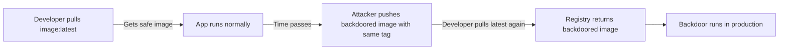

# Lab 0.3: How Containers Work

  Understand: ~8 min | Break: ~8 min | Defend: ~9 min | Detect: ~5 min
  Beginner
  Prerequisites: <a href="../../tier-0/0.2-package-managers/">Lab 0.2</a>

  Overview
  ›
  <a href="understand/" class="phase-step upcoming">Understand</a>
  ›
  <a href="break/" class="phase-step upcoming">Break</a>
  ›
  <a href="defend/" class="phase-step upcoming">Defend</a>
  ›
  <a href="detect/" class="phase-step upcoming">Detect</a>

Containers are how modern software is packaged and deployed. When you pull a Docker image, you trust that it contains what you expect. But container tags like `latest` are mutable. They can be changed to point to a completely different image at any time.

### Attack Flow

## Environment

| Service        | Address              |
|----------------|----------------------|
| Local Registry | `registry:5000`      |

> **Related Labs**
>
> - **Prerequisite:** [0.2 How Package Managers Work](../0.2-package-managers/index.md) — Container images bundle application code and its dependencies
> - **Next:** [3.1 Container Image Internals](../../tier-3/3.1-image-internals/index.md) — Deep dive into how container images are structured internally
> - **Next:** [0.5 Artifacts & Registries](../0.5-artifacts-registries/index.md) — Registries store container images alongside other artifacts
> - **See also:** [3.3 Base Image Poisoning](../../tier-3/3.3-base-image-poisoning/index.md) — What happens when someone poisons the base image you build on
