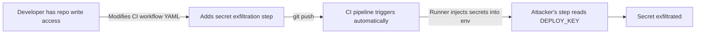

# Lab 0.4: How CI/CD Works

<div class="lab-meta">
  <span>~25 min hands-on | ~5 min reference</span>
  <span class="difficulty beginner">Beginner</span>
  <span>Prerequisites: <a href="../0.1-version-control/">Lab 0.1</a></span>
</div>

Modern software is built, tested, and deployed automatically by CI/CD pipelines. This lab covers how pipelines run, how they access secrets, and why they are a massive target for attackers.

### Attack Flow



---

## Environment

This lab uses Gitea with **Gitea Actions** (fully compatible with GitHub Actions syntax). When you push code, Gitea checks `.gitea/workflows/` for YAML configs matching the event and spins up a **Runner** to execute the workflow steps.

---

???+ info "Phase 1: UNDERSTAND. Exploring the Pipeline"

1. Access the Workstation terminal and switch to the lab directory:
   ```bash
   cd /workspace/ci-demo
   ```

2. Inspect the CI workflow configuration:
   ```bash
   cat .gitea/workflows/ci.yml
   ```

3. The critical sections:
   * `on: push` triggers on every push
   * `runs-on: ubuntu-latest` sets the execution environment
   * `env: DEPLOY_KEY: ${{ secrets.DEPLOY_KEY }}` injects a secret into the environment

4. Make a benign change, commit, and push:
   ```bash
   echo "# A benign comment" >> app.py
   git add app.py
   git commit -m "Add comment"
   git push
   ```

5. In the Gitea web interface (http://localhost:3000), log in as `weaklink` / `weaklink`, go to the `ci-demo` repo, and click the **Actions** tab. Watch the pipeline run and succeed.

---

???+ warning "Phase 2: BREAK. Poisoning the Pipeline"

    Because the CI configuration lives *in the repository*, anyone with push access can change what the pipeline does. This is **Poisoned Pipeline Execution (PPE)**.

1. Edit `.gitea/workflows/ci.yml`. Add a step to exfiltrate the secret (in reality, an attacker would `curl` it to their server):

   ```yaml
         - name: Exfiltrate secrets
           env:
             DEPLOY_KEY: ${{ secrets.DEPLOY_KEY }}
           run: |
             echo "The secret is: $DEPLOY_KEY" > /tmp/stolen-secret.txt
   ```
   *Place this step right after "Run tests". Keep the indentation aligned.*

2. Commit and push:
   ```bash
   git add .gitea/workflows/ci.yml
   git commit -m "Update pipeline"
   git push
   ```

3. Watch the Action run in Gitea. Once it finishes, verify the secret was stolen from the workstation.

**Checkpoint:** You should now have a modified CI workflow that exfiltrates `DEPLOY_KEY` to `/tmp/stolen-secret.txt` on every push.

---

???+ success "Phase 3: DEFEND. Securing the CI/CD Pipeline"

1. **Restrict Pipeline Modifications:** In Gitea, navigate to Repo Settings -> Branches. Enable branch protection for `main`. Require pull request reviews before merging. This stops attackers from directly pushing modified `.gitea/workflows/` files.

2. **Use Ephemeral Credentials:** Never store static, long-lived secrets (like `DEPLOY_KEY`) in CI. Use OpenID Connect (OIDC) to generate short-lived, scoped tokens dynamically during the build.

3. Revert your malicious commit:
   ```bash
   git revert HEAD --no-edit
   git push
   ```

---

??? danger "Phase 4: DETECT. Catching Pipeline Modifications"

    **MITRE ATT&CK:** T1195.002 (Compromise Software Supply Chain), T1059.004 (Unix Shell), T1552.001 (Credentials in Files)

What to look for:

- Commits modifying `.gitea/workflows/`, `.github/workflows/`, `Jenkinsfile`, or other CI configs
- Pipeline steps that access secrets not required by the build
- Outbound network connections from CI runners during build
- New or modified pipeline steps added outside normal PR review

| Technique | ID | What to Monitor |
|-----------|----|-----------------|
| Compromise Software Supply Chain | T1195.002 | CI config changes, workflow file modifications |
| Unix Shell | T1059.004 | Unexpected shell commands in pipeline steps |
| Credentials in Files | T1552.001 | Secrets written to disk, echoed to logs |

---

## Verification

When you're ready, run the verification script:

```bash
weaklink verify 0.4
```

## What You Learned

- **CI/CD pipelines execute whatever is in the workflow file.** Anyone with push access to the repository can modify the pipeline behavior.
- **Secrets are injected into the runner environment.** A malicious pipeline step can read and exfiltrate them.
- **Branch protection and ephemeral credentials** are the primary defenses against Poisoned Pipeline Execution.

## Further Reading

- [OWASP Top 10 CI/CD Security Risks](https://owasp.org/www-project-top-10-ci-cd-security-risks/)
- [Cider Security: Top 10 CI/CD Risks](https://www.cidersecurity.io/top-10-cicd-security-risks/)
- [MITRE ATT&CK: T1195.002 Compromise Software Supply Chain](https://attack.mitre.org/techniques/T1195/002/)
