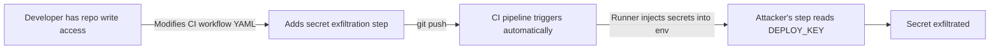

# Lab 0.4: How CI/CD Works

  ~25 min hands-on | ~5 min reference
  Beginner
  Prerequisites: <a href="../../tier-0/0.1-version-control/">Lab 0.1</a>

  Overview
  ›
  <a href="understand/" class="phase-step upcoming">Understand</a>
  ›
  <a href="break/" class="phase-step upcoming">Break</a>
  ›
  <a href="defend/" class="phase-step upcoming">Defend</a>
  ›
  <a href="detect/" class="phase-step upcoming">Detect</a>

Modern software is built, tested, and deployed automatically by CI/CD pipelines. This lab covers how pipelines run, how they access secrets, and why they are a massive target for attackers.

### Attack Flow

## Environment

This lab uses Gitea with **Gitea Actions** (fully compatible with GitHub Actions syntax). When you push code, Gitea checks `.gitea/workflows/` for YAML configs matching the event and spins up a **Runner** to execute the workflow steps.
