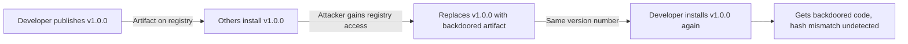

# Lab 0.5: Artifacts & Registries

<div class="lab-meta">
  <span>~25 min hands-on | ~5 min reference</span>
  <span class="difficulty beginner">Beginner</span>
  <span>Prerequisites: <a href="../0.2-package-managers/">Lab 0.2</a></span>
</div>

Once source code is built, it is packaged into an artifact (Python wheel, npm tarball, Docker image) and uploaded to a **registry**. Other developers and systems download these artifacts. Relying on version numbers without cryptographic hashes is dangerous because artifacts can be silently replaced. In 2021, attackers compromised Codecov's bash uploader artifact and replaced it with a backdoored version that exfiltrated CI environment variables for over two months before detection.

### Attack Flow



---

## Environment

| Service | Address |
|---------|---------|
| PyPI Private | `http://pypi-private:8080` |
| Verdaccio | `http://verdaccio:4873` |
| OCI Registry | `http://registry:5000` |

---

???+ info "Phase 1: UNDERSTAND. Publishing and Downloading"

1. Navigate to the demo library source code:
   ```bash
   cd /labs/tier-0-foundations/0.5-artifacts-registries/src/packages/demo-lib
   ```

2. Inspect `setup.py` and `demo_lib.py`. The version is `1.0.0`.

3. Build the artifact:
   ```bash
   python setup.py sdist
   ```

4. Publish to the private PyPI registry:
   ```bash
   pip install twine
   twine upload --repository-url http://pypi-private:8080/ dist/*
   # Enter blank or any credentials, the lab registry accepts anything.
   ```

5. Verify the package is available:
   ```bash
   curl http://pypi-private:8080/simple/demo-lib/
   ```

---

???+ warning "Phase 2: BREAK. Tampering with the Artifact"

    Registries often allow packages to be overwritten. An attacker with registry credentials can delete v1.0.0 and replace it with a malicious v1.0.0.

1. Edit `demo_lib.py`, adding a backdoor:
   ```python
   import os
   print(f"TAMPERED: running as {os.getenv('USER', 'unknown')}")
   ```

2. Rebuild the artifact:
   ```bash
   python setup.py sdist
   ```

3. Re-upload to the registry:
   ```bash
   twine upload --repository-url http://pypi-private:8080/ dist/* --skip-existing
   # Our simple lab registry actually allows overwriting. Pypiserver can be configured to overwrite.
   # Let's forcefully push it.
   ```

4. Anyone performing a clean `pip install demo-lib==1.0.0` now gets your malicious code despite the version number being identical.

**Checkpoint:** You should now have a tampered `demo-lib` 1.0.0 in the registry that prints the `TAMPERED` message on import, while the version number is unchanged.

---

???+ success "Phase 3: DEFEND. Using Cryptographic Hashes"

    An artifact's contents can change even if the version number stays the same. Cryptographic checksums verify integrity.

1. Get the hash of the *good* artifact:
   ```bash
   /labs/tier-0-foundations/0.5-artifacts-registries/src/scripts/verify-integrity.sh
   ```

2. Enforce this hash in `requirements.txt`:
   ```text
   demo-lib==1.0.0 --hash=sha256:e3b0c44298fc1c149afbf4c8996fb92427ae41e4649b934ca495991b7852b855
   ```

3. Running `pip install -r requirements.txt` with `--require-hashes` will reject the tampered file, preventing the attack.

---

??? danger "Phase 4: DETECT. Catching Hash Mismatches"

    **MITRE ATT&CK:** T1195.002 (Compromise Software Supply Chain), T1195.001 (Compromise Software Dependencies)

What to look for:

- Hash mismatches during `pip install --require-hashes`
- Same version number with different checksums across builds
- Registry audit logs showing re-uploads of existing versions
- Artifact downloads from unexpected registry URLs

| Technique | ID | What to Monitor |
|-----------|----|-----------------|
| Compromise Software Supply Chain | T1195.002 | Version re-uploads, hash mismatches |
| Compromise Software Dependencies | T1195.001 | Unexpected registry sources, unsigned artifacts |

---

## Verification

When you're ready, run the verification script:

```bash
weaklink verify 0.5
```

## What You Learned

- **Artifacts can be silently replaced.** A version number alone does not guarantee the same content across installs.
- **Cryptographic hashes are the defense.** Pinning `--hash=sha256:...` in requirements ensures pip rejects tampered artifacts.
- **Registry access controls matter.** Without upload restrictions, anyone with credentials can overwrite published packages.

## Further Reading

- [pip documentation: Hash-checking mode](https://pip.pypa.io/en/stable/topics/secure-installs/)
- [PEP 503: Simple Repository API](https://peps.python.org/pep-0503/)
- [Codecov Supply Chain Attack (2021)](https://about.codecov.io/security-update/)
