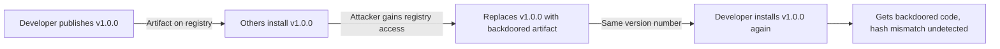

# Lab 0.5: Artifacts & Registries

  Understand: ~8 min | Break: ~8 min | Defend: ~9 min | Detect: ~5 min
  Beginner
  Prerequisites: <a href="../../tier-0/0.2-package-managers/">Lab 0.2</a>

  Overview
  ›
  <a href="understand/" class="phase-step upcoming">Understand</a>
  ›
  <a href="break/" class="phase-step upcoming">Break</a>
  ›
  <a href="defend/" class="phase-step upcoming">Defend</a>
  ›
  <a href="detect/" class="phase-step upcoming">Detect</a>

Once source code is built, it is packaged into an artifact (Python wheel, npm tarball, Docker image) and uploaded to a **registry**. Other developers and systems download these artifacts. Relying on version numbers without cryptographic hashes is dangerous because artifacts can be silently replaced. In 2021, attackers compromised Codecov's bash uploader artifact and replaced it with a backdoored version that exfiltrated CI environment variables for over two months before detection.

### Attack Flow

## Environment

| Service | Address |
|---------|---------|
| PyPI Private | `http://pypi-private:8080` |
| Verdaccio | `http://verdaccio:4873` |
| OCI Registry | `http://registry:5000` |

!!! tip "Related Labs"
    - **Prerequisite:** [0.2 How Package Managers Work](../0.2-package-managers/index.md) — Registries host the packages that package managers install
    - **Prerequisite:** [0.3 How Containers Work](../0.3-containers/index.md) — Container registries store the images you build
    - **Next:** [3.4 Registry Confusion](../../tier-3/3.4-registry-confusion/index.md) — What happens when registry resolution is ambiguous
    - **See also:** [1.2 Dependency Confusion](../../tier-1/1.2-dependency-confusion/index.md) — Dependency confusion exploits how registries are prioritized
