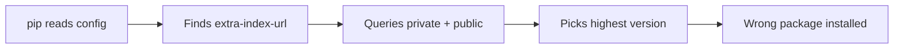

# Lab 1.1: How Dependency Resolution Works

  ~25 min hands-on | ~10 min reference
  Intermediate
  Prerequisites: <a href="../../tier-0/0.2-package-managers/">Lab 0.2</a>

  Overview
  ›
  <a href="understand/" class="phase-step upcoming">Understand</a>
  ›
  <a href="break/" class="phase-step upcoming">Break</a>
  ›
  <a href="defend/" class="phase-step upcoming">Defend</a>
  ›
  <a href="detect/" class="phase-step upcoming">Detect</a>

When you run `pip install`, pip resolves an entire dependency tree. **Every supply chain attack exploits something about this process.** Understanding how pip resolves versions across registries is prerequisite to understanding why Alex Birsan's dependency confusion attack affected Microsoft, Apple, and PayPal.

### Attack Flow

## Environment

| Service | Address | Description |
|---------|---------|-------------|
| Private PyPI | `pypi-private:8080` | Corporate internal PyPI server with legitimate packages |
| Public PyPI | `pypi-public:8080` | Simulated public PyPI (starts with a higher-version fake package) |
