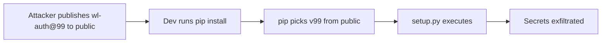

# Lab 1.2: Dependency Confusion

<div class="lab-meta">
  <span>~25 min hands-on | ~10 min reference</span>
  <span class="difficulty intermediate">Intermediate</span>
  <span>Prerequisites: <a href="1.1-dependency-resolution.md">Lab 1.1</a></span>
</div>

In February 2021, Alex Birsan published a technique that let him execute code inside Microsoft, Apple, PayPal, Tesla, Uber, and dozens more. He published packages to public PyPI with the same names as their internal packages. Pip picked the higher version, ran the attacker's `setup.py`, and the company was compromised.

In this lab, you are a developer at WeakLink Corp. You will see the attack happen, then defend against it.

### Attack Flow



---

## Environment

| Service | Address | Description |
|---------|---------|-------------|
| Private PyPI | `pypi-private:8080` | WeakLink Corp private PyPI server with `wl-auth==1.0.0` |
| Public PyPI | `pypi-public:8080` | Simulated public PyPI with attacker's `wl-auth==99.0.0` |

## Connect to the Workstation

```bash
./weaklink shell
```

---

???+ info "Phase 1: UNDERSTAND. The Corporate Package Setup"

### Step 1: Explore the corporate app

```bash
cat /app/requirements.txt
cat /app/app.py
```

The app depends on `wl-auth==1.0.0`, an internal authentication library.

### Step 2: Check the private registry

```bash
curl -s http://pypi-private:8080/simple/ | grep -o 'href="[^"]*"'
curl -s http://pypi-private:8080/simple/wl-auth/
```

### Step 3: Check the public registry

```bash
curl -s http://pypi-public:8080/simple/ | grep -o 'href="[^"]*"'
curl -s http://pypi-public:8080/simple/wl-auth/
```

`wl-auth` version 99.0.0 on the public registry. The attacker found the internal package name (from a leaked `requirements.txt`, a job posting, or a public repo) and published a higher version.

### Step 4: Check pip configuration

```bash
cat /etc/pip.conf
```

`extra-index-url` points to the public registry. Pip checks **both** registries and picks the highest version.

### Step 5: Install and test (safe for now)

The exact version pin (`==1.0.0`) protects you:

```bash
pip install -r requirements.txt
python app.py
```

### Step 6: Verify no compromise

```bash
bash /app/scripts/check-compromise.sh
```

Clean. But the danger is lurking.

---

???+ warning "Phase 2: BREAK. Dependency Confusion Attack"

### Step 1: Simulate a common developer action

A developer loosens the version pin (to get the "latest" version, or during a dependency upgrade):

```bash
sed -i 's/wl-auth==1.0.0/wl-auth/' requirements.txt
cat requirements.txt
```

### Step 2: Reinstall

```bash
pip install --force-reinstall -r requirements.txt
```

Pip finds version 99.0.0 on the public registry and installs it.

**The malicious `setup.py` executes during installation.** Code runs before you ever import the package.

### Step 3: Check for compromise

```bash
cat /tmp/dependency-confusion-pwned
```

COMPROMISED. The malicious `setup.py` wrote this file during `pip install`. In a real attack, this exfiltrates environment variables, downloads a reverse shell, or sends source code to the attacker.

### Step 4: Run the app to see runtime impact

```bash
python app.py
```

The malicious package replaces the `authenticate()` function with one that logs credentials.

### Step 5: Verify with the check script

```bash
bash /app/scripts/check-compromise.sh
```

### Step 6: Understand why it worked

```bash
pip show wl-auth
```

The attack worked because:

1. `--extra-index-url` makes pip search **both** registries
2. Pip picks the **highest version** across all sources
3. `setup.py` runs arbitrary code **during installation**
4. The damage is done before you can detect it

**Checkpoint:** You should now have `wl-auth==99.0.0` installed, `/tmp/dependency-confusion-pwned` present, and the app reporting compromise.

---

???+ success "Phase 3: DEFEND. Eliminating the Confusion"

### Fix 1: Use --index-url (not --extra-index-url)

Clean up the compromise marker from Phase 2:

```bash
rm -f /tmp/dependency-confusion-pwned
```

Look at the current (vulnerable) pip config:

```bash
cat /etc/pip.conf
```

The problem: `extra-index-url` tells pip to search **both** the private registry and the public one. Pip picks whichever has the highest version, which is how the attacker won.

Now replace it with the safe config that uses `index-url` instead:

```bash
cp /etc/pip-configs/pip.conf.safe /etc/pip.conf
cat /etc/pip.conf
```

The difference: `index-url` (without `extra-`) makes pip search **only** the specified registry. The public registry is gone. Even if the attacker publishes `wl-auth==99.0.0` on public PyPI, pip will never see it.

### Fix 2: Restore and reinstall

```bash
echo "wl-auth==1.0.0" > requirements.txt
pip uninstall -y wl-auth
pip install -r requirements.txt
```

### Fix 3: Verify the defense

```bash
pip show wl-auth
python app.py
bash /app/scripts/check-compromise.sh
```

You should see version 1.0.0 installed and no compromise detected.

### Additional defenses

1. **`--require-hashes`**: Pin packages to SHA256 hashes. Even if an attacker publishes the same name+version, the hash won't match.
2. **Register internal names on public PyPI**: Claim the namespace with an empty `0.0.1` package.
3. **Repository manager** (Artifactory, Nexus): Proxy public PyPI and prefer private packages by name pattern.

### Step 4: Final verification

```bash
weaklink verify 1.2
```

---

??? example "CI Integration"

    **`.github/workflows/dependency-confusion-check.yml`:**

    ```yaml
    name: Dependency Confusion Prevention

    on:
      pull_request:
        paths:
          - "requirements*.txt"
          - "setup.py"
          - "setup.cfg"
          - "pyproject.toml"
          - "pip.conf"
          - ".pip/**"
      schedule:
        - cron: "0 6 * * 1"

    jobs:
      check-confusion-risk:
        runs-on: ubuntu-latest
        steps:
          - uses: actions/checkout@v4

          - name: Set up Python
            uses: actions/setup-python@v5
            with:
              python-version: "3.12"

          - name: Block extra-index-url usage
            run: |
              FOUND=0
              for f in pip.conf .pip/pip.conf setup.cfg pyproject.toml; do
                if [ -f "$f" ]; then
                  if grep -qi "extra-index-url" "$f"; then
                    echo "::error file=$f::CRITICAL: $f uses extra-index-url, which enables dependency confusion."
                    FOUND=1
                  fi
                fi
              done
              for f in requirements*.txt; do
                if [ -f "$f" ]; then
                  if grep -qi "\-\-extra-index-url" "$f"; then
                    echo "::error file=$f::CRITICAL: $f has inline --extra-index-url flag."
                    FOUND=1
                  fi
                fi
              done
              if [ "$FOUND" -eq 1 ]; then
                exit 1
              fi
              echo "PASS: No extra-index-url usage found."

          - name: Check internal package names against public PyPI
            env:
              INTERNAL_PREFIXES: "wl-,internal-,company-,corp-"
            run: |
              pip install pip-tools 2>/dev/null
              RISK_FOUND=0
              for f in requirements*.txt; do
                if [ -f "$f" ]; then
                  while IFS= read -r line; do
                    [[ "$line" =~ ^[[:space:]]*# ]] && continue
                    [[ "$line" =~ ^[[:space:]]*$ ]] && continue
                    [[ "$line" =~ ^- ]] && continue
                    pkg=$(echo "$line" | sed 's/[>=<!=].*//' | sed 's/\[.*//' | xargs)
                    [ -z "$pkg" ] && continue
                    IFS=',' read -ra PREFIXES <<< "$INTERNAL_PREFIXES"
                    for prefix in "${PREFIXES[@]}"; do
                      if [[ "$pkg" == ${prefix}* ]]; then
                        HTTP_CODE=$(curl -s -o /dev/null -w "%{http_code}" \
                          "https://pypi.org/pypi/${pkg}/json" 2>/dev/null || echo "000")
                        if [ "$HTTP_CODE" = "200" ]; then
                          echo "::error::CRITICAL: Internal package '${pkg}' exists on public PyPI!"
                          RISK_FOUND=1
                        fi
                      fi
                    done
                  done < "$f"
                fi
              done
              if [ "$RISK_FOUND" -eq 1 ]; then
                exit 1
              fi
              echo "PASS: No dependency confusion risk detected."
    ```

---

???+ danger "Phase 4: DETECT. Catching Dependency Confusion in the Wild"

Dependency confusion has a distinctive signature: **a build system installs a package from a public registry that shares a name with an internal package, at a suspiciously high version number**. Detection must happen at the network and process level. By the time you see it in application logs, the damage is done.

**What to look for:**

- pip output showing a version jump (e.g., `wl-auth` from `1.0.0` to `99.0.0`)
- pip downloading from `pypi.org` a package matching your internal namespace (`wl-*`, `company-*`)
- `setup.py` spawning child processes during `pip install` (network calls, file writes, shell commands)
- Outbound HTTP/DNS from a `pip install` process to attacker-controlled infrastructure
- New files appearing in `/tmp` during package installation

### MITRE ATT&CK Mapping

| Technique | ID | Relevance |
|-----------|-----|-----------|
| **Supply Chain Compromise: Compromise Software Supply Chain** | [T1195.002](https://attack.mitre.org/techniques/T1195/002/) | Attacker publishes a malicious package to public PyPI to hijack the build process |
| **Command and Scripting Interpreter: Python** | [T1059.006](https://attack.mitre.org/techniques/T1059/006/) | `setup.py` executes arbitrary Python code during package installation |
| **Automated Exfiltration** | [T1020](https://attack.mitre.org/techniques/T1020/) | Malicious setup.py exfiltrates environment variables and credentials without user interaction |

---

??? tip "SOC Relevance"

    **Alerts:**

    - "Internal package name resolved from public PyPI" (proxy/DNS logs)
    - "setup.py spawning curl/wget on build server" (EDR)
    - "Outbound POST from pip child process to external host" (firewall)

    Dependency confusion is not theoretical. It produced $130,000+ in bug bounties from Microsoft, Apple, and PayPal in a single disclosure. The attack requires zero authentication, zero network access to the target, and zero interaction from the victim.

    **Triage workflow:**

    1. **Package name**: matches an internal namespace (`wl-*`, `company-*`)? Escalate immediately.
    2. **Version**: `99.0.0`, `999.0.0`, or any unusually high version are classic indicators.
    3. **Process tree**: did `setup.py` spawn child processes? Legitimate packages almost never run `curl`, `wget`, or shell commands during installation.
    4. **Exfiltration**: outbound connections to unfamiliar hosts, DNS queries with encoded subdomains, files created in `/tmp`.
    5. **Blast radius**: every CI run that used `--extra-index-url` in the same timeframe may be compromised. Rotate all secrets.

---

## What You Learned

1. **`--extra-index-url` is the root cause**: it tells pip to search multiple registries and pick the highest version, regardless of source.
2. **`setup.py` runs during install**: malicious code executes before you ever `import` the package.
3. **Version pins alone are not enough**: a developer loosening a pin or running `pip install --upgrade` reopens the vulnerability.

## Further Reading

- [Alex Birsan: Dependency Confusion (original disclosure)](https://medium.com/@alex.birsan/dependency-confusion-4a5d60fec610)
- [Microsoft: 3 Ways to Mitigate Risk When Using Private Package Feeds](https://azure.microsoft.com/en-us/resources/3-ways-to-mitigate-risk-using-private-package-feeds/)
- [pip documentation: --extra-index-url](https://pip.pypa.io/en/stable/cli/pip_install/#cmdoption-extra-index-url)
