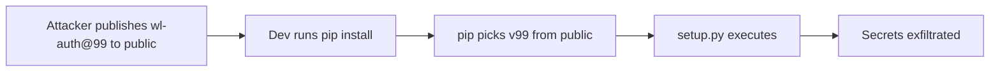

# Lab 1.2: Dependency Confusion

  ~25 min hands-on | ~10 min reference
  Intermediate
  Prerequisites: <a href="../../tier-1/1.1-dependency-resolution/">Lab 1.1</a>

  Overview
  ›
  <a href="understand/" class="phase-step upcoming">Understand</a>
  ›
  <a href="break/" class="phase-step upcoming">Break</a>
  ›
  <a href="defend/" class="phase-step upcoming">Defend</a>
  ›
  <a href="detect/" class="phase-step upcoming">Detect</a>

In February 2021, Alex Birsan published a technique that let him execute code inside Microsoft, Apple, PayPal, Tesla, Uber, and dozens more. He published packages to public PyPI with the same names as their internal packages. Pip picked the higher version, ran the attacker's `setup.py`, and the company was compromised. The disclosure earned $130,000+ in bug bounties.

In this lab, you are a developer at WeakLink Corp. You will see the attack happen, then defend against it.

### Attack Flow

## Environment

| Service | Address | Description |
|---------|---------|-------------|
| Private PyPI | `pypi-private:8080` | WeakLink Corp private PyPI server with `wl-auth==1.0.0` |
| Public PyPI | `pypi-public:8080` | Simulated public PyPI with attacker's `wl-auth==99.0.0` |

!!! tip "Related Labs"
    - **Prerequisite:** [1.1 How Dependency Resolution Works](../1.1-dependency-resolution/index.md) — Understanding resolution is essential before exploiting it
    - **Next:** [1.3 Typosquatting](../1.3-typosquatting/index.md) — Another package namespace attack using name similarity
    - **See also:** [3.4 Registry Confusion](../../tier-3/3.4-registry-confusion/index.md) — Registry confusion applies the same concept to container images
    - **See also:** [6.8 Case Study: event-stream](../../tier-6/6.8-case-study-event-stream/index.md) — event-stream used a similar trust exploitation vector
