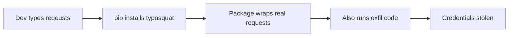

# Lab 1.3: Typosquatting

<div class="lab-meta">
  <span>~20 min hands-on | ~10 min reference</span>
  <span class="difficulty intermediate">Intermediate</span>
  <span>Prerequisites: <a href="../1.1-dependency-resolution/">Lab 1.1</a></span>
</div>

A developer installs `reqeusts` instead of `requests`. The package works perfectly. But it also steals their secrets.

### Attack Flow



---

## Environment

| Service | Address | Description |
|---------|---------|-------------|
| PyPI | `pypi-private:8080` | A private PyPI server with both legitimate and typosquatted packages |

## Connect to the Workstation

```bash
./weaklink shell
```

---

???+ info "Phase 1: UNDERSTAND. How Typosquatting Works"

### Step 1: Explore the PyPI registry

```bash
curl -s http://pypi-private:8080/simple/ | grep -oP '(?<=href="/simple/)[^/]+'
```

Two packages: `requests` and `reqeusts`.

### Step 2: Install the legitimate package

```bash
pip install --index-url http://pypi-private:8080/simple/ --trusted-host pypi-private requests
```

Test it:

```bash
python3 -c "import requests; print(f'Package: {requests.__title__} v{requests.__version__}')"
```

### Step 3: Compare the two packages

```bash
curl -s http://pypi-private:8080/simple/requests/
curl -s http://pypi-private:8080/simple/reqeusts/
```

Both are version 2.31.0 with the same description. A developer glancing at these would see nothing suspicious.

---

???+ warning "Phase 2: BREAK. Installing the Typosquatted Package"

### Step 1: The developer's mistake

```bash
cat /app/scripts/install_deps.sh
```

Spot the typo: `reqeusts` instead of `requests`.

### Step 2: Check the environment

```bash
echo $SECRET_API_KEY
```

This simulates any secret a developer might have: AWS keys, database credentials, API tokens.

### Step 3: Run the install script

```bash
pip uninstall requests -y 2>/dev/null
bash /app/scripts/install_deps.sh
```

Completes without errors.

### Step 4: Test the package

```bash
python3 -c "
import reqeusts
print(f'Package: {reqeusts.__title__} v{reqeusts.__version__}')
resp = reqeusts.get('http://pypi-private:8080/simple/')
print(f'HTTP GET -> {resp.status_code}')
print('All tests pass!')
"
```

Everything works. Tests pass. No errors.

### Step 5: Find the damage

```bash
cat /tmp/typosquat-exfil
```

Your `SECRET_API_KEY`, username, home directory, and hostname were all exfiltrated. In a real attack, this data would be sent to an attacker's server during `pip install`, before the developer writes a single line of code.

### Step 6: Inspect the malicious package

```bash
pip download --no-deps --dest /tmp/pkg-inspect reqeusts \
    -i http://pypi-private:8080/simple/ --trusted-host pypi-private 2>/dev/null
cd /tmp/pkg-inspect && unzip -q *.whl -d extracted 2>/dev/null || python3 -m zipfile -e *.whl extracted
find /tmp/pkg-inspect/extracted -name "*.py" -exec grep -l "exfil\|secret\|environ" {} \;
```

**Checkpoint:** You should now have `/tmp/typosquat-exfil` containing your stolen secrets, and the typosquatted package installed and passing all tests.

---

???+ success "Phase 3: DEFEND. Catching and Preventing Typosquatting"

### Defense 1: Remove the typosquatted package

```bash
pip uninstall reqeusts -y
rm -f /tmp/typosquat-exfil
```

### Defense 2: Install the correct package

```bash
pip install --index-url http://pypi-private:8080/simple/ --trusted-host pypi-private requests
```

### Defense 3: Create a pinned requirements.txt

Never install packages by typing names manually. Use a requirements file with exact version pins:

```bash
cat > /app/requirements.txt << 'EOF'
requests==2.31.0
EOF
```

### Defense 4: Validate against an allowlist

```bash
bash /app/scripts/validate_packages.sh /app/allowlist.txt
```

### Defense 5: Run pip-audit

```bash
pip-audit 2>/dev/null || echo "pip-audit found no known vulnerabilities"
```

`pip-audit` catches packages with reported CVEs but may not catch brand-new typosquatting attacks. Defense-in-depth (allowlists + pinning + review) matters.

### Verify your defenses

```bash
weaklink verify 1.3
```

---

??? example "CI Integration"

    **`.github/workflows/typosquatting-check.yml`:**

    ```yaml
    name: Typosquatting Prevention

    on:
      pull_request:
        paths:
          - "requirements*.txt"
          - "setup.py"
          - "setup.cfg"
          - "pyproject.toml"

    jobs:
      check-typosquatting:
        runs-on: ubuntu-latest
        steps:
          - uses: actions/checkout@v4

          - name: Set up Python
            uses: actions/setup-python@v5
            with:
              python-version: "3.12"

          - name: Install detection tools
            run: pip install python-Levenshtein

          - name: Check for typosquatted packages
            run: |
              python3 << 'PYEOF'
              import sys
              import re
              from pathlib import Path

              try:
                  from Levenshtein import distance as levenshtein_distance
              except ImportError:
                  def levenshtein_distance(s1, s2):
                      if len(s1) < len(s2):
                          return levenshtein_distance(s2, s1)
                      if len(s2) == 0:
                          return len(s1)
                      prev_row = range(len(s2) + 1)
                      for i, c1 in enumerate(s1):
                          curr_row = [i + 1]
                          for j, c2 in enumerate(s2):
                              insertions = prev_row[j + 1] + 1
                              deletions = curr_row[j] + 1
                              substitutions = prev_row[j] + (c1 != c2)
                              curr_row.append(min(insertions, deletions, substitutions))
                          prev_row = curr_row
                      return prev_row[-1]

              KNOWN_PACKAGES = [
                  "requests", "numpy", "pandas", "flask", "django", "boto3",
                  "urllib3", "setuptools", "pip", "wheel", "cryptography",
                  "pyyaml", "pyjwt", "pillow", "scipy", "matplotlib",
                  "beautifulsoup4", "sqlalchemy", "celery", "redis",
                  "psycopg2", "pymongo", "colorama", "paramiko", "jinja2",
                  "click", "pytest", "coverage", "tox", "black", "flake8",
                  "mypy", "isort", "pylint", "httpx", "aiohttp", "fastapi",
                  "uvicorn", "gunicorn", "pydantic", "python-dateutil",
                  "python-dotenv", "python-multipart", "docker", "kubernetes",
                  "protobuf", "grpcio", "tensorflow", "torch", "transformers",
                  "scrapy", "selenium", "ansible", "fabric", "invoke",
              ]

              issues_found = 0
              for req_file in Path(".").glob("requirements*.txt"):
                  with open(req_file) as f:
                      for line_num, line in enumerate(f, 1):
                          line = line.strip()
                          if not line or line.startswith("#") or line.startswith("-"):
                              continue
                          pkg = re.split(r"[>=<!;\[]", line)[0].strip()
                          if not pkg:
                              continue
                          pkg_norm = pkg.lower().replace("_", "-")
                          if pkg_norm in KNOWN_PACKAGES:
                              continue
                          for known in KNOWN_PACKAGES:
                              dist = levenshtein_distance(pkg_norm, known)
                              if dist == 1:
                                  print(
                                      f"::error file={req_file},line={line_num}::"
                                      f"TYPOSQUATTING RISK: '{pkg}' is 1 edit away from "
                                      f"'{known}'. Verify this is the correct package."
                                  )
                                  issues_found += 1
                              elif dist == 2 and len(pkg_norm) > 5:
                                  print(
                                      f"::warning file={req_file},line={line_num}::"
                                      f"Possible typosquat: '{pkg}' is 2 edits from "
                                      f"'{known}'. Please verify."
                                  )

              if issues_found > 0:
                  print(f"\nFound {issues_found} potential typosquatting issue(s).")
                  sys.exit(1)
              else:
                  print("PASS: No typosquatting risks detected.")
              PYEOF

          - name: Enforce package allowlist
            run: |
              ALLOWLIST_FILE="allowed-packages.txt"
              if [ ! -f "$ALLOWLIST_FILE" ]; then
                echo "::warning::No allowed-packages.txt found. Create one to enforce an allowlist."
                exit 0
              fi
              BLOCKED=0
              for f in requirements*.txt; do
                if [ -f "$f" ]; then
                  while IFS= read -r line; do
                    [[ "$line" =~ ^[[:space:]]*# ]] && continue
                    [[ "$line" =~ ^[[:space:]]*$ ]] && continue
                    [[ "$line" =~ ^- ]] && continue
                    pkg=$(echo "$line" | sed 's/[>=<!=;\[].*//' | xargs | tr '[:upper:]' '[:lower:]' | tr '_' '-')
                    [ -z "$pkg" ] && continue
                    if ! grep -qi "^${pkg}$" "$ALLOWLIST_FILE"; then
                      echo "::error file=$f::BLOCKED: Package '${pkg}' is not in the allowlist ($ALLOWLIST_FILE)."
                      BLOCKED=1
                    fi
                  done < "$f"
                fi
              done
              if [ "$BLOCKED" -eq 1 ]; then
                exit 1
              fi
              echo "PASS: All packages are on the allowlist."
    ```

---

???+ danger "Phase 4: DETECT. Catching Typosquatting Before and After Installation"

Typosquatting detection is a **string similarity problem combined with behavioral analysis**: (1) package names suspiciously close to popular packages, and (2) `setup.py` executing code unrelated to the package's purpose.

**What to look for:**

- pip installing a package 1-2 characters different from a top-1000 PyPI package
- `setup.py` reading environment variables, writing to `/tmp/`, or making outbound HTTP/DNS calls
- A package that imports and re-exports another package (wrapper pattern)
- Outbound connections to `webhook.site`, `pipedream.net`, `requestbin.com`, `burpcollaborator.net`

### MITRE ATT&CK Mapping

| Technique | ID | Relevance |
|-----------|-----|-----------|
| **Supply Chain Compromise: Compromise Software Supply Chain** | [T1195.002](https://attack.mitre.org/techniques/T1195/002/) | Attacker publishes a malicious package with a name designed to be confused with a legitimate one |
| **User Execution: Malicious File** | [T1204.002](https://attack.mitre.org/techniques/T1204/002/) | Developer executes `pip install <typosquat>` believing it to be the legitimate package |
| **Masquerading** | [T1036](https://attack.mitre.org/techniques/T1036/) | Typosquatted package masquerades as the legitimate one: same version, same description, wraps the real functionality |

---

??? tip "SOC Relevance"

    **Alerts:**

    - "pip installed unrecognized package on build server" (EDR/allowlist)
    - "setup.py spawned network connection to external host" (EDR)
    - "Sensitive environment variables accessed during package installation" (EDR)

    Unlike dependency confusion (which targets CI infrastructure), typosquatting targets **individual developers**. A single developer running `pip install reqeusts` compromises their entire credential set. The typosquatted package often **works correctly** because it wraps the legitimate one. All tests pass.

    **Triage:**

    1. Compare package name against PyPI top-1000. Levenshtein distance of 1-2 is almost certainly a typosquat.
    2. Check package age on PyPI. Typosquats are usually recently published.
    3. Inspect `setup.py` process tree during installation.
    4. Rotate credentials immediately if exfiltration is confirmed.

---

## What You Learned

1. **Typosquatting exploits human error**: attackers register package names one keystroke away from popular packages.
2. **`setup.py` runs during install**: secrets are stolen before you ever import the package.
3. **Functional wrappers evade detection**: malicious packages wrap the real one, passing all tests while exfiltrating data.

## Further Reading

- [PyPI Typosquatting Research (Phylum, 2023)](https://blog.phylum.io/pypi-malware-replaces-crypto-addresses-in-developers-clipboard)
- [Typosquatting in Python Ecosystem (arxiv)](https://arxiv.org/abs/2005.09535)
- [pip-audit](https://github.com/pypa/pip-audit)
