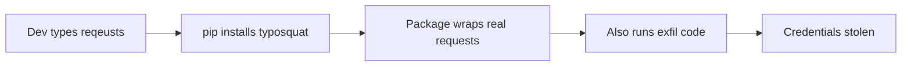

# Lab 1.3: Typosquatting

  ~20 min hands-on | ~10 min reference
  Intermediate
  Prerequisites: <a href="../../tier-1/1.1-dependency-resolution/">Lab 1.1</a>

  Overview
  ›
  <a href="understand/" class="phase-step upcoming">Understand</a>
  ›
  <a href="break/" class="phase-step upcoming">Break</a>
  ›
  <a href="defend/" class="phase-step upcoming">Defend</a>
  ›
  <a href="detect/" class="phase-step upcoming">Detect</a>

A developer installs `reqeusts` instead of `requests`. The package works perfectly. But it also steals their secrets.

### Attack Flow

## Environment

| Service | Address | Description |
|---------|---------|-------------|
| PyPI | `pypi-private:8080` | A private PyPI server with both legitimate and typosquatted packages |
