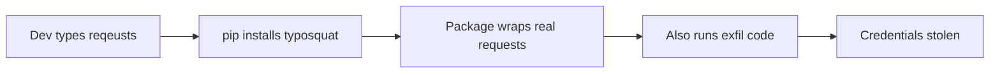

# Lab 1.3: Typosquatting

  Understand: ~7 min | Break: ~7 min | Defend: ~6 min | Detect: ~10 min
  Intermediate
  Prerequisites: <a href="../../tier-1/1.1-dependency-resolution/">Lab 1.1</a>

  Overview
  ›
  <a href="understand/" class="phase-step upcoming">Understand</a>
  ›
  <a href="break/" class="phase-step upcoming">Break</a>
  ›
  <a href="defend/" class="phase-step upcoming">Defend</a>
  ›
  <a href="detect/" class="phase-step upcoming">Detect</a>

A developer installs `reqeusts` instead of `requests`. The package works perfectly. But it also steals their secrets.

### Attack Flow

## Environment

| Service | Address | Description |
|---------|---------|-------------|
| PyPI | `pypi-private:8080` | A private PyPI server with both legitimate and typosquatted packages |

!!! tip "Related Labs"
    - **Prerequisite:** [1.1 How Dependency Resolution Works](../1.1-dependency-resolution/index.md) — Package resolution determines which typosquatted package gets installed
    - **Next:** [1.4 Lockfile Injection](../1.4-lockfile-injection/index.md) — Another way to slip malicious packages past developers
    - **See also:** [1.2 Dependency Confusion](../1.2-dependency-confusion/index.md) — Both attacks exploit the package namespace
    - **See also:** [6.1 AI/ML Model Supply Chain](../../tier-6/6.1-ml-model-supply-chain/index.md) — ML model registries face the same typosquatting risks
