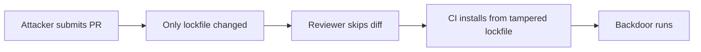

# Lab 1.4: Lockfile Injection

<div class="lab-meta">
  <span>~25 min hands-on | ~10 min reference</span>
  <span class="difficulty intermediate">Intermediate</span>
  <span>Prerequisites: <a href="../1.1-dependency-resolution/">Lab 1.1</a></span>
</div>

A PR titled "chore: update flask-utils to latest version" only changes the lockfile. Auto-generated, thousands of lines, nobody reads it carefully. But hidden in the diff, one hash has been swapped. The new hash points to a backdoored package.

### Attack Flow



---

## Environment

| Service | Address | Description |
|---------|---------|-------------|
| PyPI | `pypi-private:8080` | A private PyPI server hosting the legitimate `flask-utils` package |
| Gitea | `gitea:3000` | A Gitea instance with a repo containing a malicious PR |

Login: `weaklink` / `weaklink`

## Connect to the Workstation

```bash
./weaklink shell
```

---

???+ info "Phase 1: UNDERSTAND. What Lockfiles Are and Why They Matter"

### Step 1: What is a lockfile?

A lockfile captures the **exact** versions and **cryptographic hashes** of every dependency. It turns a loose dependency spec into a reproducible build.

**Without a lockfile** (loose requirements):

```
# requirements.in
flask-utils
```

**With a lockfile** (locked + hashed):

```
# requirements.txt
flask-utils==1.0.0 \
    --hash=sha256:abc123def456...
```

The hash ensures that even if someone publishes a different package with the same version number, pip will refuse to install it.

### Step 2: Generate a lockfile

```bash
cd /app/project
cat requirements.in
```

Lock it:

```bash
pip-compile --generate-hashes \
    --index-url http://pypi-private:8080/simple/ \
    --trusted-host pypi-private \
    requirements.in \
    --output-file requirements.txt
```

```bash
cat requirements.txt
```

Exact version (`flask-utils==1.0.0`), SHA-256 hash, and a comment trail showing it was generated from `requirements.in`.

### Step 3: Install using the lockfile

```bash
pip install --require-hashes -r requirements.txt \
    --index-url http://pypi-private:8080/simple/ --trusted-host pypi-private
```

`--require-hashes` verifies the hash of every downloaded package. If the hash doesn't match, installation fails.

---

???+ warning "Phase 2: BREAK. Tampering with a Lockfile in a PR"

### Step 1: Look at the "routine" PR

Open Gitea at `http://gitea:3000/weaklink/secure-app/pulls/1`, or inspect from the command line:

```bash
cd /tmp && git clone http://gitea:3000/weaklink/secure-app.git
cd secure-app
git log --oneline main..origin/update-deps
```

The commit message says "chore: update flask-utils to latest version" and claims it ran `pip-compile`.

### Step 2: See the diff

```bash
git diff main..origin/update-deps
```

The only change is in `requirements.txt`. The version is the same (`flask-utils==1.0.0`), but the **hash** is different. In a real lockfile with dozens of dependencies, this would be buried in hundreds of lines.

### Step 3: Check out the malicious branch and install

```bash
git checkout update-deps
cat requirements.txt
```

Compare:

```bash
cd /app/project
cp /tmp/secure-app/requirements.txt requirements.txt.malicious
diff <(grep "hash" /app/project/requirements.txt) <(grep "hash" requirements.txt.malicious)
```

The tampered hash corresponds to a backdoored `flask-utils` with a post-install hook.

### Step 4: Understand the attack surface

1. Lockfile diffs are HUGE and BORING. Reviewers skip them.
2. The commit message says "ran pip-compile". Looks legitimate.
3. The version number doesn't change. Only the hash.
4. CI/CD trusts the lockfile and installs whatever it says.
5. The backdoor runs at INSTALL time, not import time.

### Step 5: Check for compromise

```bash
ls -la /tmp/lockfile-pwned 2>&1
```

**Checkpoint:** You should now have the tampered lockfile identified, with a clear diff showing the hash swap between the legitimate and malicious versions.

---

???+ success "Phase 3: DEFEND. Lockfile Regeneration and CI Checks"

### Defense 1: Clean up any compromise

```bash
rm -f /tmp/lockfile-pwned
```

### Defense 2: Regenerate the lockfile from source

The key defense: **never trust a lockfile diff in a PR. Always regenerate from source.**

```bash
cd /app/project
pip-compile --generate-hashes \
    --index-url http://pypi-private:8080/simple/ \
    --trusted-host pypi-private \
    requirements.in \
    --output-file requirements.txt
```

Compare to the PR's version:

```bash
diff <(grep -v "^#" requirements.txt) <(grep -v "^#" requirements.txt.malicious 2>/dev/null) && \
    echo "Files match (no tampering)" || echo "FILES DIFFER -- tampering detected!"
```

### Defense 3: Set up a CI check

```bash
cat /app/project/verify-lockfile.sh
```

Test against the legitimate lockfile:

```bash
cd /app/project
bash verify-lockfile.sh requirements.in requirements.txt
```

Test against a tampered lockfile:

```bash
cp requirements.txt requirements.txt.backup
sed -i 's/--hash=sha256:\([a-f0-9]\)/--hash=sha256:0/' requirements.txt
bash verify-lockfile.sh requirements.in requirements.txt
```

Restore:

```bash
cp requirements.txt.backup requirements.txt
```

### Verify your defenses

```bash
weaklink verify 1.4
```

---

??? example "CI Integration"

    **GitHub Actions: Lockfile integrity check on every PR**

    `.github/workflows/lockfile-verify.yml`:

    ```yaml
    name: Verify Lockfile Integrity
    on:
      pull_request:
        paths:
          - 'requirements.txt'
          - 'requirements.in'

    jobs:
      verify-python-lockfile:
        runs-on: ubuntu-latest
        if: hashFiles('requirements.in') != ''
        steps:
          - uses: actions/checkout@v4
          - uses: actions/setup-python@v5
            with:
              python-version: '3.11'
          - name: Install pip-tools
            run: pip install pip-tools
          - name: Regenerate lockfile from source
            run: |
              pip-compile --generate-hashes \
                requirements.in \
                --output-file /tmp/regenerated-requirements.txt
          - name: Compare against committed lockfile
            run: |
              grep -v '^#' requirements.txt > /tmp/committed.txt
              grep -v '^#' /tmp/regenerated-requirements.txt > /tmp/fresh.txt
              if ! diff /tmp/committed.txt /tmp/fresh.txt; then
                echo "::error::Lockfile mismatch! Regenerate with: pip-compile --generate-hashes requirements.in"
                exit 1
              fi
              echo "Lockfile integrity verified."
    ```

---

???+ danger "Phase 4: DETECT. Finding Lockfile Injection in Production"

Lockfile injection leaves traces across three layers: source control audit logs, network traffic during builds, and process execution on build runners. Each individual signal looks mundane. The *combination* reveals the attack.

**What to look for:**

- A PR modifies **only** lockfile(s) with no change to manifest files (`requirements.in`, `package.json`, `Pipfile`)
- The PR author is a human account, not a bot (Dependabot/Renovate PRs modify both manifest and lock)
- Commit message says "update deps" / "ran pip-compile" but the manifest is untouched
- `pip install` spawning child processes (shell, curl, wget) during installation
- File writes to unexpected locations during `pip install`

### MITRE ATT&CK Mapping

| Technique | ID | Relevance |
|-----------|-----|-----------|
| Supply Chain Compromise: Compromise Software Dependencies | **T1195.002** | Replacing a legitimate dependency hash with a backdoored one |
| Phishing: Spearphishing Attachment (via code review) | **T1566.001** | The PR itself is the phishing vector, tricking a reviewer into approving malicious code |
| Subvert Trust Controls | **T1553** | Exploiting trust in the lockfile as an "auto-generated" artifact |

??? tip "SOC Relevance"

    - **Triage signal**: A PR that modifies *only* lockfiles from a non-bot account is a high-confidence indicator. Normal dependency updates always touch the manifest too. Low false-positive alert.
    - **Build pipeline monitoring**: Alert on `pip install` downloading packages from URLs that don't match configured registries.
    - **Incident response**: Regenerate the lockfile from the manifest and diff against the committed version. Any mismatch is confirmed tampering.
    - **Correlation**: Lockfile-only PR + outbound connections from build runner to unusual IP = strong attack chain indicator.

---

## What You Learned

1. **Lockfile injection exploits review blindness**: lockfile diffs are large, "auto-generated," and reviewers skip them.
2. **Always regenerate lockfiles in CI**: compare against the committed version to catch tampered hashes.
3. **`--require-hashes` enforces integrity**: pip only installs packages matching expected hashes.

## Further Reading

- [Lockfile Injection (Snyk Research)](https://snyk.io/blog/why-npm-lockfiles-can-be-a-security-blindspot-for-injecting-malicious-modules/)
- [pip-compile documentation](https://pip-tools.readthedocs.io/)
- [SLSA Build Requirements](https://slsa.dev/spec/v1.0/requirements)
