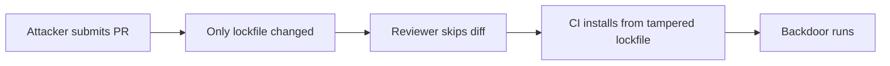

# Lab 1.4: Lockfile Injection

  ~25 min hands-on | ~10 min reference
  Intermediate
  Prerequisites: <a href="../../tier-1/1.1-dependency-resolution/">Lab 1.1</a>

  Overview
  ›
  <a href="understand/" class="phase-step upcoming">Understand</a>
  ›
  <a href="break/" class="phase-step upcoming">Break</a>
  ›
  <a href="defend/" class="phase-step upcoming">Defend</a>
  ›
  <a href="detect/" class="phase-step upcoming">Detect</a>

A PR titled "chore: update flask-utils to latest version" only changes the lockfile. Auto-generated, thousands of lines, nobody reads it carefully. But hidden in the diff, one hash has been swapped. The new hash points to a backdoored package.

### Attack Flow

## Environment

| Service | Address | Description |
|---------|---------|-------------|
| PyPI | `pypi-private:8080` | A private PyPI server hosting the legitimate `flask-utils` package |
| Gitea | `gitea:3000` | A Gitea instance with a repo containing a malicious PR |

Login: `weaklink` / `weaklink`

!!! tip "Related Labs"
    - **Prerequisite:** [1.1 How Dependency Resolution Works](../1.1-dependency-resolution/index.md) — Lockfiles record resolution decisions, which this attack modifies
    - **Next:** [1.5 Manifest Confusion](../1.5-manifest-confusion/index.md) — Manifest confusion is another metadata-based package attack
    - **See also:** [1.6 Phantom Dependencies](../1.6-phantom-dependencies/index.md) — Phantom dependencies arise when lockfiles diverge from manifests
    - **See also:** [4.7 SBOM Tampering](../../tier-4/4.7-sbom-tampering/index.md) — SBOM tampering is a similar integrity attack on metadata
