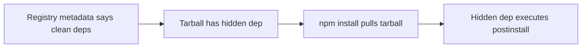

# Lab 1.5: Manifest Confusion

<div class="lab-meta">
  <span>~25 min hands-on | ~10 min reference</span>
  <span class="difficulty intermediate">Intermediate</span>
  <span>Prerequisites: <a href="1.1-dependency-resolution.md">Lab 1.1</a>, <a href="1.2-dependency-confusion.md">Lab 1.2</a>, <a href="1.3-typosquatting.md">Lab 1.3</a>, <a href="1.4-lockfile-injection.md">Lab 1.4</a></span>
</div>

In 2023, Darcy Clarke discovered a fundamental flaw in the npm ecosystem: the package metadata that `npm view` shows can differ from what's actually inside the tarball you install. Auditing tools, security scanners, and developers all trusted the registry API. But the registry was lying.

### Attack Flow



---

## Environment

| Service | Address | Purpose |
|---------|---------|---------|
| Verdaccio | `verdaccio:4873` | Local npm registry with crafted packages |

Packages pre-loaded:

- `safe-utils@1.0.0`: normal, legitimate package
- `crafted-widget@2.1.0`: **mismatched manifests** (the attack)
- `evil-pkg@1.0.0`: the hidden malicious dependency

## Connect to the Workstation

```bash
./weaklink shell
```

---

???+ info "Phase 1: UNDERSTAND. How npm Package Publishing Works"

When a developer publishes a package, two things happen:

1. `npm pack` creates a `.tgz` tarball containing the code and `package.json`
2. `npm publish` uploads that tarball to the registry, which extracts metadata from it

The registry then serves **two things** for each package:

- **Metadata** (via the API): what `npm view` shows
- **Tarball** (the download): what `npm install` actually extracts into `node_modules/`

### Step 1: Inspect a normal package via the registry API

```bash
npm view safe-utils
```

### Step 2: Download and inspect the actual tarball

```bash
mkdir /tmp/inspect && cd /tmp/inspect
npm pack safe-utils
tar xzf safe-utils-1.0.0.tgz
cat package/package.json
```

Compare with what `npm view` showed. For a normal package, they match.

### Step 3: Check the crafted package

```bash
npm view crafted-widget
```

Dependencies show just `lodash`. Looks safe.

### Step 4: Download and inspect the crafted package tarball

```bash
cd /tmp/inspect
npm pack crafted-widget
tar xzf crafted-widget-2.1.0.tgz
cat package/package.json
```

**Compare the dependencies and scripts to what `npm view` showed:**

- The tarball has `"evil-pkg": "*"` in dependencies. The registry API did NOT show this.
- The tarball has a `postinstall` script. The registry API did NOT show this.

This is **manifest confusion**: the registry metadata and the tarball contents disagree. Any tool that relies on the registry API to audit packages will miss what's actually installed.

---

???+ warning "Phase 2: BREAK. Exploiting Manifest Confusion"

### Step 1: Clean the environment

```bash
cd /workspace
rm -rf node_modules package.json package-lock.json
rm -f /tmp/manifest-confusion-pwned
```

### Step 2: Create a project that depends on crafted-widget

```bash
cat > package.json << 'EOF'
{
  "name": "victim-app",
  "version": "1.0.0",
  "dependencies": {
    "crafted-widget": "^2.1.0"
  }
}
EOF
```

### Step 3: Audit before installing

```bash
npm view crafted-widget dependencies
```

Output: `{ lodash: '^4.17.21' }`. Looks safe. No suspicious dependencies.

### Step 4: Install the package

```bash
npm install
```

`evil-pkg` gets installed and its postinstall script runs.

### Step 5: Verify the attack

```bash
cat /tmp/manifest-confusion-pwned
ls node_modules/evil-pkg/
cat node_modules/crafted-widget/package.json | head -20
```

What happened:

1. `npm view` showed only `lodash` as a dependency
2. `npm install` downloaded the **tarball**, which contained `evil-pkg`
3. npm installed `evil-pkg` and ran its `postinstall` script
4. **Every security tool that trusts registry metadata would have missed this**

**Checkpoint:** You should now have `/tmp/manifest-confusion-pwned` present, `evil-pkg` in `node_modules/`, and a clear understanding of the metadata/tarball mismatch.

---

???+ success "Phase 3: DEFEND. Detecting Manifest Mismatches"

### Step 1: Clean up

```bash
cd /workspace
rm -rf node_modules package-lock.json
rm -f /tmp/manifest-confusion-pwned
```

### Step 2: Use the manifest comparison tool

```bash
compare-manifests crafted-widget
```

Should show `[MISMATCH]`.

```bash
compare-manifests safe-utils
```

Should show `[CLEAN]`.

### Step 3: Inspect before you install

```bash
mkdir -p /tmp/audit && cd /tmp/audit
npm pack crafted-widget
tar xzf crafted-widget-2.1.0.tgz
cat package/package.json
```

The hidden `evil-pkg` dependency and `postinstall` script are visible.

### Step 4: Install from a verified lockfile with integrity hashes

```bash
cd /workspace
rm -rf node_modules package-lock.json

cat > package.json << 'EOF'
{
  "name": "victim-app",
  "version": "1.0.0",
  "dependencies": {
    "safe-utils": "1.0.0"
  }
}
EOF

npm install
```

Verify integrity hashes:

```bash
cat package-lock.json | grep -A2 '"integrity"'
```

Use `npm ci` (enforces the lockfile exactly):

```bash
rm -rf node_modules
npm ci
```

### Step 5: Verify the defense

```bash
ls node_modules/evil-pkg 2>/dev/null && echo "FAIL: evil-pkg found" || echo "PASS: no evil-pkg"
test -f /tmp/manifest-confusion-pwned && echo "FAIL: pwned" || echo "PASS: not pwned"
grep -q '"integrity"' package-lock.json && echo "PASS: lockfile has integrity hashes" || echo "FAIL: no integrity"
which compare-manifests && echo "PASS: comparison tool available" || echo "FAIL: no tool"
```

### Verify your defenses

```bash
weaklink verify 1.5
```

---

??? example "CI Integration"

    `.github/workflows/manifest-verify.yml`:

    ```yaml
    name: Detect Manifest Confusion
    on:
      pull_request:
        paths:
          - 'package.json'
          - 'package-lock.json'

    jobs:
      check-manifests:
        runs-on: ubuntu-latest
        steps:
          - uses: actions/checkout@v4
          - uses: actions/setup-node@v4
            with:
              node-version: '20'
          - name: Compare registry metadata vs tarball contents
            run: |
              set -euo pipefail
              FAILED=0
              DEPS=$(node -e "
                const pkg = require('./package.json');
                const deps = {...(pkg.dependencies || {}), ...(pkg.devDependencies || {})};
                console.log(Object.keys(deps).join('\n'));
              ")
              mkdir -p /tmp/manifest-check
              cd /tmp/manifest-check
              for dep in $DEPS; do
                echo "Checking $dep..."
                REGISTRY_DEPS=$(npm view "$dep" dependencies --json 2>/dev/null || echo "{}")
                REGISTRY_SCRIPTS=$(npm view "$dep" scripts --json 2>/dev/null || echo "{}")
                npm pack "$dep" --quiet 2>/dev/null
                TARBALL=$(ls -t *.tgz | head -1)
                tar xzf "$TARBALL"
                TARBALL_DEPS=$(node -e "console.log(JSON.stringify(require('./package/package.json').dependencies || {}))")
                TARBALL_SCRIPTS=$(node -e "console.log(JSON.stringify(require('./package/package.json').scripts || {}))")
                if [ "$REGISTRY_DEPS" != "$TARBALL_DEPS" ]; then
                  echo "::error::MANIFEST CONFUSION in $dep: registry dependencies differ from tarball"
                  FAILED=1
                fi
                if echo "$TARBALL_SCRIPTS" | grep -q "postinstall\|preinstall\|install" && \
                   ! echo "$REGISTRY_SCRIPTS" | grep -q "postinstall\|preinstall\|install"; then
                  echo "::error::HIDDEN INSTALL SCRIPT in $dep: tarball has install hooks not shown in registry"
                  FAILED=1
                fi
                rm -rf package "$TARBALL"
              done
              if [ "$FAILED" -eq 1 ]; then
                exit 1
              fi
              echo "All package manifests verified."

          - name: Enforce npm ci over npm install
            run: npm ci
    ```

---

???+ danger "Phase 4: DETECT. Finding Manifest Confusion in Production"

Manifest confusion is harder to detect than most supply chain attacks because the malicious payload is *invisible* to API-based tooling. Detection requires comparing both sources or monitoring what actually gets installed.

**What to look for:**

- `npm view <package>` shows different dependencies than what ends up in `node_modules/`
- A package's registry metadata shows zero install scripts, but the installed `package.json` contains one
- During `npm install`, packages are downloaded that don't appear in the dependency tree from `npm view`
- DNS lookups for domains referenced in hidden `postinstall` scripts
- Installed `node_modules/` contains packages not present in the dependency graph from `npm ls`

### MITRE ATT&CK Mapping

| Technique | ID | Relevance |
|-----------|-----|-----------|
| Supply Chain Compromise: Compromise Software Dependencies | **T1195.002** | A published package contains hidden dependencies not visible through the registry API |
| Masquerading: Match Legitimate Name | **T1036.005** | The package presents a clean manifest to auditing tools while hiding its true contents |
| Hijack Execution Flow | **T1574** | Hidden `postinstall` scripts hijack the normal install flow to execute attacker code |

??? tip "SOC Relevance"

    - **Blind spot in existing tooling**: Most dependency scanners historically relied on registry API metadata. If the registry lies, your scanner lies. Confirm your scanner checks tarball contents.
    - **High-value detection**: Alert on any `postinstall` script execution from packages not on your known-good allowlist. A short allowlist (husky, esbuild, sharp, node-gyp, puppeteer) covers 90% of legitimate cases.
    - **Pre-install audit**: `npm pack <package> && tar xzf <package>.tgz && diff <(npm view <package> dependencies) <(node -e "console.log(JSON.stringify(require('./package/package.json').dependencies))")`. If they differ, escalate.

---

## What You Learned

1. **Registry metadata can lie**: `npm view` output and tarball contents can disagree, and `npm install` trusts the tarball.
2. **Tarball inspection is the only truth**: always `npm pack` + extract to see what you're actually installing.
3. **`npm ci` enforces the lockfile**: `npm install` can modify it, `npm ci` strictly follows it.

## Further Reading

- [Darcy Clarke: "The massive hole in the npm ecosystem"](https://blog.vlt.sh/blog/the-massive-hole-in-the-npm-ecosystem)
- [npm Package Provenance](https://github.blog/2023-07-12-introducing-npm-package-provenance/)
- [Socket.dev](https://socket.dev/)
