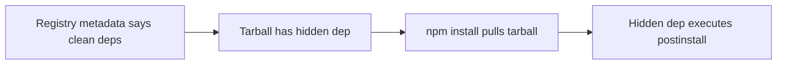

# Lab 1.5: Manifest Confusion

  ~25 min hands-on | ~10 min reference
  Intermediate
  Prerequisites: <a href="../../tier-1/1.1-dependency-resolution/">Lab 1.1</a>, <a href="../../tier-1/1.2-dependency-confusion/">Lab 1.2</a>, <a href="../../tier-1/1.3-typosquatting/">Lab 1.3</a>, <a href="../../tier-1/1.4-lockfile-injection/">Lab 1.4</a>

  Overview
  ›
  <a href="understand/" class="phase-step upcoming">Understand</a>
  ›
  <a href="break/" class="phase-step upcoming">Break</a>
  ›
  <a href="defend/" class="phase-step upcoming">Defend</a>
  ›
  <a href="detect/" class="phase-step upcoming">Detect</a>

In 2023, Darcy Clarke discovered a fundamental flaw in the npm ecosystem: the package metadata that `npm view` shows can differ from what's actually inside the tarball you install. Auditing tools, security scanners, and developers all trusted the registry API. But the registry was lying.

### Attack Flow

## Environment

| Service | Address | Purpose |
|---------|---------|---------|
| Verdaccio | `verdaccio:4873` | Local npm registry with crafted packages |

Packages pre-loaded:

- `safe-utils@1.0.0`: normal, legitimate package
- `crafted-widget@2.1.0`: **mismatched manifests** (the attack)
- `evil-pkg@1.0.0`: the hidden malicious dependency
