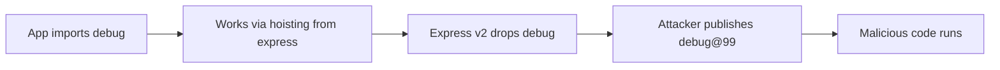

# Lab 1.6: Phantom Dependencies

<div class="lab-meta">
  <span>~25 min hands-on | ~10 min reference</span>
  <span class="difficulty intermediate">Intermediate</span>
  <span>Prerequisites: <a href="1.1-dependency-resolution.md">Lab 1.1</a>, <a href="1.2-dependency-confusion.md">Lab 1.2</a>, <a href="1.3-typosquatting.md">Lab 1.3</a>, <a href="1.4-lockfile-injection.md">Lab 1.4</a></span>
</div>

Your code imports `debug`. It works. But `debug` isn't in your `package.json`. It's there because `wl-framework` depends on it, and npm hoists transitive dependencies to the root of `node_modules/`. You're relying on something you don't control, and an attacker can exploit the gap. In 2018, a new maintainer of the event-stream npm package added flatmap-stream as a dependency containing a targeted cryptocurrency theft payload. The attack succeeded partly because event-stream's consumers relied on transitive hoisting rather than explicit declarations.

### Attack Flow



---

## Environment

| Service | Address | Purpose |
|---------|---------|---------|
| Verdaccio | `verdaccio:4873` | Local npm registry |

The workspace contains:

- An Express-like app (`app.js`) that uses `debug`, but `debug` is NOT in `package.json`
- `wl-framework@1.0.0` on the registry (depends on `debug@4.3.4`)
- `wl-framework@2.0.0` ready to publish (drops `debug` dependency)

## Connect to the Workstation

```bash
./weaklink shell
```

---

???+ info "Phase 1: UNDERSTAND. What Phantom Dependencies Are"

A phantom (or implicit) dependency is a package your code `require()`s that is NOT listed in your `package.json`. It exists in `node_modules/` only because another package depends on it, and npm hoists transitive dependencies to the root.

### Step 1: Look at your app

```bash
cat /workspace/package.json
```

Dependencies: only `wl-framework`. No `debug`.

```bash
cat /workspace/app.js
```

But the code does `require('debug')`.

### Step 2: Install and run

```bash
cd /workspace
npm install
node app.js
```

It works. But why?

### Step 3: Understand hoisting

```bash
ls node_modules/debug/
npm ls debug
```

`debug@4.3.4` is a dependency of `wl-framework@1.0.0`. npm hoisted it to `node_modules/debug/` at the root, making it accessible to your code even though you never declared it.

### Step 4: Find phantom dependencies with depcheck

```bash
depcheck /workspace
```

`depcheck` reports `debug` as a missing dependency: used in code but not in `package.json`.

Your code depends on an implementation detail of `wl-framework`. If `wl-framework` drops or changes `debug`, your app breaks.

---

???+ warning "Phase 2: BREAK. When the Phantom Disappears (or Gets Replaced)"

### Part A: The reliability failure

#### Step 1: Publish the updated wl-framework

This command publishes a malicious version of wl-framework to the npm registry, simulating an attacker who claims an unclaimed transitive dependency:

```bash
publish-attack
```

Publishes `wl-framework@2.0.0` (no longer depends on `debug`) and a malicious `debug@99.0.0`.

#### Step 2: Update your dependencies

```bash
cd /workspace
npm update
```

npm upgrades `wl-framework` to v2.0.0. Since v2 doesn't depend on `debug`, npm may remove it or resolve the malicious v99.

#### Step 3: Try running the app

```bash
node app.js
```

One of two things happens:

1. **`debug` is gone**: `Cannot find module 'debug'`
2. **`debug@99.0.0` is resolved**: the app runs but you've been compromised

#### Step 4: Check for compromise

```bash
cat /tmp/phantom-dep-pwned 2>/dev/null
```

If this file exists, the malicious `debug@99.0.0` was installed and executed its payload.

### Part B: The supply chain attack

The attack vector:

1. Attacker identifies popular packages used as phantom dependencies (`debug`, `ms`, `qs`)
2. Attacker waits for the upstream package to drop the dependency
3. Attacker publishes a higher-version malicious package
4. npm resolves the attacker's version for anyone who didn't declare it explicitly

```bash
npm ls debug
cat node_modules/debug/package.json | grep version
```

**Checkpoint:** You should now have either a crashed app (missing `debug`) or a compromised app (`debug@99.0.0` with `/tmp/phantom-dep-pwned` present).

---

???+ success "Phase 3: DEFEND. Declaring and Pinning All Dependencies"

### Step 1: Clean up

```bash
cd /workspace
rm -rf node_modules package-lock.json
rm -f /tmp/phantom-dep-pwned
```

### Step 2: Find all phantom dependencies

```bash
depcheck /workspace
```

### Step 3: Add debug as an explicit, pinned dependency

```bash
cat > package.json << 'EOF'
{
  "name": "phantom-demo-app",
  "version": "1.0.0",
  "description": "An app with properly declared dependencies",
  "main": "app.js",
  "scripts": {
    "start": "node app.js"
  },
  "dependencies": {
    "wl-framework": "1.0.0",
    "debug": "4.3.4"
  }
}
EOF
```

`debug` is now explicit with a pinned version (`4.3.4`, not `^4.3.4`).

### Step 4: Install and verify

```bash
npm install
node app.js
```

### Step 5: Use npm ci for reproducible installs

```bash
rm -rf node_modules
npm ci
```

### Step 6: Re-run depcheck

```bash
depcheck /workspace
```

No more phantom dependencies.

### Step 7: Test the defense against the attack

```bash
npm update
npm ls debug
node app.js
test ! -f /tmp/phantom-dep-pwned && echo "PASS: not compromised"
```

Because `debug@4.3.4` is explicitly declared and pinned, `npm update` won't replace it with `99.0.0`.

### Verify your defenses

```bash
weaklink verify 1.6
```

---

??? example "CI Integration"

    `.github/workflows/phantom-deps.yml`:

    ```yaml
    name: Detect Phantom Dependencies
    on:
      pull_request:
        paths:
          - '**.js'
          - '**.ts'
          - 'package.json'
          - 'package-lock.json'
      push:
        branches: [main]

    jobs:
      depcheck:
        runs-on: ubuntu-latest
        steps:
          - uses: actions/checkout@v4
          - uses: actions/setup-node@v4
            with:
              node-version: '20'
          - name: Install dependencies with npm ci
            run: |
              if ! npm ci; then
                echo "::error::npm ci failed. Lockfile may be out of sync with package.json."
                exit 1
              fi
          - name: Install depcheck
            run: npm install -g depcheck
          - name: Run depcheck for phantom dependencies
            run: |
              set -euo pipefail
              OUTPUT=$(depcheck . --json 2>/dev/null || true)
              MISSING=$(echo "$OUTPUT" | node -e "
                const data = JSON.parse(require('fs').readFileSync('/dev/stdin', 'utf8'));
                const missing = Object.keys(data.missing || {});
                if (missing.length > 0) {
                  console.log('PHANTOM DEPENDENCIES FOUND:');
                  missing.forEach(dep => {
                    const files = data.missing[dep];
                    console.log('  ' + dep + ' (used in: ' + files.join(', ') + ')');
                  });
                  process.exit(1);
                } else {
                  console.log('No phantom dependencies detected.');
                }
              ")
              echo "$OUTPUT"
          - name: Check for high-version anomalies
            run: |
              node -e "
                const lockfile = require('./package-lock.json');
                const packages = lockfile.packages || {};
                let found = false;
                for (const [path, info] of Object.entries(packages)) {
                  if (!path || !info.version) continue;
                  const major = parseInt(info.version.split('.')[0]);
                  if (major > 50) {
                    console.log('WARNING: ' + path + ' has version ' + info.version + ' (suspiciously high)');
                    found = true;
                  }
                }
                if (found) process.exit(1);
                console.log('No version anomalies detected.');
              "

      enforce-npm-ci:
        runs-on: ubuntu-latest
        steps:
          - uses: actions/checkout@v4
          - name: Verify no npm install in scripts
            run: |
              if grep -rn 'npm install' .github/ Dockerfile* Makefile 2>/dev/null | grep -v 'npm install -g' | grep -v '#'; then
                echo "::warning::Found 'npm install' in CI/build files. Use 'npm ci' for reproducible builds."
              fi
    ```

---

???+ danger "Phase 4: DETECT. Finding Phantom Dependencies in Production"

Phantom dependency exploitation has two phases: *silent reliance* (your code uses undeclared packages) and *substitution* (an attacker publishes a malicious version that fills the gap).

**What to look for:**

- `depcheck` reports `require()` / `import` statements for packages not in `package.json`
- `npm ls <package>` shows a package as transitive, but your code imports it directly
- A previously-transitive package suddenly appears at a significantly higher version (e.g., `debug@4.3.4` to `debug@99.0.0`)
- New packages appear in `node_modules/` after `npm update` that were never in `package.json`
- Outbound network connections from packages that previously had no network activity

### MITRE ATT&CK Mapping

| Technique | ID | Relevance |
|-----------|-----|-----------|
| Supply Chain Compromise: Compromise Software Dependencies | **T1195.002** | Exploiting implicit dependency relationships in the package ecosystem |
| Supply Chain Compromise: Compromise Software Supply Chain | **T1195.001** | Attacker publishes a malicious version of a commonly-used transitive package |
| Hijack Execution Flow | **T1574.002** | Attacker places a malicious package where the resolver will find it, exploiting npm's hoisting mechanism |

??? tip "SOC Relevance"

    - **Proactive detection**: Run `depcheck` in CI and feed results to your SIEM. Any `require()` without a corresponding `package.json` entry is a phantom dependency. This is your pre-attack detection.
    - **Version anomaly alerting**: Alert on package installs where the major version jumps by more than 10. Attackers use high version numbers to win resolution.
    - **npm install vs npm ci**: If CI uses `npm install` instead of `npm ci`, it can modify the lockfile and resolve new versions at build time. `npm ci` strictly follows the lockfile.
    - **Post-incident forensics**: Compare `ls node_modules/` against `package.json`. Every package not declared (directly or transitively via `npm ls --all`) is either hoisted or a substitution attack.

---

## What You Learned

1. **Phantom dependencies are a ticking time bomb**: packages your code uses but doesn't declare can disappear or be replaced at any time.
2. **npm hoisting makes them invisible**: transitive deps at root `node_modules/` are accidentally importable.
3. **`depcheck` + explicit pinning + `npm ci`**: the defense stack that eliminates the attack surface.

## Further Reading

- [Phantom dependencies in Node.js (Rush.js)](https://rushjs.io/pages/advanced/phantom_deps/)
- [depcheck on npm](https://www.npmjs.com/package/depcheck)
- [Yarn PnP](https://yarnpkg.com/features/pnp/)
