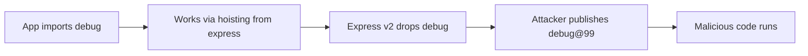

# Lab 1.6: Phantom Dependencies

<div class="lab-meta">
  <span>~30 minutes</span>
  <span>Intermediate</span>
  <span>Prerequisites: <a href="1.1-dependency-resolution.md">Lab 1.1</a>, <a href="1.2-dependency-confusion.md">Lab 1.2</a>, <a href="1.3-typosquatting.md">Lab 1.3</a>, <a href="1.4-lockfile-injection.md">Lab 1.4</a></span>
</div>

Your code imports `debug`. It works. But `debug` isn't in your `package.json`. It's there because `acme-framework` depends on it, and npm hoists transitive dependencies to the root of `node_modules/`. You're relying on something you don't control. and one day, it will break. Or worse, an attacker will exploit the gap.

This lab teaches you what phantom (implicit) dependencies are, how they silently break production, and how attackers weaponize them.

### Attack Flow



---

## Environment

| Service | Address | Purpose |
|---------|---------|---------|
| Verdaccio | `verdaccio:4873` | Local npm registry |

The workspace contains:

- An Express-like app (`app.js`) that uses `debug`. but `debug` is NOT in `package.json`
- `acme-framework@1.0.0` on the registry (depends on `debug@4.3.4`)
- `acme-framework@2.0.0` ready to publish (drops `debug` dependency)

## Connect to the Workstation

```bash
./weaklink shell
```

### Workstation Terminal

Use the embedded terminal below, or open a separate terminal and run `./cli/weaklink shell`.

<div class="terminal-embed">
  <iframe src="http://localhost:7681" title="WeakLink Workstation Terminal"></iframe>
</div>

---

???+ info "Phase 1: UNDERSTAND. What Phantom Dependencies Are"

    **Goal:** Discover that your app uses a package it never declared.

### What is a phantom dependency?

A phantom (or implicit) dependency is a package your code `require()`s that is NOT listed in your `package.json`. It exists in `node_modules/` only because another package depends on it, and npm "hoists" transitive dependencies to the root.

### Step 1: Look at your app

```bash
cat /workspace/package.json
```

Dependencies: only `acme-framework`. No `debug`.

```bash
cat /workspace/app.js
```

But the code does `require('debug')`. This should fail... right?

### Step 2: Install and run

```bash
cd /workspace
npm install
node app.js
```

It works. But why?

### Step 3: Understand hoisting

```bash
# Is debug in node_modules?
ls node_modules/debug/

# Where did it come from? Check the dependency tree:
npm ls debug
```

You'll see: `debug@4.3.4` is installed as a dependency of `acme-framework@1.0.0`. npm hoisted it to `node_modules/debug/` at the root level, making it accessible to your code even though you never declared it.

### Step 4: Find phantom dependencies with depcheck

```bash
depcheck /workspace
```

`depcheck` analyzes your code and compares `require()` calls against `package.json`. It will report `debug` as a missing dependency.

### Key Insight

Your code depends on an implementation detail of `acme-framework`. If `acme-framework` upgrades, drops, or changes the version of `debug`, your app breaks. and you have zero control over when that happens.

---

???+ warning "Phase 2: BREAK. When the Phantom Disappears (or Gets Replaced)"

    **Goal:** See what happens when the upstream dependency drops `debug`. and an attacker fills the gap.

### Part A: The reliability failure

What happens when the upstream dependency drops `debug`?

#### Step 1: Publish the updated acme-framework

```bash
publish-attack
```

This publishes `acme-framework@2.0.0` (which no longer depends on `debug`) and a malicious `debug@99.0.0` to the registry.

#### Step 2: Update your dependencies

```bash
cd /workspace
npm update
```

npm upgrades `acme-framework` to v2.0.0. Since v2 doesn't depend on `debug`, npm may remove `debug` from `node_modules/` (or resolve the malicious v99).

#### Step 3: Try running the app

```bash
node app.js
```

One of two things happens:

1. **`debug` is gone**: The app crashes with `Cannot find module 'debug'`
2. **`debug@99.0.0` is resolved**: The app runs but you've been compromised

#### Step 4: Check for compromise

```bash
cat /tmp/phantom-dep-pwned 2>/dev/null
```

If this file exists, the malicious `debug@99.0.0` was installed and executed its payload.

### Part B: The supply chain attack

Even if the reliability failure doesn't happen, the attack vector is real:

1. Attacker identifies popular packages used as phantom dependencies (e.g., `debug`, `ms`, `qs`)
2. Attacker waits for the upstream package to drop or change the dependency
3. Attacker publishes a higher-version malicious package
4. npm resolves the attacker's version for anyone who didn't declare it explicitly

```bash
# Check what version of debug is installed now
npm ls debug
cat node_modules/debug/package.json | grep version
```

### What just happened

- You depended on `debug` without declaring it
- When `acme-framework` dropped `debug`, your implicit contract broke
- The malicious `debug@99.0.0` could fill the gap, silently compromising your app
- **This is not hypothetical**: real packages like `event-stream` and `ua-parser-js` were compromised through similar dependency gaps

---

???+ success "Phase 3: DEFEND. Declaring and Pinning All Dependencies"

    **Goal:** Eliminate phantom dependencies by declaring and pinning everything your code uses.

### Step 1: Clean up

```bash
cd /workspace
rm -rf node_modules package-lock.json
rm -f /tmp/phantom-dep-pwned
```

### Step 2: Find all phantom dependencies

```bash
depcheck /workspace
```

This reports `debug` as a missing dependency (used in code but not in `package.json`).

### Step 3: Add debug as an explicit, pinned dependency

```bash
# Edit package.json to add debug with a pinned version
cat > package.json << 'EOF'
{
  "name": "phantom-demo-app",
  "version": "1.0.0",
  "description": "An app with properly declared dependencies",
  "main": "app.js",
  "scripts": {
    "start": "node app.js"
  },
  "dependencies": {
    "acme-framework": "1.0.0",
    "debug": "4.3.4"
  }
}
EOF
```

Key changes:

- `debug` is now an **explicit** dependency with a **pinned version** (`4.3.4`, not `^4.3.4`)
- `acme-framework` is pinned to `1.0.0` (you can also use `^1.0.0` if you want minor updates)

### Step 4: Install from clean state

```bash
npm install
```

### Step 5: Verify the app works

```bash
node app.js
```

The app should start and show `debug version: 4.3.4`.

### Step 6: Use npm ci for reproducible installs

```bash
# Verify lockfile exists
cat package-lock.json | grep -c '"integrity"'

# Clean install from lockfile (strict mode)
rm -rf node_modules
npm ci
```

`npm ci` ensures exact lockfile reproduction. It will fail if `package.json` and `package-lock.json` are out of sync.

### Step 7: Re-run depcheck

```bash
depcheck /workspace
```

No more phantom dependencies.

### Step 8: Test the defense against the attack

Even if `acme-framework@2.0.0` is available and `debug@99.0.0` exists on the registry:

```bash
# Try updating -- debug stays at 4.3.4 because it's pinned
npm update
npm ls debug
node app.js

# No compromise
test ! -f /tmp/phantom-dep-pwned && echo "PASS: not compromised"
```

Because `debug@4.3.4` is explicitly declared and pinned, `npm update` won't replace it with `99.0.0`.

### Verify your defenses

Run the verification from your host terminal (outside the workstation):

```bash
weaklink verify 1.6
```

---

??? danger "Phase 4: DETECT. Finding Phantom Dependencies in Production"

    **Goal:** Identify phantom dependency usage and exploitation through code analysis, SIEM queries, and build monitoring.

### What This Attack Looks Like in Logs

Phantom dependency exploitation has two phases: the *silent reliance* phase (your code uses undeclared packages) and the *substitution* phase (an attacker publishes a malicious version that fills the gap). Detection differs for each phase.

**Phase 1. Silent reliance (pre-attack):**

- `depcheck` or similar tools report `require()` / `import` statements for packages not in `package.json`
- `npm ls <package>` shows the package as a transitive dependency (indented under another package), but your code imports it directly
- Build succeeds on CI but fails locally (or vice versa) due to different hoisting behavior across npm versions

**Phase 2. Substitution attack:**

- A previously-transitive package suddenly appears as a direct install with a significantly higher version number (e.g., `debug@4.3.4` jumps to `debug@99.0.0`)
- `npm install` resolves a package version that doesn't match any version in your dependency tree's constraints
- New packages appear in `node_modules/` after `npm update` that were never in your `package.json`

**Network indicators:**

- Package downloads for versions with anomalously high version numbers (e.g., `99.x`, `999.x`. attackers use high versions to win resolution)
- Outbound network connections from packages that previously had no network activity
- DNS lookups from `node` processes during `npm install` to non-registry domains

**EDR/process indicators:**

- After `npm update`, new processes are spawned by packages that previously had no install scripts
- File writes to `/tmp/`, home directories, or system paths from packages during `npm install`
- `node` child processes making outbound HTTP requests during install phase

### Detection Queries

### MITRE ATT&CK Mapping

| Technique | ID | Relevance |
|-----------|-----|-----------|
| Supply Chain Compromise: Compromise Software Dependencies | **T1195.002** | The core category. exploiting implicit dependency relationships in the package ecosystem |
| Supply Chain Compromise: Compromise Software Supply Chain | **T1195.001** | The attacker publishes a malicious version of a commonly-used transitive package to the public registry |
| Hijack Execution Flow (DLL Side-Loading equivalent) | **T1574.002** | Analogous to DLL side-loading: the attacker places a malicious package where the resolver will find it, exploiting the implicit trust in npm's hoisting mechanism |

??? tip "SOC Relevance"

    **Why SOC analysts care about phantom dependencies:**

    - **Proactive detection**: Run `depcheck` in CI and feed the results to your SIEM. Any `require()` without a corresponding `package.json` entry is a phantom dependency. This is your *pre-attack* detection. fix these before an attacker can exploit them.
    - **Version anomaly alerting**: Alert on any package install where the major version jumps by more than 10 from the previously-installed version. Attackers use high version numbers (99.x, 999.x) to ensure npm resolves their malicious package over the legitimate one.
    - **npm install vs npm ci**: If your CI pipeline uses `npm install` instead of `npm ci`, it can modify the lockfile and resolve new versions at build time. Alert on any CI build that uses `npm install`. this is both a security risk and a reproducibility issue. `npm ci` strictly follows the lockfile and fails if it's out of sync.
    - **Post-incident forensics**: After a suspected compromise, compare `ls node_modules/` against the packages declared in `package.json`. Every package in `node_modules/` that isn't in `package.json` (directly or transitively via `npm ls --all`) is either a hoisted transitive dependency or a substitution attack. Cross-reference with `npm ls` to determine which.

??? example "CI Integration"

    **GitHub Actions: Phantom dependency detection and lockfile enforcement**

    This workflow runs `depcheck` to find undeclared dependencies and enforces `npm ci` for reproducible builds. Copy-paste into `.github/workflows/phantom-deps.yml`:

    ```yaml
    name: Detect Phantom Dependencies
    on:
      pull_request:
        paths:
          - '**.js'
          - '**.ts'
          - 'package.json'
          - 'package-lock.json'
      push:
        branches: [main]

    jobs:
      depcheck:
        runs-on: ubuntu-latest
        steps:
          - uses: actions/checkout@v4
          - uses: actions/setup-node@v4
            with:
              node-version: '20'
          - name: Install dependencies with npm ci
            run: |
              # Enforce npm ci -- never npm install in CI
              if ! npm ci; then
                echo "::error::npm ci failed. Lockfile may be out of sync with package.json."
                echo "::error::Run 'npm install' locally and commit the updated package-lock.json."
                exit 1
              fi
          - name: Install depcheck
            run: npm install -g depcheck
          - name: Run depcheck for phantom dependencies
            run: |
              set -euo pipefail
              OUTPUT=$(depcheck . --json 2>/dev/null || true)

              # Extract missing dependencies (used in code but not in package.json)
              MISSING=$(echo "$OUTPUT" | node -e "
                const data = JSON.parse(require('fs').readFileSync('/dev/stdin', 'utf8'));
                const missing = Object.keys(data.missing || {});
                if (missing.length > 0) {
                  console.log('PHANTOM DEPENDENCIES FOUND:');
                  missing.forEach(dep => {
                    const files = data.missing[dep];
                    console.log('  ' + dep + ' (used in: ' + files.join(', ') + ')');
                  });
                  process.exit(1);
                } else {
                  console.log('No phantom dependencies detected.');
                }
              ")
              echo "$OUTPUT"
          - name: Check for high-version anomalies
            run: |
              # Flag any installed package with a suspiciously high major version
              node -e "
                const lockfile = require('./package-lock.json');
                const packages = lockfile.packages || {};
                let found = false;
                for (const [path, info] of Object.entries(packages)) {
                  if (!path || !info.version) continue;
                  const major = parseInt(info.version.split('.')[0]);
                  if (major > 50) {
                    console.log('WARNING: ' + path + ' has version ' + info.version + ' (suspiciously high)');
                    found = true;
                  }
                }
                if (found) process.exit(1);
                console.log('No version anomalies detected.');
              "

      enforce-npm-ci:
        runs-on: ubuntu-latest
        steps:
          - uses: actions/checkout@v4
          - name: Verify no npm install in scripts
            run: |
              # Check that CI scripts and Dockerfiles use npm ci, not npm install
              if grep -rn 'npm install' .github/ Dockerfile* Makefile 2>/dev/null | grep -v 'npm install -g' | grep -v '#'; then
                echo "::warning::Found 'npm install' in CI/build files. Use 'npm ci' for reproducible builds."
              fi
    ```

---

## What You Learned

| Concept | Real-World Application |
|---------|----------------------|
| Phantom dependencies | Packages your code uses but doesn't declare. a ticking time bomb |
| npm hoisting | Transitive deps get hoisted to root `node_modules/`, making them accidentally importable |
| `depcheck` | Tool that finds undeclared dependencies by comparing `require()` calls vs `package.json` |
| Pinned versions | `"debug": "4.3.4"` (exact) vs `"^4.3.4"` (allows minor/patch updates) |
| `npm ci` vs `npm install` | `npm ci` reproduces the lockfile exactly; `npm install` can modify it |
| Supply chain gap | Phantom deps create a window where an attacker can substitute a malicious version |

## Real-World Examples

- **event-stream (2018)**: A maintainer transferred ownership to an attacker who added a malicious dependency. Projects that depended on `event-stream` transitively were compromised without ever declaring it.
- **ua-parser-js (2021)**: A popular package was hijacked. Anyone importing it as a phantom dependency had no pinned version to protect them.
- **colors.js / faker.js (2022)**: Maintainer sabotaged their own packages. Projects with phantom dependencies on these had no control over which version they got.

## Further Reading

- [Phantom dependencies in Node.js](https://rushjs.io/pages/advanced/phantom_deps/). Rush.js documentation on the problem
- [npm hoisting explained](https://docs.npmjs.com/cli/v10/configuring-npm/package-lock-json). how npm flattens the dependency tree
- [depcheck on npm](https://www.npmjs.com/package/depcheck). the tool for finding phantom deps
- [Yarn PnP](https://yarnpkg.com/features/pnp). an alternative approach that eliminates hoisting entirely
