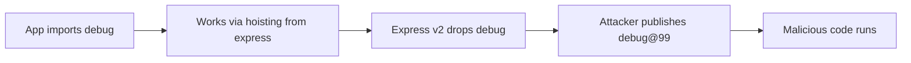

# Lab 1.6: Phantom Dependencies

  ~25 min hands-on | ~10 min reference
  Intermediate
  Prerequisites: <a href="../../tier-1/1.1-dependency-resolution/">Lab 1.1</a>, <a href="../../tier-1/1.2-dependency-confusion/">Lab 1.2</a>, <a href="../../tier-1/1.3-typosquatting/">Lab 1.3</a>, <a href="../../tier-1/1.4-lockfile-injection/">Lab 1.4</a>

  Overview
  ›
  <a href="understand/" class="phase-step upcoming">Understand</a>
  ›
  <a href="break/" class="phase-step upcoming">Break</a>
  ›
  <a href="defend/" class="phase-step upcoming">Defend</a>
  ›
  <a href="detect/" class="phase-step upcoming">Detect</a>

Your code imports `debug`. It works. But `debug` isn't in your `package.json`. It's there because `wl-framework` depends on it, and npm hoists transitive dependencies to the root of `node_modules/`. You're relying on something you don't control, and an attacker can exploit the gap. In 2018, a new maintainer of the event-stream npm package added flatmap-stream as a dependency containing a targeted cryptocurrency theft payload. The attack succeeded partly because event-stream's consumers relied on transitive hoisting rather than explicit declarations.

### Attack Flow

## Environment

| Service | Address | Purpose |
|---------|---------|---------|
| Verdaccio | `verdaccio:4873` | Local npm registry |

The workspace contains:

- An Express-like app (`app.js`) that uses `debug`, but `debug` is NOT in `package.json`
- `wl-framework@1.0.0` on the registry (depends on `debug@4.3.4`)
- `wl-framework@2.0.0` ready to publish (drops `debug` dependency)

!!! tip "Related Labs"
    - **Prerequisite:** [1.1 How Dependency Resolution Works](../1.1-dependency-resolution/index.md) — Dependency resolution creates the tree where phantom deps hide
    - **Next:** [4.1 What SBOMs Actually Contain](../../tier-4/4.1-sbom-contents/index.md) — SBOMs are a key defense for tracking actual vs. declared dependencies
    - **See also:** [1.4 Lockfile Injection](../1.4-lockfile-injection/index.md) — Lockfile injection similarly exploits metadata inconsistencies
    - **See also:** [6.8 Case Study: event-stream](../../tier-6/6.8-case-study-event-stream/index.md) — event-stream exploited a package that most consumers used implicitly
