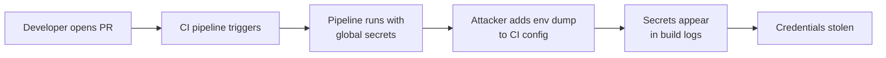

# Lab 2.1: CI/CD Fundamentals

  ~15 min hands-on | ~15 min reference
  Beginner
  Prerequisites: <a href="../../tier-0/0.1-version-control/">Lab 0.1</a>

  Overview
  ›
  <a href="understand/" class="phase-step upcoming">Understand</a>
  ›
  <a href="break/" class="phase-step upcoming">Break</a>
  ›
  <a href="defend/" class="phase-step upcoming">Defend</a>
  ›
  <a href="detect/" class="phase-step upcoming">Detect</a>

Over 70% of top GitHub repositories have CI/CD configs that leak secrets to PR builds. Pipelines automate build/test/deploy and run with elevated permissions: deployment tokens, cloud credentials, API keys. If an attacker can influence what a pipeline executes, they steal those secrets.

### Attack Flow

## Environment

| Service | Address | Description |
|---------|---------|-------------|
| Gitea | `gitea:3000` | Git server hosting `wl-webapp` repository |
| Workstation | (your shell) | Development environment with git, python, curl |

!!! tip "Related Labs"
    - **Prerequisite:** [0.4 How CI/CD Works](../../tier-0/0.4-how-cicd-works/index.md) — Covers the basics of how CI/CD pipelines work
    - **Next:** [2.2 Direct Poisoned Pipeline Execution](../2.2-direct-ppe/index.md) — Direct poisoned pipeline execution is the first CI/CD attack
    - **See also:** [2.4 Secret Exfiltration from CI](../2.4-secret-exfiltration/index.md) — CI environments often contain secrets worth stealing
