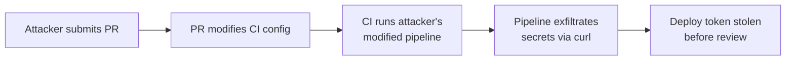

# Lab 2.2: Direct Poisoned Pipeline Execution (PPE)

  Understand: ~7 min | Break: ~7 min | Defend: ~6 min | Detect: ~15 min
  Intermediate
  Prerequisites: <a href="../2.1-cicd-fundamentals/">Lab 2.1</a>

  Overview
  ›
  <a href="understand/" class="phase-step upcoming">Understand</a>
  ›
  <a href="break/" class="phase-step upcoming">Break</a>
  ›
  <a href="defend/" class="phase-step upcoming">Defend</a>
  ›
  <a href="detect/" class="phase-step upcoming">Detect</a>

CI configs are code. They live in the repo alongside application source. When a developer opens a PR, the CI system runs the pipeline as defined **in the PR branch**, not the target branch. The PR author controls what the pipeline executes. Direct PPE: modify the CI config in a PR, exfiltrate secrets before anyone reviews it.

### Attack Flow

## Environment

| Service | Address | Description |
|---------|---------|-------------|
| Gitea | `gitea:3000` | Git server hosting `wl-webapp` with CI secrets |
| Workstation | (your shell) | Development environment |

!!! tip "Related Labs"
    - **Prerequisite:** [2.1 CI/CD Fundamentals](../2.1-cicd-fundamentals/index.md) — Understanding CI/CD fundamentals is essential for this attack
    - **Next:** [2.3 Indirect Poisoned Pipeline Execution](../2.3-indirect-ppe/index.md) — Indirect PPE is a stealthier variant of pipeline poisoning
    - **See also:** [2.6 GitHub Actions Injection](../2.6-actions-injection/index.md) — Actions injection is another way to execute code in pipelines
    - **See also:** [6.6 Case Study: SolarWinds (SUNBURST)](../../tier-6/6.6-case-study-solarwinds/index.md) — SolarWinds compromised the build process at scale
