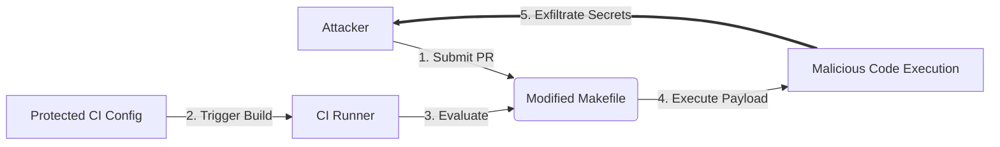

# Lab 2.3: Indirect Poisoned Pipeline Execution

  Understand: ~7 min | Break: ~7 min | Defend: ~6 min | Detect: ~15 min
  Intermediate
  Prerequisites: <a href="../2.2-direct-ppe/">Lab 2.2</a>

  Overview
  ›
  <a href="understand/" class="phase-step upcoming">Understand</a>
  ›
  <a href="break/" class="phase-step upcoming">Break</a>
  ›
  <a href="defend/" class="phase-step upcoming">Defend</a>
  ›
  <a href="detect/" class="phase-step upcoming">Detect</a>

After Direct PPE became well-known, organizations locked down CI config files with CODEOWNERS and branch protection. Attackers adapted. Indirect PPE exploits files that CI pipelines *reference*: Makefiles, shell scripts, test configs, Dockerfiles. Even if the CI config is protected, the files it executes often are not. A PR that modifies `Makefile` or `scripts/test.sh` never touches the CI config, but the pipeline still runs the modified file. The SolarWinds attack (2020) demonstrated this at scale: attackers modified build scripts referenced by the CI system, injecting the SUNBURST backdoor into signed Orion updates without touching the build configuration itself.

### Understanding the Attack Flow

## Environment

| Service | Address | Description |
|---------|---------|-------------|
| Gitea | `gitea:3000` | Git server hosting `wl-webapp` with Makefile-based CI |
| Workstation | (your shell) | Development environment |

> **Related Labs**
>
> - **Prerequisite:** [2.2 Direct Poisoned Pipeline Execution](../2.2-direct-ppe/index.md) — Direct PPE covers the foundational pipeline poisoning technique
> - **Next:** [2.4 Secret Exfiltration from CI](../2.4-secret-exfiltration/index.md) — After pipeline access, exfiltrating secrets is the next step
> - **See also:** [6.5 Case Study: xz-utils (CVE-2024-3094)](../../tier-6/6.5-case-study-xz-utils/index.md) — xz-utils used indirect build system manipulation over two years
> - **See also:** [2.8 Workflow Run & Cross-Workflow Attacks](../2.8-workflow-run-attacks/index.md) — Workflow run attacks chain indirect triggers across workflows
