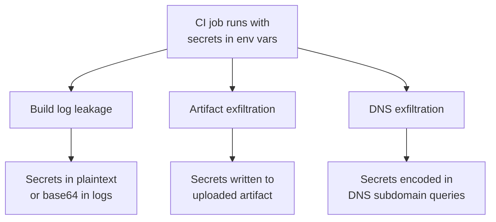

# Lab 2.4: Secret Exfiltration from CI

  ~15 min hands-on | ~15 min reference
  Intermediate
  Prerequisites: <a href="../2.1-cicd-fundamentals/">Lab 2.1</a>

  Overview
  ›
  <a href="understand/" class="phase-step upcoming">Understand</a>
  ›
  <a href="break/" class="phase-step upcoming">Break</a>
  ›
  <a href="defend/" class="phase-step upcoming">Defend</a>
  ›
  <a href="detect/" class="phase-step upcoming">Detect</a>

CI secrets are environment variables. Build steps can read, log, write, and transmit them. Three exfiltration channels: **build logs** (`echo $SECRET`), **artifacts** (write to a file, upload as build artifact), and **network** (base64-encode in DNS queries or HTTP requests). Even with secret masking enabled, attackers bypass it by encoding, splitting, or reversing the value before printing.

### Attack Flow

## Environment

| Service | Address | Description |
|---------|---------|-------------|
| Gitea | `gitea:3000` | Git server hosting `wl-webapp` with multiple CI secrets |
| Workstation | (your shell) | Development environment |

!!! tip "Related Labs"
    - **Prerequisite:** [2.1 CI/CD Fundamentals](../2.1-cicd-fundamentals/index.md) — Understanding CI environments is essential before exfiltrating their secrets
    - **Next:** [2.5 Self-Hosted Runner Attacks](../2.5-self-hosted-runners/index.md) — Self-hosted runners expand the attack surface for secret access
    - **See also:** [6.7 Case Study: Codecov Bash Uploader](../../tier-6/6.7-case-study-codecov/index.md) — Codecov exfiltrated CI secrets at massive scale
    - **See also:** [9.4 IAM Chain Abuse](../../tier-9/9.4-iam-chain-abuse/index.md) — IAM chain abuse extends credential theft beyond CI
