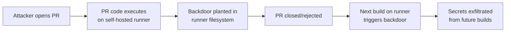

# Lab 2.5: Self-Hosted Runner Attacks

  Understand: ~8 min | Break: ~8 min | Defend: ~9 min | Detect: ~15 min
  Advanced
  Prerequisites: <a href="../2.1-cicd-fundamentals/">Lab 2.1</a>

  Overview
  ›
  <a href="understand/" class="phase-step upcoming">Understand</a>
  ›
  <a href="break/" class="phase-step upcoming">Break</a>
  ›
  <a href="defend/" class="phase-step upcoming">Defend</a>
  ›
  <a href="detect/" class="phase-step upcoming">Detect</a>

Unlike GitHub-hosted runners (fresh VMs destroyed after each job), self-hosted runners are persistent machines that retain state between workflow runs: files, environment variables, credentials, running processes. An attacker who gets code execution on a self-hosted runner via a PR can plant backdoors that survive across builds and affect every subsequent workflow on that machine. PyTorch and Kubernetes have been impacted by self-hosted runner misconfigurations.

### Attack Flow

## Environment

| Service | Address | Description |
|---------|---------|-------------|
| Gitea | `gitea:3000` | Git server hosting `wl-webapp` with CI runner |
| Runner | `/runner` | Simulated self-hosted runner filesystem exposed inside the workstation |
| Workstation | (your shell) | Development environment |

!!! tip "Related Labs"
    - **Prerequisite:** [2.1 CI/CD Fundamentals](../2.1-cicd-fundamentals/index.md) — Understanding CI/CD basics including hosted vs. self-hosted runners
    - **Next:** [2.7 Build Cache Poisoning](../2.7-build-cache-poisoning/index.md) — Build cache poisoning targets persistent state on shared runners
    - **See also:** [2.4 Secret Exfiltration from CI](../2.4-secret-exfiltration/index.md) — Self-hosted runners expose more secrets than cloud runners
