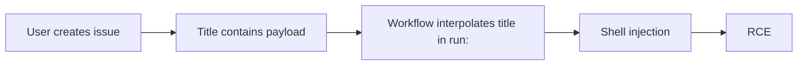

# Lab 2.6: GitHub Actions Injection

  ~15 min hands-on | ~15 min reference
  Intermediate
  Prerequisites: <a href="../2.2-direct-ppe/">Lab 2.2</a>

  Overview
  ›
  <a href="understand/" class="phase-step upcoming">Understand</a>
  ›
  <a href="break/" class="phase-step upcoming">Break</a>
  ›
  <a href="defend/" class="phase-step upcoming">Defend</a>
  ›
  <a href="detect/" class="phase-step upcoming">Detect</a>

`${{ }}` expressions interpolate user-controlled inputs directly into shell commands. An attacker who controls an issue title, PR branch name, commit message, or comment body can inject arbitrary shell commands into the CI pipeline without modifying any workflow file. The workflow YAML stays on the default branch; the vulnerability is in how it uses expressions. When `${{ github.event.issue.title }}` appears inside a `run:` block, GitHub Actions performs string interpolation *before* the shell sees it. `github/codeql-action`, `microsoft/vscode`, and hundreds of others were found vulnerable.

### Attack Flow

## Environment

| Service | Address | Description |
|---------|---------|-------------|
| Gitea | `gitea:3000` | Git server hosting `wl-webapp` with Actions workflows |
| Workstation | (your shell) | Development environment |
