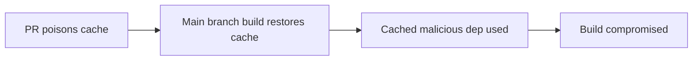

# Lab 2.7: Build Cache Poisoning

  Understand: ~7 min | Break: ~7 min | Defend: ~6 min | Detect: ~15 min
  Advanced
  Prerequisites: <a href="../2.1-cicd-fundamentals/">Lab 2.1</a>

  Overview
  ›
  <a href="understand/" class="phase-step upcoming">Understand</a>
  ›
  <a href="break/" class="phase-step upcoming">Break</a>
  ›
  <a href="defend/" class="phase-step upcoming">Defend</a>
  ›
  <a href="detect/" class="phase-step upcoming">Detect</a>

CI systems cache dependencies, build outputs, and Docker layers to speed up pipelines. The cache is keyed by a hash (typically the lockfile) and shared across workflow runs. If an attacker can poison the cache by inserting a modified dependency, every subsequent build using that cache key silently uses the malicious version. The attack remains viable when cache keys are weak, when PR caches are not isolated, or when self-hosted caching infrastructure is used. Legit Security's 2022 research demonstrated that GitHub Actions caches could be poisoned from a pull request and restored by default branch builds, compromising production pipelines without touching any protected files.

### Attack Flow

## Environment

| Service | Address | Description |
|---------|---------|-------------|
| Gitea | `gitea:3000` | Git server hosting `wl-webapp` with CI caching |
| Registry | `registry:5000` | Local package registry |
| Workstation | (your shell) | Development environment |
