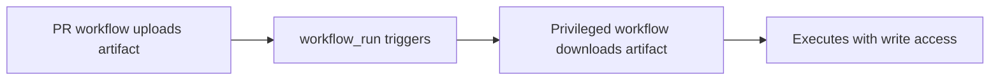

# Lab 2.8: Workflow Run & Cross-Workflow Attacks

  ~25 min hands-on | ~15 min reference
  Advanced
  Prerequisites: <a href="../2.2-direct-ppe/">Lab 2.2</a>, <a href="../2.6-actions-injection/">Lab 2.6</a>

  Overview
  ›
  <a href="understand/" class="phase-step upcoming">Understand</a>
  ›
  <a href="break/" class="phase-step upcoming">Break</a>
  ›
  <a href="defend/" class="phase-step upcoming">Defend</a>
  ›
  <a href="detect/" class="phase-step upcoming">Detect</a>

`workflow_run` lets one workflow start after another completes. The triggered workflow **always runs on the default branch** with **write permissions**, regardless of what triggered the first workflow. A PR from a fork runs with read-only permissions, but the `workflow_run` workflow runs on `main` with full write access, secrets, and the GitHub token. Combining this with artifact passing creates a privilege escalation: the PR workflow uploads an artifact (PR author controls it), and the `workflow_run` workflow downloads and processes it with elevated privileges. This affected `actions/runner`, `microsoft/TypeScript`, and many others.

### Attack Flow

## Environment

| Service | Address | Description |
|---------|---------|-------------|
| Gitea | `gitea:3000` | Git server hosting `wl-webapp` with workflow_run triggers |
| Workstation | (your shell) | Development environment |
