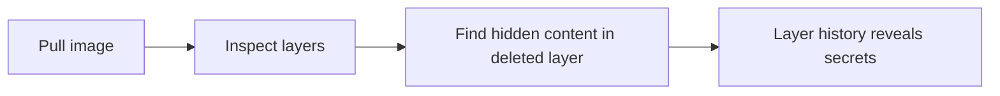

# Lab 3.1: Container Image Internals

<div class="lab-meta">
  <span>~20 min hands-on | ~10 min reference</span>
  <span class="difficulty beginner">Beginner</span>
  <span>Prerequisites: <a href="../tier-0/0.3-containers.md">Lab 0.3</a></span>
</div>

`docker pull` downloads a **stack of compressed tarballs** (layers), a **manifest** listing them in order, and a **config blob** with metadata. Attackers hide malicious content in layers that appear "deleted" in the final filesystem but remain extractable from the image. In 2020-2021, researchers found dozens of Docker Hub images with cryptominers hidden in intermediate layers, accumulating millions of pulls before removal.

---

### Attack Flow



---

## Environment

| Service | Address | Description |
|---------|---------|-------------|
| OCI Registry | `registry:5000` | Local registry with pre-loaded images |
| Workstation | Pod with docker CLI, crane, and jq | Your working environment |

## Connect to the Workstation

```bash
./weaklink shell
```

---

???+ info "Phase 1: UNDERSTAND. How Container Images Are Built"

### Step 1: Pull and inspect an image

```bash
docker pull registry:5000/webapp:latest
docker inspect registry:5000/webapp:latest | jq '.[0].RootFS'
```

`RootFS` shows the layer digests. Each layer is a tarball that adds, modifies, or deletes files on top of the previous layer.

### Step 2: View the build history

```bash
docker history registry:5000/webapp:latest
```

Each Dockerfile instruction that created a layer appears here. Layers with `SIZE` of 0B are metadata-only (`CMD`, `ENV`).

### Step 3: Inspect the manifest with crane

```bash
crane manifest registry:5000/webapp:latest | jq .
```

The manifest contains:

- `mediaType`. the format (OCI or Docker v2)
- `config`. pointer to the config blob (env vars, entrypoint, etc.)
- `layers`. ordered list of layer digests and sizes

### Step 4: Inspect the config blob

```bash
crane config registry:5000/webapp:latest | jq .
```

The config contains runtime metadata: environment variables, entrypoint, working directory, and the full `history` array.

### Step 5: Understand tags vs digests

```bash
# A tag is a mutable pointer
crane digest registry:5000/webapp:latest

# A digest is an immutable content hash
crane manifest registry:5000/webapp@sha256:$(crane digest registry:5000/webapp:latest) | jq .
```

Tags can be overwritten at any time. Digests cannot.

### Step 6: Count the layers

```bash
crane manifest registry:5000/webapp:latest | jq '.layers | length'
```

Remember this number. You will need it to detect when extra layers have been added.

---

???+ warning "Phase 2: BREAK. Hidden Content in Image Layers"

### Step 1: Compare two images

Two images are available: `webapp:latest` and `webapp:clean`. They produce identical output:

```bash
docker run --rm registry:5000/webapp:latest
docker run --rm registry:5000/webapp:clean
```

### Step 2: Check the history

```bash
docker history --no-trunc registry:5000/webapp:latest
docker history --no-trunc registry:5000/webapp:clean
```

The `latest` image has extra history entries. One layer copies a file, a subsequent layer deletes it. The file does not appear in the running container's filesystem, but it is still in the image.

### Step 3: Extract all layers

```bash
docker save registry:5000/webapp:latest -o /tmp/webapp.tar
mkdir -p /app/extracted-layers
tar xf /tmp/webapp.tar -C /app/extracted-layers
```

### Step 4: Find the hidden content

```bash
cd /app/extracted-layers
for layer in */layer.tar; do
    echo "=== $layer ==="
    tar tf "$layer" 2>/dev/null | head -20
done
```

One layer contains a file absent from the final filesystem. This is the hidden backdoor, "deleted" by a whiteout file in a later layer but still present in the image data.

### Step 5: Find the whiteout markers

Whiteout files are how container layers "delete" content from earlier layers. A file named `.wh.backdoor.sh` means `backdoor.sh` was deleted in this layer but still exists in an earlier one:

```bash
for layer in */layer.tar; do
    WHITEOUTS=$(tar tf "$layer" 2>/dev/null | grep "\.wh\.")
    if [ -n "$WHITEOUTS" ]; then
        echo "=== Whiteout in: $layer ==="
        echo "$WHITEOUTS"
    fi
done
```

The whiteout filename tells you exactly what was hidden. Strip the `.wh.` prefix to get the original filename.

### Step 6: Extract and read the hidden file

Now find which earlier layer added the original file and extract it:

```bash
HIDDEN_NAME=$(for layer in */layer.tar; do tar tf "$layer" 2>/dev/null | grep "\.wh\."; done | head -1 | sed 's|.*/\.wh\.||')
echo "Looking for: $HIDDEN_NAME"

mkdir -p /tmp/hidden
for layer in */layer.tar; do
    if tar tf "$layer" 2>/dev/null | grep -qF "$HIDDEN_NAME"; then
        echo "Found in: $layer"
        tar xf "$layer" -C /tmp/hidden 2>/dev/null
        find /tmp/hidden -name "$HIDDEN_NAME" -exec cat {} \;
    fi
done
```

### Step 7: Document your findings

```bash
LAYER_HASH=$(for layer in */layer.tar; do tar tf "$layer" 2>/dev/null | grep -l "\.wh\." 2>/dev/null; done | head -1 | cut -d/ -f1)

cat > /app/findings.txt << EOF
Hidden content found in image registry:5000/webapp:latest
File: $HIDDEN_NAME
Added in an early layer, deleted via whiteout in layer $LAYER_HASH.
The file is invisible to docker run but still present in the image data.
Anyone who pulls this image downloads the hidden content.
EOF
cat /app/findings.txt
```

Save the full history output:

```bash
docker history --no-trunc registry:5000/webapp:latest > /app/history-output.txt
```

---

???+ success "Phase 3: DEFEND. Inspecting All Layers and Using Minimal Images"

### Defense 1: Always inspect full history

```bash
docker history --no-trunc <image>
```

Any image with `RUN rm` after a `COPY` or `ADD` is suspicious.

### Defense 2: Scan all layers, not just the final filesystem

```bash
trivy image --scanners vuln registry:5000/webapp:latest
```

Configure your scanner to inspect every layer, not just the final merged filesystem.

### Defense 3: Use minimal base images

Distroless and Chainguard images have no shell, no package manager, and minimal layers:

```bash
crane manifest registry:5000/webapp:latest | jq '.layers | length'
crane manifest cgr.dev/chainguard/static:latest | jq '.layers | length'
```

Fewer layers means less surface area for hidden content.

### Defense 4: Build from scratch when possible

For compiled languages (Go, Rust), build `FROM scratch`:

```dockerfile
FROM scratch
COPY --from=builder /app/binary /app/binary
ENTRYPOINT ["/app/binary"]
```

One layer. Nothing to hide in.

### Step 5: Verify the lab

```bash
weaklink verify 3.1
```

---

??? danger "Phase 4: DETECT. Finding Hidden Content in Production Images"

Images with more layers than expected, or layer history showing file additions followed by deletions, indicate hidden content. This pattern is abnormal in properly built images.

**Indicators:**

- `docker history` shows `RUN rm` or whiteout entries after `COPY`/`ADD` of executables
- Layer count mismatches between Dockerfile instruction count and actual manifest
- Images significantly larger than expected for their base image
- Registry webhook events showing pushes with unusual layer counts

### MITRE ATT&CK Mapping

| Technique | ID | Relevance |
|-----------|-----|-----------|
| **Implant Internal Image** | [T1525](https://attack.mitre.org/techniques/T1525/) | Malicious content hidden in a layer survives casual inspection |
| **Masquerading** | [T1036](https://attack.mitre.org/techniques/T1036/) | Image appears identical to the clean version at filesystem level |

---

??? tip "SOC Relevance"

    **Alert:** "Container image layer count exceeds baseline" or "Image history contains add-then-delete pattern"

    **Triage steps:**

    1. Extract all layers with `docker save` and inspect each individually
    2. Compare layer count and digests against expected Dockerfile output
    3. Look for executables or scripts that appear only in intermediate layers
    4. If unexpected content found, quarantine and rebuild from source

---

??? example "CI Integration"

    **`.github/workflows/image-layer-audit.yml`:**

    ```yaml
    name: Container Image Layer Audit

    on:
      push:
        paths:
          - "Dockerfile*"
          - "docker-compose*.yml"

    jobs:
      audit-layers:
        runs-on: ubuntu-latest
        steps:
          - uses: actions/checkout@v4

          - name: Install crane
            run: |
              curl -sL https://github.com/google/go-containerregistry/releases/latest/download/go-containerregistry_Linux_x86_64.tar.gz \
                | tar xz crane
              sudo mv crane /usr/local/bin/

          - name: Build image
            run: docker build -t audit-target:latest .

          - name: Check for add-then-delete pattern
            run: |
              HISTORY=$(docker history --no-trunc --format '{{.CreatedBy}}' audit-target:latest)
              if echo "$HISTORY" | grep -qE '(rm -rf|rm -f|rm /)' ; then
                echo "::warning::Image history contains file deletion after addition."
                echo "Use multi-stage builds to avoid this pattern."
              fi

          - name: Verify layer count
            run: |
              EXPECTED_LAYERS=$(grep -cE '^(RUN|COPY|ADD) ' Dockerfile || echo 0)
              ACTUAL_LAYERS=$(docker inspect --format '{{len .RootFS.Layers}}' audit-target:latest)
              echo "Dockerfile instructions: $EXPECTED_LAYERS"
              echo "Actual image layers: $ACTUAL_LAYERS"
              if [ "$ACTUAL_LAYERS" -gt $((EXPECTED_LAYERS + 15)) ]; then
                echo "::error::Image has significantly more layers than expected."
                exit 1
              fi

          - name: Scan all layers with Trivy
            uses: aquasecurity/trivy-action@master
            with:
              image-ref: audit-target:latest
              severity: CRITICAL,HIGH
              exit-code: 1
    ```

---

## What You Learned

- **Deleted files are not truly deleted.** A whiteout hides the file from the runtime filesystem, but the data remains extractable from the image layers.
- **`docker inspect` shows only the merged view.** You need `docker history --no-trunc` and layer extraction to see everything.
- **Minimal base images reduce risk.** Fewer layers mean less surface area for hidden content.

## Further Reading

- [OCI Image Specification](https://github.com/opencontainers/image-spec/blob/main/spec.md)
- [Dive: exploring container image layers](https://github.com/wagoodman/dive)
- [Google crane tool](https://github.com/google/go-containerregistry/tree/main/cmd/crane)
