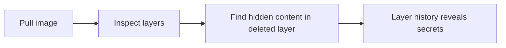

# Lab 3.1: Container Image Internals

  Understand: ~7 min | Break: ~7 min | Defend: ~6 min | Detect: ~10 min
  Beginner
  Prerequisites: <a href="../../tier-0/0.3-containers/">Lab 0.3</a>

  Overview
  ›
  <a href="understand/" class="phase-step upcoming">Understand</a>
  ›
  <a href="break/" class="phase-step upcoming">Break</a>
  ›
  <a href="defend/" class="phase-step upcoming">Defend</a>
  ›
  <a href="detect/" class="phase-step upcoming">Detect</a>

`docker pull` downloads a **stack of compressed tarballs** (layers), a **manifest** listing them in order, and a **config blob** with metadata. Attackers hide malicious content in layers that appear "deleted" in the final filesystem but remain extractable from the image. In 2020-2021, researchers found dozens of Docker Hub images with cryptominers hidden in intermediate layers, accumulating millions of pulls before removal.

### Attack Flow

## Environment

| Service | Address | Description |
|---------|---------|-------------|
| OCI Registry | `registry:5000` | Local registry with pre-loaded images |
| Workstation | Pod with docker CLI, crane, and jq | Your working environment |

> **Related Labs**
>
> - **Prerequisite:** [0.3 How Containers Work](../../tier-0/0.3-containers/index.md) — Basic container concepts before diving into image internals
> - **Next:** [3.2 Tag Mutability Attacks](../3.2-tag-mutability/index.md) — Tag mutability attacks exploit how images are referenced
> - **Next:** [3.5 Layer Injection](../3.5-layer-injection/index.md) — Layer injection manipulates the layer structure covered here
> - **See also:** [4.3 Signing Fundamentals](../../tier-4/4.3-signing-fundamentals/index.md) — Signing fundamentals protect the images analyzed here
