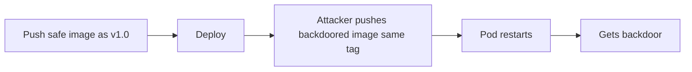

# Lab 3.2: Tag Mutability Attacks

  Understand: ~7 min | Break: ~7 min | Defend: ~6 min | Detect: ~10 min
  Intermediate
  Prerequisites: <a href="../../tier-0/0.3-containers.md">Lab 0.3</a>

  Overview
  ›
  <a href="understand/" class="phase-step upcoming">Understand</a>
  ›
  <a href="break/" class="phase-step upcoming">Break</a>
  ›
  <a href="defend/" class="phase-step upcoming">Defend</a>
  ›
  <a href="detect/" class="phase-step upcoming">Detect</a>

Container image tags are mutable pointers. `image: webapp:1.0.0` in a Kubernetes deployment has no guarantee that `1.0.0` today points to the same image as yesterday. An attacker (or compromised CI pipeline) can overwrite a tag with a different image. The next pod restart pulls the attacker's version. The `latest` tag problem is well documented: AWS ECR added tag immutability as a feature specifically because tag overwrites in production registries caused silent deployments of wrong images, and Docker Hub's lack of immutability has been exploited in multiple incidents.

### Attack Flow

## Environment

| Service | Address | Description |
|---------|---------|-------------|
| OCI Registry | `registry:5000` | Local registry with `webapp:1.0.0` |
| Kubernetes | minikube cluster | Running deployment that pulls from the registry |
