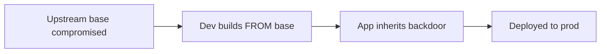

# Lab 3.3: Base Image Poisoning

<div class="lab-meta">
  <span>~25 min hands-on | ~10 min reference</span>
  <span class="difficulty intermediate">Intermediate</span>
  <span>Prerequisites: <a href="3.1-image-internals.md">Lab 3.1</a></span>
</div>

Every Dockerfile starts with `FROM`. That single line imports an entire OS, runtime, and all its dependencies. If the base image is compromised, every image built on top of it inherits the backdoor. A poisoned `python:3.12` or `node:20` affects every application built `FROM` it.

---

### Attack Flow



---

## Environment

| Service | Address | Description |
|---------|---------|-------------|
| OCI Registry | `registry:5000` | Contains `python-base:3.12` (poisoned) and build artifacts |
| Workstation | Pod with docker CLI, crane, trivy | Your working environment |

## Connect to the Workstation

```bash
./weaklink shell
```

---

???+ info "Phase 1: UNDERSTAND. How Base Images Work"

### Step 1: Explore the application Dockerfile

```bash
cat /app/Dockerfile
```

`FROM registry:5000/python-base:3.12` means the app inherits the OS, Python runtime, any additional packages, files, scripts, environment variables, and entrypoint from the base.

### Step 2: Inspect the base image

```bash
docker pull registry:5000/python-base:3.12
docker inspect registry:5000/python-base:3.12 | jq '.[0].Config.Env'
docker history registry:5000/python-base:3.12
```

At first glance, a standard Python base image.

### Step 3: Build and run the app

```bash
docker build -t registry:5000/myapp:latest /app/
docker run --rm registry:5000/myapp:latest
```

The app works. Nothing obviously wrong.

### Step 4: Understand the trust chain

Your Dockerfile only contains your application code. But your image contains everything the base has plus your code. You are implicitly trusting the base image maintainer, the hosting registry, the CI pipeline that built it, and every upstream dependency in it.

---

???+ warning "Phase 2: BREAK. Discovering the Poisoned Base Image"

### Step 1: Deep inspect the base image

```bash
docker history --no-trunc registry:5000/python-base:3.12
```

Look for `RUN` or `COPY` commands that do not belong in a standard Python base image.

### Step 2: Look for suspicious files

```bash
docker run --rm registry:5000/python-base:3.12 find /usr/local/bin -type f -newer /usr/local/bin/python3

docker run --rm registry:5000/python-base:3.12 ls -la /docker-entrypoint.d/ 2>/dev/null
docker run --rm registry:5000/python-base:3.12 cat /usr/local/bin/backdoor 2>/dev/null
```

### Step 3: Check if the backdoor is in your app image

```bash
docker run --rm registry:5000/myapp:latest which backdoor 2>/dev/null
docker run --rm registry:5000/myapp:latest cat /usr/local/bin/backdoor 2>/dev/null
```

The backdoor exists in your app image even though your Dockerfile never added it. Inherited from the poisoned base.

### Step 4: Compare with the clean base

```bash
cat /app/clean-base-digest.txt

crane manifest registry:5000/python-base:3.12 | jq '.layers | length'
crane manifest registry:5000/python-base@$(cat /app/clean-base-digest.txt) | jq '.layers | length'
```

The poisoned base has more layers than the clean one.

### Step 5: Scan the base image

```bash
trivy image registry:5000/python-base:3.12
```

### Step 6: Document the finding

```bash
cat > /app/findings.txt << 'EOF'
FINDING: Base image registry:5000/python-base:3.12 is poisoned.
The backdoor binary at /usr/local/bin/backdoor was added in an extra layer.
Every image built FROM this base inherits the backdoor.
Clean base digest: <paste from clean-base-digest.txt>
Poisoned base digest: <paste current digest>
The app Dockerfile was NOT modified -- the compromise is entirely in the base.
EOF
```

---

!!! checkpoint "Phase 2 Checkpoint"
    Before continuing, confirm you can answer:

    - How many extra layers does the poisoned base have compared to the clean one?
    - Why did `trivy image` on the app image not flag the backdoor?
    - What is the blast radius if this base image is used by 50 microservices?

---

???+ success "Phase 3: DEFEND. Pinning Base Images and Verifying Integrity"

### Defense 1: Pin the base image by digest

```bash
CLEAN_DIGEST=$(cat /app/clean-base-digest.txt)

sed -i "s|FROM registry:5000/python-base:3.12|FROM registry:5000/python-base@${CLEAN_DIGEST}|" /app/Dockerfile
cat /app/Dockerfile
```

Now even if someone poisons `python-base:3.12` again, your build uses the exact image at this digest.

### Defense 2: Rebuild with the clean base

```bash
docker build -t registry:5000/myapp:secure /app/
docker push registry:5000/myapp:secure
```

### Defense 3: Verify no backdoor

```bash
docker run --rm registry:5000/myapp:secure cat /usr/local/bin/backdoor 2>/dev/null
echo "Exit code: $?"
# Should fail (exit code 1)
```

### Defense 4: Scan the clean image

```bash
trivy image registry:5000/myapp:secure > /app/scan-results.txt
cat /app/scan-results.txt
```

### Defense 5: Establish base image verification process

1. **Maintain an internal base image registry** with approved, scanned images
2. **Pin all base images by digest** in every Dockerfile
3. **Automate base image scanning** on a schedule, not just at app build time
4. **Use signed base images** verified with cosign before building
5. **Monitor upstream updates.** Scan new versions before updating your digest pin

### Step 6: Verify the lab

```bash
weaklink verify 3.3
```

---

??? danger "Phase 4: DETECT. Catching Base Image Compromise"

The core signal is a **base image digest change without a corresponding approved update**. Base images should only change through your controlled update process.

**Indicators:**

- Registry push events for base image tags from unexpected users or pipelines
- Base image digest changes not correlated with a planned update ticket
- Build logs showing a different base image digest than the Dockerfile pin
- New layers appearing in a base image that do not match the upstream Dockerfile

### MITRE ATT&CK Mapping

| Technique | ID | Relevance |
|-----------|-----|-----------|
| **Supply Chain Compromise: Software Supply Chain** | [T1195.002](https://attack.mitre.org/techniques/T1195/002/) | Poisoned base image inherited by all downstream application images |
| **Implant Internal Image** | [T1525](https://attack.mitre.org/techniques/T1525/) | Backdoor embedded in base image, invisible in individual Dockerfiles |

---

??? tip "SOC Relevance"

    **Alerts:**

    - "Base image pushed from unauthorized source"
    - "Base image digest changed without change request"

    A poisoned base image is a force multiplier. If 50 microservices use `python-base:3.12`, poisoning that single image compromises all 50 without touching any application code.

    **Triage steps:**

    1. Identify blast radius: which Dockerfiles use `FROM` with the affected base?
    2. Compare digests against your approved digest list
    3. Inspect base image layers for unexpected files, scripts, or binaries
    4. Check push history: who, from which IP, through which pipeline?
    5. Pin the known-good digest and rebuild every downstream image

    **Prevention:** Lock write access to base image repositories. Only your base image CI pipeline should push.

---

??? example "CI Integration"

    **`.github/workflows/base-image-verify.yml`:**

    ```yaml
    name: Base Image Integrity Check

    on:
      push:
        paths:
          - "Dockerfile*"
      schedule:
        - cron: "0 6 * * *"

    jobs:
      verify-base:
        runs-on: ubuntu-latest
        steps:
          - uses: actions/checkout@v4

          - name: Install crane
            run: |
              curl -sL https://github.com/google/go-containerregistry/releases/latest/download/go-containerregistry_Linux_x86_64.tar.gz \
                | tar xz crane
              sudo mv crane /usr/local/bin/

          - name: Verify base image digests
            run: |
              UNPINNED=0
              while IFS= read -r line; do
                if echo "$line" | grep -qE '^FROM ' && ! echo "$line" | grep -q '@sha256:'; then
                  IMAGE=$(echo "$line" | awk '{print $2}')
                  echo "::error::Base image not pinned by digest: $IMAGE"
                  UNPINNED=1
                fi
              done < <(grep -h '^FROM ' Dockerfile*)
              if [ "$UNPINNED" -eq 1 ]; then
                exit 1
              fi
              echo "PASS: All base images are pinned by digest."

          - name: Scan base images
            run: |
              for image in $(grep -ohE '@sha256:[a-f0-9]+' Dockerfile* | sort -u); do
                BASE=$(grep -B1 "$image" Dockerfile* | grep 'FROM' | awk '{print $2}')
                echo "Scanning: $BASE"
                docker pull "$BASE" 2>/dev/null
                trivy image --severity CRITICAL "$BASE"
              done
    ```

---

## What You Learned

- **`FROM` is a trust statement.** Your image inherits everything from the base, including any backdoors.
- **Base image poisoning is a force multiplier.** One poisoned base compromises every application built on it.
- **Digest pinning is essential.** `FROM python@sha256:abc123...` ensures you build on the exact base you verified.

## Further Reading

- [Docker Official Images: How They Work](https://docs.docker.com/trusted-content/official-images/)
- [XZ Utils Backdoor (CVE-2024-3094)](https://nvd.nist.gov/vuln/detail/CVE-2024-3094)
- [Cosign: Container Image Signing](https://docs.sigstore.dev/cosign/signing/signing_with_containers/)
