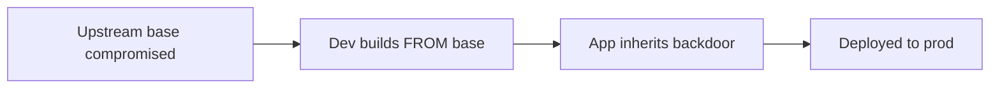

# Lab 3.3: Base Image Poisoning

  Understand: ~8 min | Break: ~8 min | Defend: ~9 min | Detect: ~10 min
  Intermediate
  Prerequisites: <a href="../3.1-image-internals/">Lab 3.1</a>

  Overview
  ›
  <a href="understand/" class="phase-step upcoming">Understand</a>
  ›
  <a href="break/" class="phase-step upcoming">Break</a>
  ›
  <a href="defend/" class="phase-step upcoming">Defend</a>
  ›
  <a href="detect/" class="phase-step upcoming">Detect</a>

Every Dockerfile starts with `FROM`. That single line imports an entire OS, runtime, and all its dependencies. If the base image is compromised, every image built on top of it inherits the backdoor. A poisoned `python:3.12` or `node:20` affects every application built `FROM` it.

### Attack Flow

## Environment

| Service | Address | Description |
|---------|---------|-------------|
| OCI Registry | `registry:5000` | Contains `python-base:3.12` (poisoned) and build artifacts |
| Workstation | Pod with docker CLI, crane, trivy | Your working environment |

> **Related Labs**
>
> - **Prerequisite:** [3.1 Container Image Internals](../3.1-image-internals/index.md) — Image internals explain how base images propagate into builds
> - **Next:** [3.5 Layer Injection](../3.5-layer-injection/index.md) — Layer injection is a more targeted variant of image manipulation
> - **See also:** [3.2 Tag Mutability Attacks](../3.2-tag-mutability/index.md) — Tag mutability enables base image poisoning when tags are reused
> - **See also:** [6.6 Case Study: SolarWinds (SUNBURST)](../../tier-6/6.6-case-study-solarwinds/index.md) — SolarWinds poisoned the build environment, similar to base image attacks
