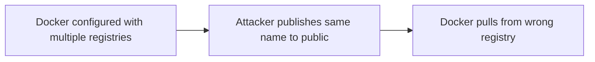

# Lab 3.4: Registry Confusion

<div class="lab-meta">
  <span>~30 minutes</span>
  <span class="difficulty intermediate">Intermediate</span>
  <span>Prerequisites: <a href="3.1-image-internals.md">Lab 3.1</a></span>
</div>

When you type `docker pull myapp:latest`, Docker silently rewrites this to `docker.io/library/myapp:latest`. This implicit behavior. combined with registry mirrors, search paths, and short-name aliasing. creates an attack surface. An attacker can publish an image with the same name on a registry that takes priority over yours.

This is the container equivalent of dependency confusion. Just as pip's `--extra-index-url` lets an attacker's package win by having a higher version number, Docker's registry resolution lets an attacker's image win by being on a higher-priority registry.

In this lab, you have a private registry with `myapp:latest`. Docker is configured to check multiple registries. An attacker publishes `myapp:latest` to a public registry with higher priority. Your deployment pulls the attacker's image.

---

### Attack Flow



---

## Environment

| Service | Address | Description |
|---------|---------|-------------|
| Private Registry | `registry:5000` | Your organization's registry with `myapp:latest` |
| Attacker Registry | `attacker-registry:5000` | Simulated public registry with malicious `myapp:latest` |
| Workstation | Pod with docker CLI, crane, kubectl | Your working environment |

## Connect to the Workstation

```bash
./weaklink shell
```

---

???+ info "Phase 1: UNDERSTAND. How Docker Resolves Image Names"

    **Goal:** See how Docker resolves short image names and how registry mirrors and search order affect which image you actually get.

### Step 1: Understand name resolution

When you run `docker pull myapp:latest`, Docker:

1. Checks if the name contains a registry hostname (contains `.` or `:`)
2. If not, prepends `docker.io/library/`
3. So `myapp:latest` becomes `docker.io/library/myapp:latest`
4. If registry mirrors are configured, Docker checks mirrors first

```bash
# This pulls from docker.io/library/
docker pull alpine:latest 2>&1 | head -5

# This pulls from the explicit registry
docker pull registry:5000/myapp:latest 2>&1 | head -5
```

### Step 2: Check Docker daemon configuration

```bash
cat /etc/docker/daemon.json
```

Look at the `registry-mirrors` or `insecure-registries` configuration. The order of registries matters. Docker checks them in the order listed.

### Step 3: See what each registry has

```bash
# Your private registry
crane catalog registry:5000

# The attacker's registry
crane catalog attacker-registry:5000
```

Both have `myapp`. The attacker registered the same name on their registry.

### Step 4: Compare the images

```bash
# Your legitimate image
crane digest registry:5000/myapp:latest

# The attacker's image
crane digest attacker-registry:5000/myapp:latest
```

Different digests. different images with the same name and tag.

### Step 5: Check the deployment

```bash
cat /app/deploy/deployment.yml
```

Notice the image reference. Does it include the full registry hostname?

---

???+ warning "Phase 2: BREAK. Registry Confusion Attack"

    **Goal:** See how an ambiguous image reference causes Docker to pull from the wrong registry.

### Step 1: Examine the vulnerable deployment

```bash
cat /app/deploy/deployment.yml
```

The deployment uses a short image name like `myapp:latest` without a registry prefix. Docker must decide which registry to pull from.

### Step 2: Deploy the application

```bash
kubectl apply -f /app/deploy/deployment.yml
kubectl rollout status deployment/myapp --timeout=60s
```

### Step 3: Check which image was pulled

```bash
kubectl get pod -l app=myapp -o jsonpath='{.items[0].status.containerStatuses[0].imageID}'
```

Compare this digest against both registries:

```bash
echo "Private registry digest: $(crane digest registry:5000/myapp:latest)"
echo "Attacker registry digest: $(crane digest attacker-registry:5000/myapp:latest)"
```

### Step 4: Verify the damage

```bash
kubectl exec deploy/myapp -- cat /app/version.txt
```

If this shows "ATTACKER-CONTROLLED" or similar, the deployment pulled the attacker's image instead of yours. The registry search order prioritized the attacker's registry.

### Step 5: Understand why

Docker resolved `myapp:latest` using its configured registry search order. The attacker's registry was checked first (or had higher priority), so the attacker's image was pulled. Your private registry was never consulted.

This is identical in principle to package dependency confusion:

- **Package confusion:** pip checks multiple indexes, attacker's higher version wins
- **Registry confusion:** Docker checks multiple registries, attacker's higher-priority registry wins

### Step 6: Document the attack

```bash
cat > /app/findings.txt << 'EOF'
FINDING: Registry confusion attack successful.
The deployment used an unqualified image name "myapp:latest".
Docker resolved this to the attacker's registry due to search order priority.
The attacker's image was deployed instead of our legitimate image.
Private registry digest: <private-digest>
Attacker registry digest: <attacker-digest>
Deployed digest matched the attacker's image.
The wrong registry was consulted because the image name was not fully qualified.
EOF
```

---

???+ success "Phase 3: DEFEND. Fully Qualified Names and Registry Allowlists"

    **Goal:** Eliminate registry ambiguity by using fully qualified image names and blocking unapproved registries.

### Defense 1: Use fully qualified image names

```bash
cat > /app/deploy/deployment.yml << 'EOF'
apiVersion: apps/v1
kind: Deployment
metadata:
  name: myapp
spec:
  replicas: 1
  selector:
    matchLabels:
      app: myapp
  template:
    metadata:
      labels:
        app: myapp
    spec:
      containers:
        - name: myapp
          image: registry:5000/myapp:latest
          imagePullPolicy: Always
EOF

kubectl apply -f /app/deploy/deployment.yml
kubectl rollout status deployment/myapp --timeout=60s
```

Now Docker knows exactly which registry to pull from. No ambiguity.

### Defense 2: Verify the correct image is running

```bash
kubectl exec deploy/myapp -- cat /app/version.txt
```

Should show the legitimate version from your private registry.

### Defense 3: Create a registry allowlist policy

```bash
mkdir -p /app/policy
cat > /app/policy/registry-allowlist.yml << 'EOF'
apiVersion: kyverno.io/v1
kind: ClusterPolicy
metadata:
  name: restrict-registries
spec:
  validationFailureAction: Enforce
  rules:
    - name: allowed-registries
      match:
        any:
          - resources:
              kinds: ["Pod"]
      validate:
        message: "Images must come from approved registries: registry:5000"
        pattern:
          spec:
            containers:
              - image: "registry:5000/*"
    - name: deny-unqualified-names
      match:
        any:
          - resources:
              kinds: ["Pod"]
      validate:
        message: "Unqualified image names are not allowed. Use fully qualified names."
        deny:
          conditions:
            any:
              - key: "{{request.object.spec.containers[].image}}"
                operator: NotEquals
                value: "registry:5000/*"
EOF
```

This policy rejects any pod that references an image from a registry other than `registry:5000`.

### Defense 4: Consider digest pinning for maximum safety

For the strongest defense, combine fully qualified names with digest pinning:

```yaml
image: registry:5000/myapp@sha256:<digest>
```

This eliminates both registry confusion and tag mutability.

### Step 5: Verify the lab

```bash
weaklink verify 3.4
```

---

??? danger "Phase 4: DETECT. Catching Registry Confusion in the Wild"

    **Goal:** Detect when deployments pull images from unexpected registries.

### SIEM / Log Indicators

The core signal is **a container image pulled from a registry that is not on your approved list**. This can indicate either a misconfiguration (short image name resolved to the wrong registry) or an active registry confusion attack.

**What to look for:**

- Kubelet image pull events where the resolved registry differs from the expected registry
- Deployment manifests with unqualified image names (no registry hostname)
- Docker daemon pulling from registry mirrors when it should only use the private registry
- New image repositories appearing in public registries that match your internal image names

### Network Indicators

| Indicator | What It Means |
|-----------|---------------|
| Kubelet connecting to `docker.io` or unexpected registry IP | Image is being pulled from wrong registry |
| DNS query for `registry-1.docker.io` from cluster nodes | Short image name caused Docker Hub resolution |
| HTTP GET to `/v2/<your-internal-app>/manifests/latest` on public registry | Someone (or Docker) is checking for your internal image name on a public registry |

### MITRE ATT&CK Mapping

| Technique | ID | Relevance |
|-----------|-----|-----------|
| **Supply Chain Compromise: Compromise Software Supply Chain** | [T1195.002](https://attack.mitre.org/techniques/T1195/002/) | Attacker publishes a malicious image with the same name on a higher-priority registry |
| **Masquerading: Match Legitimate Name or Location** | [T1036.005](https://attack.mitre.org/techniques/T1036/005/) | The attacker's image uses the same name and tag as the legitimate image, causing Docker to pull it instead |

---

??? tip "SOC Relevance"

    **Alerts you will see:**

    - "Container image pulled from unapproved registry"
    - "Deployment uses unqualified image name"

    **Why this matters:** Registry confusion is the container equivalent of dependency confusion. It is trivially exploitable if your organization uses short image names (e.g., `myapp:latest` instead of `registry.internal.corp/myapp:latest`). Any deployment using a short name is vulnerable to having its image replaced by an attacker-controlled version.

    **Triage steps:**

    1. **Check the image reference**. is it fully qualified? Does it include a registry hostname?
    2. **Compare digests**. get the digest of the pulled image and compare it against your private registry
    3. **Check the Docker daemon config**. is `registry-mirrors` configured? Are there multiple registries in the search path?
    4. **Inspect the image**. scan the pulled image for unexpected binaries, scripts, or layers
    5. **Fix the deployment**. update the image reference to be fully qualified with the private registry hostname

    **Prevention:** Enforce fully qualified image names via admission controller. Remove `registry-mirrors` from Docker daemon config on production nodes. Use an image proxy (Harbor, Artifactory) as the single source of truth.

---

??? example "CI Integration"

    Add this to your CI pipeline to reject unqualified image names in Kubernetes manifests.

    **`.github/workflows/registry-check.yml`:**

    ```yaml
    name: Registry Qualification Check

    on:
      pull_request:
        paths:
          - "k8s/**"
          - "deploy/**"
          - "helm/**"

    jobs:
      check-registry-refs:
        runs-on: ubuntu-latest
        env:
          ALLOWED_REGISTRIES: "registry.internal.corp,gcr.io/distroless,registry.k8s.io"
        steps:
          - uses: actions/checkout@v4

          - name: Reject unqualified image names
            run: |
              echo "--- Scanning for unqualified image references ---"
              FOUND=0
              for f in $(find k8s/ deploy/ helm/ -name '*.yml' -o -name '*.yaml' 2>/dev/null); do
                while IFS= read -r line; do
                  IMAGE=$(echo "$line" | grep -oP 'image:\s*\K\S+')
                  [ -z "$IMAGE" ] && continue
                  # Check if image has a registry hostname (contains . or :port before /)
                  if ! echo "$IMAGE" | grep -qE '^[a-z0-9.-]+[.:][a-z0-9]+/'; then
                    echo "::error file=$f::Unqualified image name: $IMAGE"
                    echo "  Must include registry hostname, e.g., registry.internal.corp/$IMAGE"
                    FOUND=1
                  fi
                done < "$f"
              done
              if [ "$FOUND" -eq 1 ]; then
                echo ""
                echo "Unqualified image names allow Docker to resolve from multiple registries."
                echo "An attacker can publish the same name on a higher-priority registry."
                echo "Always use fully qualified names: <registry>/<repo>:<tag>"
                exit 1
              fi
              echo "PASS: All image references are fully qualified."

          - name: Verify allowed registries
            run: |
              echo "--- Verifying images come from approved registries ---"
              IFS=',' read -ra ALLOWED <<< "$ALLOWED_REGISTRIES"
              BLOCKED=0
              for f in $(find k8s/ deploy/ helm/ -name '*.yml' -o -name '*.yaml' 2>/dev/null); do
                for image in $(grep -oP 'image:\s*\K\S+' "$f" 2>/dev/null); do
                  REGISTRY=$(echo "$image" | cut -d'/' -f1)
                  APPROVED=0
                  for allowed in "${ALLOWED[@]}"; do
                    if [[ "$REGISTRY" == "$allowed" ]]; then
                      APPROVED=1
                      break
                    fi
                  done
                  if [ "$APPROVED" -eq 0 ]; then
                    echo "::error file=$f::Image from unapproved registry: $image (registry: $REGISTRY)"
                    BLOCKED=1
                  fi
                done
              done
              if [ "$BLOCKED" -eq 1 ]; then
                exit 1
              fi
              echo "PASS: All images from approved registries."
    ```

---

## What You Learned

1. **Docker implicitly resolves short names**. `myapp:latest` becomes `docker.io/library/myapp:latest` unless you specify a registry hostname.
2. **Registry mirrors and search order create attack surface**. if Docker checks multiple registries, an attacker can win by being on a higher-priority one.
3. **This is dependency confusion for containers**. same principle, different ecosystem.
4. **Fully qualified names eliminate the ambiguity**. `registry:5000/myapp:latest` always pulls from your registry, no matter what else is configured.
5. **Admission controllers enforce the policy**. Kyverno or OPA Gatekeeper can reject unqualified names and restrict allowed registries.

## Further Reading

- [Docker: Image Naming and Tagging](https://docs.docker.com/reference/cli/docker/image/tag/)
- [containerd: Registry Configuration](https://github.com/containerd/containerd/blob/main/docs/hosts.md)
- [Kyverno: Restrict Image Registries](https://kyverno.io/policies/best-practices/restrict-image-registries/)
- [Red Hat: Container Image Name Resolution](https://www.redhat.com/en/blog/understanding-container-image-names)
- [NIST SP 800-190: Container Security](https://csrc.nist.gov/publications/detail/sp/800-190/final)
